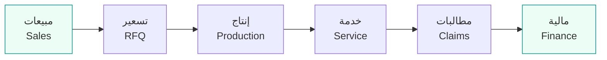
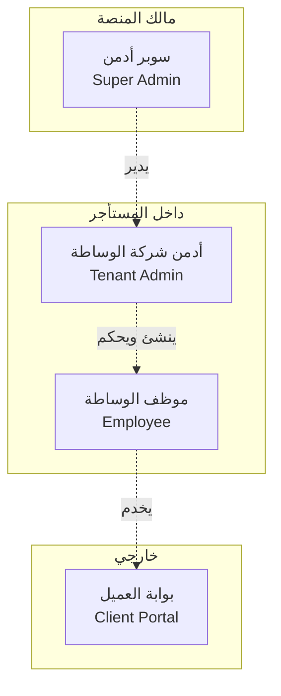

# 01 — نظرة عامة على منصة IBP

> منصة **SaaS متعددة المستأجرين** لشركات وساطة التأمين في المملكة العربية السعودية، تؤتمت دورة العمل كاملةً من المبيعات حتى المالية، وتُباع باشتراكات بباقات وصلاحيات قابلة للتحكم.

هذا المستند هو نقطة الدخول التوثيقية للمشروع. يلخّص الرؤية ونموذج العمل واللوحات والعائلات التأمينية والمبادئ التأسيسية وحالة المراحل. للتفصيل الوظيفي الكامل راجع [`BLUEPRINT.md`](../BLUEPRINT.md)، ولخطة التنفيذ [`ROADMAP.md`](../ROADMAP.md)، ولدستور المشروع [`GUIDELINES.md`](../GUIDELINES.md).

## جدول المحتويات
- [1. ما هو IBP والرؤية](#1-ما-هو-ibp-والرؤية)
- [2. نموذج العمل (SaaS بباقات + add-ons + entitlements)](#2-نموذج-العمل-saas-بباقات--add-ons--entitlements)
- [3. اللوحات الأربع](#3-اللوحات-الأربع)
- [4. عائلات التأمين المدعومة](#4-عائلات-التأمين-المدعومة)
- [5. المبادئ التأسيسية](#5-المبادئ-التأسيسية)
- [6. دورة العمل end-to-end](#6-دورة-العمل-end-to-end)
- [7. حالة المراحل](#7-حالة-المراحل)
- [8. انظر أيضاً](#8-انظر-أيضاً)

---

## 1. ما هو IBP والرؤية

**IBP (Insurance Broker Platform)** منصة برمجية كخدمة (SaaS) موجَّهة لشركات وساطة التأمين العاملة في السوق السعودي. الفكرة الجوهرية أن كل شركة وساطة تعمل اليوم بأدوات متفرّقة (إكسل، بريد، واتساب، أنظمة محاسبة منفصلة)، فتأتي المنصة لتوحّد دورة العمل كاملةً في نظام واحد مؤتمت ومتوافق تنظيمياً.

**سلسلة القيمة المؤتمتة:**

**الرؤية:** أن تكون المنصة المعيارية لأي وسيط تأمين سعودي، قابلة للتهيئة بالكامل دون تخصيص برمجي، ومتوافقة من اليوم الأول مع متطلبات **هيئة التأمين** و**نظام حماية البيانات الشخصية (PDPL)** وضوابط **الهيئة الوطنية للأمن السيبراني (NCA)**، ومجهّزة للتكامل مع المنظومة الحكومية الرقمية (نفاذ، يقين، واثق، نجم، ZATCA، نِفيس).

> ملاحظة تنظيمية: انتقل الإشراف على قطاع التأمين إلى **هيئة التأمين (Insurance Authority)** المنشأة عام 2023، وتولّت مهامًا كانت لدى مؤسسة النقد سابقاً؛ لذا تُوجَّه التقارير الرقابية إلى هيئة التأمين، والفوترة الإلكترونية إلى ZATCA. التفاصيل في [`docs/broker-requirements-coverage.md`](./broker-requirements-coverage.md).

## 2. نموذج العمل (SaaS بباقات + add-ons + entitlements)

تُباع المنصة باشتراك لكل مستأجر (شركة وساطة)، ويُتحكَّم بما يحصل عليه كل مستأجر عبر **محرّك صلاحيات/اشتراكات (Entitlement Engine)** + **متجر إضافات (Add-ons)** — لا أكواد ثابتة.

### الباقات المرجعية
يعرّفها السوبر أدمن ويضبط أسعارها وحدودها (نموذج `Plan` في المخطط: `code`, `seatLimit`, `priceMonthly`, `priceYearly`).

| الباقة | الرمز (`Plan.code`) | الجمهور | السمة الأبرز |
|---|---|---|---|
| الأساسية | `basic` | وسطاء صغار | موديولز جوهرية فقط؛ المطالبات/التقارير/الالتزام مقفلة افتراضياً |
| الاحترافية | `premium` | وسطاء متوسطون | معظم الموديولز مشمولة + حدود أعلى للمقاعد |
| المؤسسات | `enterprise` | وسطاء كبار | كل الموديولز + إعفاءات من رسوم الاستخدام |

> أمثلة من الـ seed (بيانات وهمية): مستأجر «وكالة الخليج» = `premium` + إضافة موديول المطالبات؛ مستأجر «شركة الأمان» = `basic` (المطالبات/التقارير/الالتزام مقفلة). راجع [`README.md`](../README.md).

### محورا التحكم
1. **المقاعد (Seats):** لكل باقة حد أقصى للموظفين (`Plan.seatLimit`)؛ تجاوزه يتطلّب شراء مقعد add-on.
2. **الموديولز/الميزات:** ما هو غير مفعّل في الباقة يُفعَّل بشراء add-on.

### أوضاع الـ Entitlement
كل ميزة لها وضع صلاحية ضمن الباقة (enum `EntitlementMode` في المخطط):

| الوضع | المعنى |
|---|---|
| `INCLUDED` | مشمول بالكامل ضمن الباقة |
| `QUOTA` | حصّة كمية محددة (عدد طلبات/أدوار…) عبر الحقل `quota` |
| `METERED` | رسوم لكل استخدام عبر الحقل `unitFee` |
| `ADDON` | غير متاح إلا بشراء إضافة مدفوعة |
| `DISABLED` | معطّل كلياً |

### متجر الـ Add-ons
مقاعد إضافية، تفعيل موديول، بوابة دفع، تكامل بريد، تكامل API، تخصيص العلامة، ساعات تطوير حصرية (نموذج `AddonPurchase.addonKey`).

### فوترة عمليات التحقق
لكل مستأجر نموذج فوترة لعمليات التحقق الحكومي (حقل `Tenant.billingModel`، enum `BillingModel`):

| النموذج | الآلية |
|---|---|
| `PASS_THROUGH` (الممر) | المستأجر يربط حسابه الخاص مع المزوّد ويدفع عملياته؛ دورنا تقني فقط |
| `RESELLER` (إعادة بيع) | نشتري باقات كبيرة ونخصم العملية من رصيد المستأجر (`Wallet`) بهامش |

تفصيل نموذج التسعير لكل عملية في [`BLUEPRINT.md` §7-أ](../BLUEPRINT.md).

## 3. اللوحات الأربع

المنصة تقدّم أربع واجهات بنطاقات صلاحيات منفصلة تماماً:

| اللوحة | المستخدم | النطاق | أمثلة على القدرات |
|---|---|---|---|
| **سوبر أدمن** | الشركة المالكة للمنصة | المنصة كاملةً عبر كل المستأجرين | إدارة المستأجرين، تعريف الباقات والأسعار، متجر الـ add-ons، تفعيل/تعطيل الموديولز عالمياً، مراقبة الاستخدام والفوترة، تقارير المنصة، صحة النظام |
| **أدمن شركة الوساطة** | مدير/مالك المستأجر | المستأجر فقط | إدارة الموظفين ومصفوفة الصلاحيات، إعدادات المستأجر، الاشتراك والمقاعد، شراء add-ons، الاطلاع على كل بيانات الشركة |
| **موظف الوساطة** | موظفو المستأجر | حسب صلاحياته (RBAC) | الدخول للموديولز المسموح بها فقط، بصلاحيات CRUD الممنوحة له |
| **بوابة العميل** | عملاء شركة الوساطة | حساب العميل فقط | لوحة الحساب، تقديم/تتبّع الطلبات والمطالبات، كشف الحساب، الفواتير، مكتبة المستندات، الدخول عبر نفاذ |

> الحالة الحالية: واجهة المستأجر (Broker Workspace) منفّذة فعلياً تحت `apps/web/src/app/[locale]/tenant/`. لوحة السوبر أدمن وبوابة العميل مجدولتان للمرحلة 8 (راجع [حالة المراحل](#7-حالة-المراحل)).

## 4. عائلات التأمين المدعومة

النموذج الديناميكي للمنصة يتكيّف مع تنوّع منتجات التأمين عبر كتالوج منتجات قابل للتوسيع (المصدر: [`packages/shared/src/product-catalog.ts`](../packages/shared/src/product-catalog.ts)). سبع عائلات (فئات `ProductClass`)، تحت كل عائلة فروع (`ProductLine`)، وكل فرع يحدّد **كتله المتكررة** التي يُولّدها النموذج الديناميكي:

| العائلة | الرمز | الفروع (`code`) | الكتلة المتكررة (`blockKey`) |
|---|---|---|---|
| الطبي | `MED` | `GMI` طبي جماعي · `IMI` طبي فردي | `members` (التابعون/Census) |
| المركبات | `MOT` | `MCI` شامل · `MTP` ضد الغير | `vehicles` (المركبات) |
| الممتلكات | `PRP` | `PAR` جميع أخطار الممتلكات · `FIR` الحريق والأخطار الإضافية | `locations` (المواقع/الأصول) |
| الهندسي | `ENG` | `CAR` جميع أخطار المقاولين · `EAR` جميع أخطار التركيب | `locations` (المواقع/الأصول) |
| البحري | `MAR` | `MCG` بحري بضائع | `shipments` (الشحنات) |
| الحوادث العامة | `GEN` | `GPA` حوادث شخصية جماعية · `PLI` مسؤولية عامة · `TRV` تأمين السفر | `lives` / `travellers` / (بلا كتلة لـ `PLI`) |
| الحياة | `LIF` | `TRM` حياة لأجل · `GLI` حياة جماعي | `lives` (الأرواح المؤمَّنة) |

> النمط جوهري: بدل جداول ثابتة لكل منتج، تُخزَّن كل صفوف الكتل المتكررة في نموذج عام واحد `RequestBlockRow` مدفوع بـ `FormSchema`، فيستوعب أي كتلة لأي منتج دون تغيير المخطط. التفصيل في [`docs/03-data-model.md`](./03-data-model.md#نمط-requestblockrow-العام).

## 5. المبادئ التأسيسية

1. **متعددة المستأجرين (Multi-tenant):** كل شركة وساطة = مستأجر معزول تماماً (بيانات، مستخدمون، إعدادات). كل جدول تشغيلي يحمل `tenantId` ومُفهرس به، وكل استعلام يُفلتر تلقائياً عبر Prisma middleware. التفصيل المعماري في [`docs/02-architecture.md`](./02-architecture.md).
2. **قابلة للتهيئة بالكامل:** لا تفصيل على شركة بعينها — المنتجات، الفروع، شجرة الحسابات، القوالب، سلاسل الاعتماد، العلامة، كلها تُضبط من الإعدادات (`TenantConfig`) لا من الكود.
3. **الامتثال من الأساس:** عزل المستأجرين، تشفير at-rest / in-transit، سجل تدقيق كامل (`AuditLog`)، وتوطين بيانات الإنتاج الحقيقية (والنسخ الاحتياطية والسجلات والمرفقات) داخل المملكة وفق PDPL وضوابط NCA. بيئات التطوير ببيانات وهمية فقط؛ التكامل الحكومي عبر Sandbox.
4. **تحكم ذكي بالباقات:** كل ميزة تُدار عبر Entitlement Engine + متجر Add-ons، لا أكواد ثابتة.
5. **ثنائية اللغة (ar/en) و RTL:** دعم من البداية عبر `next-intl`، مع التقويمين الهجري والميلادي والعملة SAR.

## 6. دورة العمل end-to-end

| المرحلة | القسم | الأتمتة في المنصة |
|---|---|---|
| 1. استقطاب واستلام التفويض | المبيعات | KYC/KYB ديناميكي، تحقّق واثق/يقين، ملف عميل موحّد |
| 2. تجهيز الطلب وإرسال السلِبس | التسعير | سلِب (RFQ) موحّد يُرسل لعدة شركات، تتبّع وتذكير تلقائي |
| 3. العروض وجدول المقارنات | التسعير | بناء جدول المقارنات آلياً من الحقول المعيارية وعرضه |
| 4. أمر الإسناد والإصدار | الإنتاج + المالية | اعتماد مزدوج ← توليد القيد والإشعار والفاتورة الضريبية تلقائياً |
| 5. التسليم والخدمة والتجديد | الوثائق + خدمة العملاء | أرشفة، تنبيهات تجديد، طلبات خدمة في بوابة العميل |

نقطة حوكمة محورية: **بوّابة الالتزام** — لا طلب أسعار قبل أن يعتمد مسؤول الالتزام العميل (`Client.complianceStatus == APPROVED`).

## 7. حالة المراحل

تنفَّذ المنصة مرحلةً مرحلة وفق [`ROADMAP.md`](../ROADMAP.md). الملخّص:

| المرحلة | الموضوع | الحالة |
|---|---|---|
| **0** | التهيئة (Scaffolding): monorepo + Next.js + NestJS + Prisma + Docker compose | ✅ منجزة ومُختبرة |
| **1** | الأساس: المصادقة (JWT) + عزل المستأجرين (ALS + Prisma middleware) | ✅ منجزة ومُختبرة |
| **2** | الصلاحيات: RBAC + Entitlements + حارس موحّد + شاشة إدارة الموظفين | ✅ منجزة ومُختبرة |
| **3** | العملاء + كتالوج المنتجات + النموذج الديناميكي + بوّابة الالتزام | ✅ منجزة ومُختبرة |
| **4أ** | الاكتتاب الفني وعروض الأسعار (RFQ): `Slip` + `Quotation` + المقارنة الآلية + الإسناد | ✅ منجزة ومُختبرة |
| **4ب** | الإصدار والهندسة المالية (Finance Core): الاعتماد المزدوج + COA + السندات + الإشعارات | ✅ منجزة ومُختبرة |
| 5 | وحدة المستندات (Presigned URLs + عزل بالمسار) | ✅ منجزة ومُختبرة |
| 6 | بقية الموديولز التشغيلية (خدمة، مطالبات، تجديدات) | ✅ منجزة ومُختبرة |
| 7 | التحقق الحكومي (يقين/واثق/نفاذ + Sandbox) | ✅ منجزة ومُختبرة |
| 8 | اللوحات (سوبر أدمن، بوابة العميل) + التقارير | ✅ منجزة ومُختبرة |
| 9 | التكاملات التنظيمية (ZATCA، نجم…) + النشر داخل المملكة | ✅ منجزة ومُختبرة |
| **4ب+** | جاهزية ZATCA Fatoora المرحلة 2 (تهيئة/فوترة/توجيه معزولة) | ✅ منجزة ومُختبرة |

**الحالة:** المنصّة مكتملة وظيفيًا + **كل النواقص البرمجية منجزة** (تخزين S3/تسجيل ذاتي/فوترة اشتراكات/أقسام/حصص تخزين/إثراء حقول/ضريبة بالفرع E1/الإشعارات + مركز in-app/سلاسل اعتماد E2/تحصين أمني + MFA/سجل تدقيق ثابت/الاحتفاظ + DLP + **خارطة تجاوز أويسس 8/8** (التحصيل/الإلغاء/اتجاه الفاتورة/تسوية المؤمِّن/المبيعات/**الوسطاء الفرعيون**/فصل الاكتتاب/المرجعية IA) + **مكتبة قوالب النماذج** + **البريد BYO/الهوية البصرية/الأهداف/التملّك/إدارة شركات التأمين/سجل التدقيق كصفحة/طلبات التواصل** + **نظرة المالك المالية/تطوير الخدمة/إثراء CRM/الملاحق الاحترافية/امتثال فاتورة ZATCA** + **المنتجات + المستودع المركزي للمستندات + صلاحيات على مستوى المنتج + نموذج التحصيل القابل للتهيئة**) + **بدء إكمال القسم المالي بعد التدقيق: القيود اليدوية/المصروفات + عمولات الموظفين + خطة تقسيط الأقساط + الميزانية العمومية + دفتر الأستاذ + إقرار ض.ق.م + أعمار الذمم**) — **e2e 293/293**. السرد الحاكم لكل ما بعد الاكتمال في [`docs/34`](./34-post-completion-features.md)، وحالة الاستئناف في [`docs/00`](./00-project-status.md).

## 8. انظر أيضاً
- [`docs/02-architecture.md`](./02-architecture.md) — المعمار وتدفّق الطلب وحياد السحابة.
- [`docs/03-data-model.md`](./03-data-model.md) — مرجع نموذج البيانات الكامل.
- [`BLUEPRINT.md`](../BLUEPRINT.md) — المرجع الوظيفي التأسيسي الكامل.
- [`ROADMAP.md`](../ROADMAP.md) — خطة التنفيذ مرحلةً مرحلة.
- [`docs/broker-requirements-coverage.md`](./broker-requirements-coverage.md) — مصفوفة الأمان ودورة العمل المتتبَّعة.
- [`GUIDELINES.md`](../GUIDELINES.md) — دستور المشروع وقواعده غير القابلة للتفاوض.
