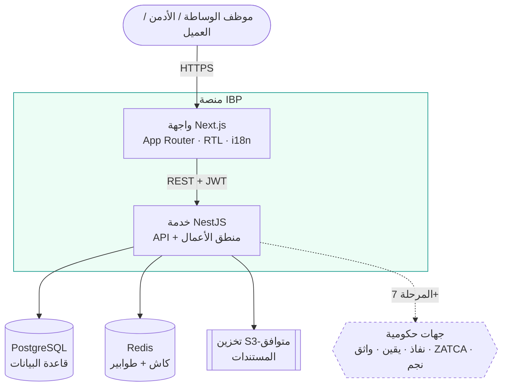
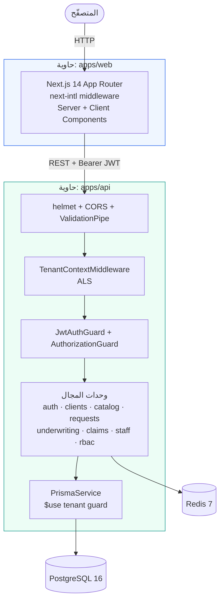
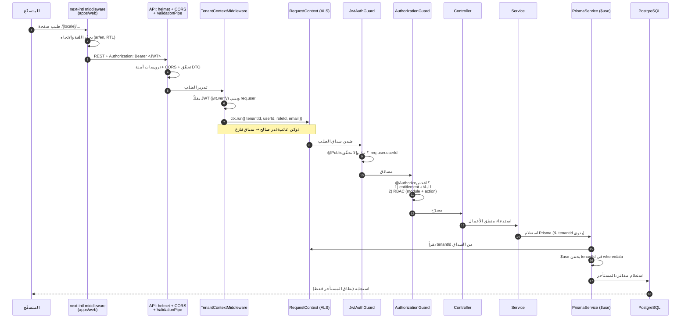
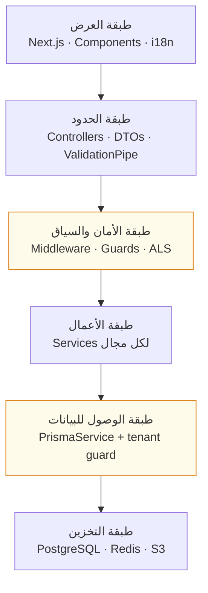
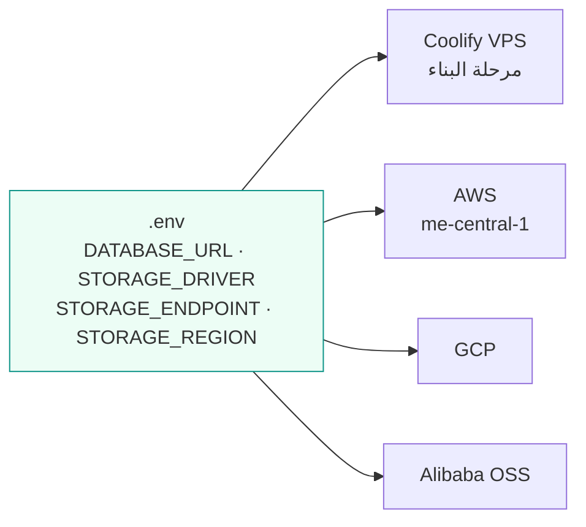

# 02 — المعمار (Architecture)

> يصف هذا المستند البنية التقنية لمنصة IBP: مخططات C4 (السياق والحاويات)، حزمة التقنيات، بنية الـ monorepo، **تدفّق الطلب** عبر طبقات الأمان والعزل، وحياد السحابة. كل ما هنا مستخرج من الكود الفعلي (المسارات مذكورة).

## جدول المحتويات
- [1. مخطط السياق (C4 Context)](#1-مخطط-السياق-c4-context)
- [2. مخطط الحاويات (C4 Container)](#2-مخطط-الحاويات-c4-container)
- [3. حزمة التقنيات](#3-حزمة-التقنيات)
- [4. بنية الـ monorepo](#4-بنية-الـ-monorepo)
- [5. تدفّق الطلب (Request Flow)](#5-تدفق-الطلب-request-flow)
- [6. الطبقات المعمارية الأساسية](#6-الطبقات-المعمارية-الأساسية)
- [7. الحاويات و Docker Compose](#7-الحاويات-و-docker-compose)
- [8. حياد السحابة](#8-حياد-السحابة)
- [9. انظر أيضاً](#9-انظر-أيضاً)

---

## 1. مخطط السياق (C4 Context)



المستخدم يتعامل مع الواجهة فقط؛ الواجهة تستهلك الـ API عبر REST موقّعة بـ JWT؛ الـ API هو الطبقة الوحيدة التي تلمس القاعدة والكاش والتخزين والتكاملات الحكومية.

## 2. مخطط الحاويات (C4 Container)



- **الواجهة (`apps/web`):** تطبيق Next.js يعرض اللوحات الأربع. الترجمة والاتجاه عبر `next-intl` بمسار `/[locale]/...`.
- **الـ API (`apps/api`):** خدمة NestJS بمعماري وحدات (module لكل مجال)، مع حارس عالمي للمصادقة، وحارس تفويض لكل endpoint، و `PrismaService` يفرض عزل المستأجرين.

## 3. حزمة التقنيات

| الطبقة | التقنية | الإصدار/الملاحظة | المرجع |
|---|---|---|---|
| الواجهة | Next.js (App Router) + TypeScript + Tailwind | Next.js 14، RTL وثنائية لغة عبر `next-intl` | `apps/web/` |
| الخطوط | Inter (لاتيني) + IBM Plex Sans Arabic (عربي) | عبر Google Fonts | [`DESIGN.md`](../DESIGN.md) |
| الخدمات | NestJS | 10 — معماري وحدات | `apps/api/src/app.module.ts` |
| الأمان (API) | `helmet` + CORS + `ValidationPipe` | ترويسات آمنة + تحقّق مدخلات صارم | `apps/api/src/main.ts` |
| المصادقة | JWT عبر `@nestjs/jwt` | `JWT_SECRET` + `JWT_EXPIRES_IN` من البيئة | `apps/api/src/modules/auth/` |
| قاعدة البيانات | PostgreSQL + Prisma | PostgreSQL 16، Prisma 5 | `packages/db/prisma/schema.prisma` |
| الكاش/الطوابير | Redis | Redis 7 (BullMQ للمهام والتذكيرات لاحقاً) | `apps/api/src/redis/` |
| التخزين | S3-متوافق | Presigned URLs فقط (المرحلة 5) | `.env`: `STORAGE_DRIVER` |
| سياق الطلب | AsyncLocalStorage | حمل tenantId/userId طوال الطلب | `apps/api/src/common/request-context/` |
| الحزم | pnpm workspaces (monorepo) | Node ≥ 20 · pnpm ≥ 9 | `pnpm-workspace.yaml` |
| التغليف | Docker + Docker Compose | تطوير محلي ونشر | `docker-compose.yml` |
| النشر | Coolify → Kubernetes + Terraform | حيادي سحابياً (AWS/GCP/Alibaba) | `infra/` |

## 4. بنية الـ monorepo

```
NX-IBP/
├── apps/
│   ├── web/        واجهة Next.js (اللوحات الأربع)
│   └── api/        خدمة NestJS (وحدات المجال)
├── packages/
│   ├── db/         مخطط Prisma + generated client + migrations + seed
│   └── shared/     أنواع وثوابت مشتركة (كتالوج، موديولز، RBAC، مخططات النماذج)
├── infra/          docker / k8s / terraform
├── docs/           هذا التوثيق
├── docker-compose.yml
├── pnpm-workspace.yaml
└── GUIDELINES.md · BLUEPRINT.md · ROADMAP.md · DESIGN.md · README.md
```

| المجلد | الدور | محتوى بارز |
|---|---|---|
| **`apps/web`** | الواجهة | `src/app/[locale]/tenant/` (dashboard, clients, requests, slips, settings/staff, …)، `src/components/` (layout, ui, forms مثل `DynamicForm`)، `src/i18n/` رسائل ar/en. |
| **`apps/api`** | الخدمات | `src/main.ts` (bootstrap)، `src/app.module.ts` (الجذر)، `src/common/` (request-context, middleware, audit, sequence)، `src/modules/` (auth, rbac, catalog, clients, requests, underwriting, claims, staff, health)، `src/prisma/`، `src/redis/`. |
| **`packages/db`** | البيانات | `prisma/schema.prisma` (المصدر الوحيد للبنية)، `generated/client` (مخرج مخصّص لتفادي تعارض pnpm)، migrations، seed بيانات وهمية. يُعاد تصديره كـ `@ibp/db`. |
| **`packages/shared`** | المشترك | `product-catalog.ts` (الكتالوج)، `modules.ts` (التنقّل ووحدات الـ API)، `rbac.ts` (قوالب الأدوار 12 دوراً منقولة من BLUEPRINT §4)، `form-schema.ts` / `form-schemas.ts` (مخططات النماذج)، `constants.ts`. يُستهلك من الواجهة والخدمات كـ `@ibp/shared`. |
| **`infra`** | البنية التحتية | قوالب docker/k8s/terraform (سقالة حالياً، تُملأ في المرحلة 9). |

## 5. تدفّق الطلب (Request Flow)

أهم مخطط في المعمار — يوضّح كيف يمرّ كل طلب عبر طبقات المصادقة والتفويض والعزل قبل أن يلمس القاعدة. ملاحظة: في NestJS تُنفَّذ **الـ middleware قبل الحُرّاس (Guards)**، فيُضبط سياق المستأجر أولاً ثم يفحصه الحارسان.



### تفصيل كل محطّة (بمراجع الكود)

| # | المحطّة | ما يفعله | المرجع |
|---|---|---|---|
| 1 | **next-intl middleware** | يلتقط بادئة اللغة في المسار، يضبط `dir` و RTL، يحوّل الجذر إلى `/ar/...`. | `apps/web` |
| 2 | **helmet + CORS + ValidationPipe** | ترويسات HTTP آمنة افتراضياً، أصول CORS من `CORS_ORIGINS` فقط، تحقّق صارم من DTO (`whitelist`, `forbidNonWhitelisted`, `transform`). | [`apps/api/src/main.ts`](../apps/api/src/main.ts) |
| 3 | **TenantContextMiddleware** | يفكّ JWT من ترويسة `Authorization`، يبني `req.user`، ويلفّ بقية الطلب داخل سياق ALS عبر `ctx.run(store, next)`. توكن غير صالح ⇒ سياق فارغ. | [`common/middleware/tenant-context.middleware.ts`](../apps/api/src/common/middleware/tenant-context.middleware.ts) |
| 4 | **RequestContextService (ALS)** | `AsyncLocalStorage` يحمل `tenantId/userId/roleId/email` طوال عمر الطلب، يقرؤه Prisma لاحقاً دون تمرير يدوي. | [`common/request-context/request-context.service.ts`](../apps/api/src/common/request-context/request-context.service.ts) |
| 5 | **JwtAuthGuard** (عالمي `APP_GUARD`) | يرفض المسارات غير المعلَّمة بـ `@Public` إن غاب `req.user.userId` (401). | [`modules/auth/jwt-auth.guard.ts`](../apps/api/src/modules/auth/jwt-auth.guard.ts) |
| 6 | **AuthorizationGuard** | لكل endpoint معلَّم بـ `@Authorize` يفحص فحصين: (أ) هل الموديول مفعّل في باقة المستأجر؟ عبر `EntitlementService`؛ (ب) هل لدور المستخدم صلاحية الفعل؟ عبر `PermissionService`. أي إخفاق ⇒ 403. | [`modules/rbac/authorization.guard.ts`](../apps/api/src/modules/rbac/authorization.guard.ts) |
| 7 | **Controller** | يستقبل DTO المحقّق، يقرأ `tenantId/userId` من `@CurrentUser`، يفوّض للـ Service. | مثال: [`modules/clients/clients.controller.ts`](../apps/api/src/modules/clients/clients.controller.ts) |
| 8 | **Service** | منطق الأعمال؛ يستعلم Prisma **دون** تمرير `tenantId` يدوياً (يُحقَن آلياً). | `modules/*/*.service.ts` |
| 9 | **PrismaService (`$use`)** | middleware يشتق آلياً من DMMF الموديلز الحاملة لـ `tenantId`، ويحقن الفلترة على القراءة/الكتابة. `findUnique` يُعاد توجيهه إلى `findFirst` لإضافة `tenantId` ⇒ معرّف مستأجر آخر = «غير موجود». بلا سياق (إقلاع/تسجيل دخول) ⇒ لا فرض. | [`prisma/prisma.service.ts`](../apps/api/src/prisma/prisma.service.ts) |
| 10 | **PostgreSQL** | يستقبل استعلامات مفلترة بالمستأجر دوماً؛ علاقات FK على `tenantId` تعزّز التكامل المرجعي. | `packages/db/prisma/schema.prisma` |

> طبقة العزل الحاسمة هي **المحطّة 9**: العزل يُفرض في طبقة التفويض/البيانات تلقائياً، لا بخفاء المسارات (GUIDELINES.md §3). راجع نمط الحقن لكل عملية (`create`, `update`, `delete`, `upsert`, `findUnique`…) في `installTenantGuard()`.

### مثال عملي على الحُرّاس
نقطة `GET /clients` معلَّمة بـ `@Authorize({ module: "clients", action: "read", entitlement: "module.clients" })` — فتُفحَص الباقة (هل `module.clients` مفعّل؟) ثم RBAC (هل للدور صلاحية `read` على `clients`؟) قبل تنفيذ المعالج (`apps/api/src/modules/clients/clients.controller.ts`).

## 6. الطبقات المعمارية الأساسية



خدمات مستعرضة (Cross-cutting) في `apps/api/src/common/`:
- **AuditModule / AuditService** — تسجيل العمليات الحسّاسة في `AuditLog` (إنشاء/تعديل/حذف، توليد رابط ملف، تحقّق، اعتماد).
- **SequenceModule / SequenceService** — مولّد الأرقام التسلسلية (مبدئي الآن: `CLI-2026-1001`, `RFQ-MED-2026-1001`؛ يكتمل في المرحلة 4ب بصيغة `PREFIX-BRANCH-CLASS-YEAR-SEQ`). راجع [`common/sequence/sequence.service.ts`](../apps/api/src/common/sequence/sequence.service.ts).
- **RequestContextModule** — سياق ALS المشترك.

## 7. الحاويات و Docker Compose

التطوير المحلي عبر [`docker-compose.yml`](../docker-compose.yml) — أربع حاويات:

```mermaid
flowchart LR
  subgraph compose [docker-compose]
    PG[(postgres:16-alpine<br/>:5432)]
    RD[(redis:7-alpine<br/>:6379)]
    API[ibp-api<br/>:4000]
    WEB[ibp-web<br/>:3000]
  end
  WEB --> API
  API --> PG
  API --> RD
  API -. depends_on healthcheck .-> PG
  API -. depends_on healthcheck .-> RD
```



- **postgres** و **redis**: لكلٍّ healthcheck وحجم بيانات دائم (`ibp_pgdata`, `ibp_redisdata`).
- **api**: يعتمد على صحّة القاعدة و Redis، يقرأ `DATABASE_URL` و `REDIS_URL` من البيئة.
- **web**: يعتمد على api، يقرأ `NEXT_PUBLIC_API_URL`.

أنماط التشغيل:
- البنية فقط: `docker compose up -d postgres redis` (ثم `pnpm dev` محلياً).
- الحزمة كاملةً: `docker compose up -d --build`.

التحقق من الإقلاع: `GET /health` يردّ `{"status":"ok","checks":{"database":"up","redis":"up"}}` (راجع [`README.md`](../README.md)).

## 8. حياد السحابة

المنصة محايدة سحابياً بالتصميم — لا قيم بنية تحتية صلبة في الكود، كلها من `.env`:



- **التخزين:** `STORAGE_DRIVER` يقبل `s3 | alibaba_oss | google_cloud_storage | minio`؛ التحوّل بين المزوّدين بتغيير المتغيّرات فقط دون لمس الكود (راجع [`.env.example`](../.env.example)).
- **الرابط الموقّت:** `PRESIGNED_URL_EXPIRY_SECONDS=300` (معيار أمني: 5 دقائق).
- **توطين الإنتاج:** بيانات الإنتاج الحقيقية (والنسخ الاحتياطية والسجلات والمرفقات) داخل المملكة وفق PDPL/NCA؛ بيئات التطوير ببيانات وهمية فقط والتكامل الحكومي عبر Sandbox. التفصيل في [`BLUEPRINT.md` §7-ب](../BLUEPRINT.md).
- **مسار الإنتاج:** Coolify (مرحلة البناء، لتوفير التكلفة) ← Kubernetes + Terraform داخل المملكة عند الإطلاق (المرحلة 9).

## 9. انظر أيضاً
- [`docs/01-overview.md`](./01-overview.md) — الرؤية ونموذج العمل واللوحات وحالة المراحل.
- [`docs/03-data-model.md`](./03-data-model.md) — نموذج البيانات الكامل وعزل المستأجرين على مستوى الجداول.
- [`DESIGN.md`](../DESIGN.md) — رموز التصميم والتخطيط للواجهة.
- [`docs/broker-requirements-coverage.md`](./broker-requirements-coverage.md) — المتطلبات الفنية والأمنية المتتبَّعة.
- [`GUIDELINES.md`](../GUIDELINES.md) — القواعد غير القابلة للتفاوض (العزل، الأمان، الصلاحيات).
