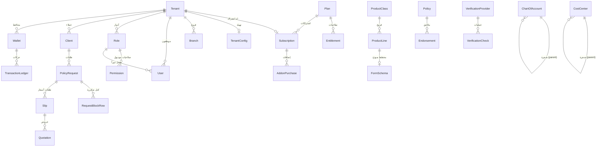

# 03 — مرجع نموذج البيانات (Data Model)

> المرجع الكامل لنموذج البيانات في [`packages/db/prisma/schema.prisma`](../packages/db/prisma/schema.prisma) — **المصدر الوحيد للبنية**. يغطّي هذا المستند كل نموذج (model) و enum، مع الغرض وجدول الحقول والعلاقات والفهارس وقيود التفرّد وملاحظة العزل.

**قاعدة العزل العامة:** كل جدول تشغيلي يحمل `tenantId` (FK إلى `Tenant`) ومُفهرس به (`@@index([tenantId])`)، ويفرض `PrismaService` فلترته تلقائياً (راجع [`docs/02-architecture.md` §5](./02-architecture.md#5-تدفق-الطلب-request-flow)). الجداول المرجعية على مستوى المنصة (`Plan`, `Entitlement`, `ProductClass`, `ProductLine`, `FormSchema`, `VerificationProvider`) لا تحمل `tenantId` لأنها مشتركة.

## جدول المحتويات
- [مخطط ERD للكيانات الأساسية](#مخطط-erd-للكيانات-الأساسية)
- [أ. المنصة: المستأجرون والاشتراكات](#أ-المنصة-المستأجرون-والاشتراكات)
- [ب. RBAC: المستخدمون والصلاحيات](#ب-rbac-المستخدمون-والصلاحيات)
- [ج. التهيئة لكل مستأجر](#ج-التهيئة-لكل-مستأجر)
- [د. كتالوج المنتجات](#د-كتالوج-المنتجات)
- [هـ. التشغيل: العملاء والطلبات والكتل](#هـ-التشغيل-العملاء-والطلبات-والكتل)
- [و. الاكتتاب: السلِبس والعروض والملاحق](#و-الاكتتاب-السلبس-والعروض-والملاحق)
- [ز. الكيانات التشغيلية المبسّطة](#ز-الكيانات-التشغيلية-المبسطة)
- [ح. المالية (مهيّأة للمرحلة 4ب)](#ح-المالية-مهيأة-للمرحلة-4ب)
- [ط. التحقق الحكومي والأرصدة](#ط-التحقق-الحكومي-والأرصدة)
- [ي. المستندات والتدقيق](#ي-المستندات-والتدقيق)
- [ملاحق: نمط RequestBlockRow و COA](#ملاحق)
- [انظر أيضاً](#انظر-أيضاً)

---

## مخطط ERD للكيانات الأساسية

---

## أ. المنصة: المستأجرون والاشتراكات

### `Tenant`
**الغرض:** المستأجر — شركة وساطة معزولة. جذر كل البيانات التشغيلية.

| الحقل | النوع | ملاحظة |
|---|---|---|
| `id` | String (cuid) | المفتاح الأساسي |
| `name` | String | اسم الشركة (عربي) |
| `nameEn` | String? | الاسم الإنجليزي |
| `crNumber` | String? | السجل التجاري لشركة الوساطة |
| `status` | `TenantStatus` | افتراضي `ACTIVE` |
| `billingModel` | `BillingModel` | فوترة التحقق، افتراضي `PASS_THROUGH` |
| `createdAt` / `updatedAt` | DateTime | تواريخ |

**العلاقات:** `subscription` (1:1)، `config` (1:1)، وعلاقات 1:N مع `users, branches, wallets, roles, clients, policyRequests, policies, serviceRequests, claims, chartOfAccounts, vouchers, invoices, commissions, verificationChecks, documents, auditLogs, requestBlockRows, slips, quotations, endorsements, costCenters, debitNotes, creditNotes`.
**العزل:** هو جذر العزل — كل جدول يشير إليه بـ `tenantId`.

### `enum TenantStatus`
`ACTIVE · SUSPENDED · TRIAL · CANCELLED`

### `enum BillingModel`
`PASS_THROUGH` (الممر — المستأجر يدفع للمزوّد مباشرة) · `RESELLER` (إعادة بيع — نخصم من رصيد المستأجر بهامش).

### `PlatformAdmin`
**الغرض:** مدير المنصّة (مالكها) — كيان **عابر للمستأجرين** يدير الباقات والاشتراكات والاستخدام عبر لوحة السوبر أدمن (راجع [`docs/24`](./24-platform-super-admin.md)).

| الحقل | النوع | ملاحظة |
|---|---|---|
| `id` | String (cuid) | المفتاح |
| `email` | String **@unique** | بريد الدخول |
| `fullName` | String | الاسم |
| `passwordHash` | String? | bcrypt |

**العزل:** **بلا `tenantId`** — نطاقه `platform`، فلا يخضع لفلترة Prisma بل يتخطّاها (انظر [`docs/04` §نطاق المنصّة](./04-security-and-multitenancy.md)). الوصول محصور بـ `PlatformGuard` على مسارات `/platform/*` فقط.

### `ClientUser`
**الغرض:** مستخدم بوّابة العميل (المؤمَّن له) — مبدأ مستقلّ عن موظفي المستأجر، يدخل لمتابعة بياناته فقط (راجع [`docs/25`](./25-client-portal.md)).

| الحقل | النوع | ملاحظة |
|---|---|---|
| `id` | String (cuid) | المفتاح |
| `tenantId` | String (FK→Tenant) | المستأجر (شركة الوساطة) |
| `clientId` | String (FK→Client) | العميل الذي يتبع له |
| `email` | String **@unique** | بريد الدخول |
| `fullName` | String | الاسم |
| `passwordHash` | String? | bcrypt |

**العزل المزدوج:** نطاقه `client` ⇒ يخضع لفلترة Prisma بـ `tenantId` (كأي مستأجر) **+** يُفلتر صراحةً بـ `clientId` في `PortalService` ⇒ يرى بياناته هو فقط. الوصول محصور بـ `PortalGuard` على `/portal/*`.

### `Commission` (قيد عمولة)
**الغرض:** قيد عمولة وساطة لكل وثيقة — أساس [تقرير العمولات](./26-reports-and-analytics.md) وتسويتها مع شركات التأمين.

| الحقل | النوع | ملاحظة |
|---|---|---|
| `policyId` / `insurerName` / `clientName` / `productLine` | — | ربط ووصف |
| `rate` | Decimal(6,3) | نسبة العمولة |
| `amount` | Decimal(12,2) | **المتوقّعة** |
| `receivedAmount` | Decimal? | المُستلم فعلاً |
| `status` | String? | `accrued` (مستحقّة) \| `received` (مستلمة) \| `variance` (فرق) |
| `periodMonth` | String? | `2026-01` |

### `TenantZatcaConfig` (هوية ZATCA المعزولة)
**الغرض:** هوية ZATCA التشفيرية وإعدادات الوساطة لكل مستأجر (راجع [`docs/28`](./28-zatca-phase2-fatoora.md)). يحمل الرقم الضريبي (15 رقماً)، حالة التهيئة، المفاتيح/الشهادات **مشفّرة at-rest (AES-256-GCM)**، و**عدّاد الفواتير وآخر تجزئة معزولَين بالمستأجر** (`invoiceCounter`/`lastDocumentHash`). علاقة 1:1 مع `Tenant`.

### `BillingDocument` (مستند فوترة ZATCA الموحّد)
**الغرض:** مستند متوافق مع ZATCA المرحلة 2 يُغني عن `Invoice`/`DebitNote`/`CreditNote` المبسّطة. `documentType` (TAX_INVOICE/DEBIT_NOTE/CREDIT_NOTE) + `invoiceSubtype` (B2B/B2C) + `uuid` (v4) + `counter`/`previousHash`/`hash` (سلسلة معزولة) + `qrTlv` + `xmlPayload` (UBL) + كل حقول التعريب والإجماليات ومراجع التسوية.

| قيد | الغرض |
|---|---|
| `@@unique([uuid])` | معرّف عالمي فريد |
| `@@unique([tenantId, counter])` | عدّاد تسلسلي معزول بالمستأجر |
| `@@unique([tenantId, serialNumber])` | رقم تسلسلي فريد لكل مستأجر |

### `Plan`
**الغرض:** باقة اشتراك مرجعية على مستوى المنصة (يعرّفها السوبر أدمن).

| الحقل | النوع | ملاحظة |
|---|---|---|
| `id` | String (cuid) | المفتاح |
| `code` | String **@unique** | `basic` \| `premium` \| `enterprise` |
| `name` | String | الاسم المعروض |
| `seatLimit` | Int | الحد الأقصى للمقاعد |
| `priceMonthly` / `priceYearly` | Decimal(12,2) | السعر |

**العلاقات:** `entitlements` (1:N)، `subscriptions` (1:N).
**العزل:** مرجعي على مستوى المنصة (بلا `tenantId`).

### `Entitlement`
**الغرض:** صلاحية/حدّ لميزة ضمن باقة — جوهر محرّك الـ entitlements.

| الحقل | النوع | ملاحظة |
|---|---|---|
| `id` | String | المفتاح |
| `planId` | String (FK→Plan) | الباقة |
| `featureKey` | String | مثل `module.claims` \| `dynamic_form` \| `upload.maxFileMb` |
| `mode` | `EntitlementMode` | وضع الصلاحية |
| `quota` | Int? | للحصص |
| `numericValue` | Decimal(12,2)? | لحدود رقمية (مثل ميغابايت الرفع) |
| `unitFee` | Decimal(12,2)? | لرسوم الاستخدام |

**التفرّد:** `@@unique([planId, featureKey])`.

### `enum EntitlementMode`
`INCLUDED` (مشمول) · `QUOTA` (حصّة) · `METERED` (رسوم لكل استخدام) · `ADDON` (إضافة مدفوعة) · `DISABLED` (معطّل).

### `Subscription`
**الغرض:** اشتراك المستأجر الحالي بباقة معيّنة.

| الحقل | النوع | ملاحظة |
|---|---|---|
| `id` | String | المفتاح |
| `tenantId` | String **@unique** (FK→Tenant) | اشتراك واحد لكل مستأجر (1:1) |
| `planId` | String (FK→Plan) | الباقة |
| `cycle` | `BillingCycle` | افتراضي `MONTHLY` |
| `seatsUsed` | Int | المقاعد المستخدمة، افتراضي 0 |
| `startedAt` | DateTime | بداية الاشتراك |
| `renewsAt` | DateTime? | تاريخ التجديد |

**العلاقات:** `addons` (1:N → AddonPurchase).

### `enum BillingCycle`
`MONTHLY · YEARLY`

### `AddonPurchase`
**الغرض:** شراء إضافة فوق الباقة (مقعد/موديول/تكامل…).

| الحقل | النوع | ملاحظة |
|---|---|---|
| `id` | String | المفتاح |
| `subscriptionId` | String (FK→Subscription) | الاشتراك |
| `addonKey` | String | `extra_seats` \| `module.claims` \| `api_integration` … |
| `quantity` | Int | افتراضي 1 |
| `createdAt` | DateTime | |

---

## ب. RBAC: المستخدمون والصلاحيات

### `User`
**الغرض:** موظف المستأجر.

| الحقل | النوع | ملاحظة |
|---|---|---|
| `id` | String | المفتاح |
| `tenantId` | String (FK→Tenant) | المستأجر |
| `email` | String | البريد |
| `fullName` | String | الاسم |
| `passwordHash` | String? | bcrypt (يُضبط عند الإنشاء/الدعوة) |
| `status` | `UserStatus` | افتراضي `ACTIVE` |
| `roleId` | String? (FK→Role) | الدور |
| `createdAt` | DateTime | |

**التفرّد:** `@@unique([tenantId, email])`. **الفهرس:** `@@index([tenantId])`.

### `enum UserStatus`
`ACTIVE · INVITED · DISABLED`

### `Role`
**الغرض:** دور قابل للتخصيص لكل مستأجر (12 دوراً preset من [`packages/shared/src/rbac.ts`](../packages/shared/src/rbac.ts)).

| الحقل | النوع | ملاحظة |
|---|---|---|
| `id` | String | المفتاح |
| `tenantId` | String (FK→Tenant) | المستأجر |
| `name` | String | المدير العام، مدير المبيعات… |
| `isPreset` | Boolean | دور جاهز من المصفوفة، افتراضي false |

**العلاقات:** `permissions` (1:N)، `users` (1:N). **الفهرس:** `@@index([tenantId])`.

### `Permission`
**الغرض:** صلاحية CRUD على موديول واحد لدور واحد.

| الحقل | النوع | ملاحظة |
|---|---|---|
| `id` | String | المفتاح |
| `roleId` | String (FK→Role) | الدور |
| `module` | String | `sales` \| `clients` \| `production` \| `finance` … (12 موديول) |
| `canAccess` / `canCreate` / `canEdit` / `canDelete` | Boolean | الصلاحيات (افتراضي false) |

**التفرّد:** `@@unique([roleId, module])`.

---

## ج. التهيئة لكل مستأجر

### `TenantConfig`
**الغرض:** كل ما يجعل المستأجر قابلاً للتهيئة دون تغيير الكود.

| الحقل | النوع | ملاحظة |
|---|---|---|
| `id` | String | المفتاح |
| `tenantId` | String **@unique** (FK→Tenant) | 1:1 |
| `enabledProducts` | String[] | أكواد الفروع المفعّلة من الكتالوج |
| `sequenceFormats` | Json? | صيغ أرقام التسلسل |
| `emailTemplates` | Json? | قوالب الإيميلات |
| `approvalChains` | Json? | سلاسل الاعتماد |
| `branding` | Json? | الشعار والألوان |

### `Branch`
**الغرض:** فرع المستأجر (يدخل في أرقام التسلسل ومراكز التكلفة).

| الحقل | النوع | ملاحظة |
|---|---|---|
| `id` | String | المفتاح |
| `tenantId` | String (FK→Tenant) | المستأجر |
| `code` | String | `RUH` \| `KBR` … |
| `name` | String | اسم الفرع |

**التفرّد:** `@@unique([tenantId, code])`.

---

## د. كتالوج المنتجات

> مرجعي على مستوى المنصة (بلا `tenantId`). المصدر التعريفي في [`packages/shared/src/product-catalog.ts`](../packages/shared/src/product-catalog.ts)؛ ما يفعّله المستأجر يُحدَّد في `TenantConfig.enabledProducts`.

### `ProductClass`
**الغرض:** فئة/عائلة تأمين (الطبي، المركبات…).

| الحقل | النوع | ملاحظة |
|---|---|---|
| `id` | String | المفتاح |
| `code` | String **@unique** | `MED` \| `MOT` \| `ENG` … |
| `name` | String | الاسم |

**العلاقات:** `lines` (1:N → ProductLine).

### `ProductLine`
**الغرض:** فرع تأمين تحت فئة (طبي جماعي، مركبات شامل…).

| الحقل | النوع | ملاحظة |
|---|---|---|
| `id` | String | المفتاح |
| `classId` | String (FK→ProductClass) | الفئة |
| `code` | String | `GMI` \| `MIC` \| `CAR` … |
| `name` | String | الاسم |

**العلاقات:** `formSchema` (1:1 → FormSchema).

### `FormSchema`
**الغرض:** مخطط النموذج الديناميكي لكل فرع (versioned) — يقود محرّك النموذج وكتله المتكررة.

| الحقل | النوع | ملاحظة |
|---|---|---|
| `id` | String | المفتاح |
| `lineId` | String **@unique** (FK→ProductLine) | 1:1 مع الفرع |
| `version` | Int | افتراضي 1 |
| `baseFields` | Json | الحقول الأساسية |
| `blocks` | Json | الكتل المتكررة المفعّلة: members/vehicles/locations/shipments… |

---

## هـ. التشغيل: العملاء والطلبات والكتل

### `Client`
**الغرض:** عميل المستأجر (فرد أو منشأة) مع حالة بوّابة الالتزام.

| الحقل | النوع | ملاحظة |
|---|---|---|
| `id` | String | المفتاح |
| `tenantId` | String (FK→Tenant) | المستأجر |
| `code` | String? | معرّف تجاري مقروء (`CLI-RUH-2026-1001`) |
| `type` | `ClientType` | فرد/منشأة |
| `name` | String | الاسم |
| `crNumber` | String? | السجل التجاري (للمنشآت) |
| `nationalId` | String? | الهوية (للأفراد) |
| `email` / `phone` / `city` / `nationalAddress` | String? | بيانات الاتصال والعنوان الوطني |
| `status` | String? | افتراضي `active` |
| `complianceStatus` | `ComplianceStatus` | بوّابة الالتزام، افتراضي `PENDING` |
| `complianceNote` | String? | ملاحظة الالتزام |
| `createdAt` | DateTime | |

**العلاقات:** `policyRequests` (1:N).
**التفرّد (لكل مستأجر):** `@@unique([tenantId, code])` · `@@unique([tenantId, crNumber])` · `@@unique([tenantId, nationalId])`. القيم `NULL` لا تتعارض، فالأفراد بلا CR والمنشآت بلا هوية مسموح بها. **الفهرس:** `@@index([tenantId])`.

### `enum ClientType`
`CORPORATE · INDIVIDUAL`

### `enum ComplianceStatus`
`PENDING · APPROVED · REJECTED` — لا طلب أسعار قبل `APPROVED` (بوّابة الالتزام، المرحلة 3).

### `PolicyRequest`
**الغرض:** طلب تأمين لعميل على فرع منتج معيّن — العمود الفقري لدورة الاكتتاب.

| الحقل | النوع | ملاحظة |
|---|---|---|
| `id` | String | المفتاح |
| `tenantId` | String (FK→Tenant) | المستأجر |
| `sequenceNo` | String? | `SL/POL-RUH-MED-2025-1001` |
| `clientId` | String (FK→Client) | العميل |
| `productLineCode` | String | كود الفرع |
| `status` | `RequestStatus` | افتراضي `DRAFT` |
| `base` | Json | الحقول الأساسية المعبّأة (محقّقة ضد FormSchema) |
| `details` | Json? | حقول خاصة بالفرع |
| `createdAt` | DateTime | |

**العلاقات:** `blockRows` (1:N → RequestBlockRow)، `slips` (1:N → Slip). **الفهارس:** `@@index([tenantId])` · `@@index([clientId])`.

### `enum RequestStatus`
`DRAFT · QUOTING · AWARDED · UNDER_REVIEW · FINANCE_REVIEW · APPROVED · REJECTED · ISSUED`
(`AWARDED` = أمر إسناد العميل/Firm Order، جاهز للإصدار في المرحلة 4ب.)

### `RequestBlockRow`
**الغرض:** مخزن **عام موحّد** لصفوف الكتل المتكررة لأي منتج — انظر [الملحق](#نمط-requestblockrow-العام).

| الحقل | النوع | ملاحظة |
|---|---|---|
| `id` | String | المفتاح |
| `tenantId` | String (FK→Tenant) | المستأجر |
| `requestId` | String (FK→PolicyRequest, onDelete: Cascade) | الطلب |
| `blockKey` | String | `members` \| `vehicles` \| `locations` \| `shipments` \| `lives` \| `travellers` |
| `rowIndex` | Int | ترتيب الصف |
| `data` | Json | بيانات الصف (مدفوعة بمخطط الفرع) |

**الفهارس:** `@@index([tenantId])` · `@@index([requestId, blockKey])`.

---

## و. الاكتتاب: السلِبس والعروض والملاحق

### `Slip`
**الغرض:** طلب أسعار (RFQ) يُرسَل لعدة شركات تأمين (المرحلة 4أ).

| الحقل | النوع | ملاحظة |
|---|---|---|
| `id` | String | المفتاح |
| `tenantId` | String (FK→Tenant) | المستأجر |
| `requestId` | String (FK→PolicyRequest) | الطلب |
| `sequenceNo` | String? | `RFQ-MED-2026-1001` |
| `status` | `SlipStatus` | افتراضي `DRAFT` |
| `insurers` | String[] | شركات التأمين المستهدفة |
| `notes` | String? | ملاحظات |
| `selectedQuotationId` | String? | العرض المختار (Firm Order) |
| `createdAt` | DateTime | |

**العلاقات:** `quotations` (1:N، onDelete Cascade على Quotation). **الفهارس:** `@@index([tenantId])` · `@@index([requestId])`.

### `enum SlipStatus`
`DRAFT · SENT · QUOTED · SELECTED · CLOSED`

### `Quotation`
**الغرض:** عرض شركة تأمين — **هجين**: حقول معيارية للمقارنة الآلية + نص حر للشروط.

| الحقل | النوع | ملاحظة |
|---|---|---|
| `id` | String | المفتاح |
| `tenantId` | String (FK→Tenant) | المستأجر |
| `slipId` | String (FK→Slip, onDelete Cascade) | الـ RFQ |
| `insurerName` | String | شركة التأمين |
| `rate` | Decimal(6,3)? | النسبة % |
| `premium` | Decimal(14,2)? | القسط الصافي |
| `vat` | Decimal(14,2)? | الضريبة |
| `totalPremium` | Decimal(14,2)? | الإجمالي |
| `deductible` | Decimal(14,2)? | مبلغ التحمّل |
| `limit` | Decimal(16,2)? | حد التغطية |
| `validUntil` | DateTime? | صلاحية العرض |
| `coverFields` | Json? | حقول معيارية إضافية خاصة بالمنتج |
| `generalRemarks` | String? | نص حر للشروط العامة |
| `additionalConditions` | String? | شروط إضافية |
| `status` | `QuotationStatus` | افتراضي `RECEIVED` |
| `createdAt` | DateTime | |

**الفهارس:** `@@index([tenantId])` · `@@index([slipId])`. الحقول المعيارية تغذّي جدول المقارنة الآلي (يحدّد الأرخص).

### `enum QuotationStatus`
`RECEIVED · SELECTED · REJECTED`

### `Endorsement`
**الغرض:** ملحق وثيقة (إضافة/حذف/تعديل/إلغاء). الكيان جاهز، ودورته الكاملة في المرحلة 4ب.

| الحقل | النوع | ملاحظة |
|---|---|---|
| `id` | String | المفتاح |
| `tenantId` | String (FK→Tenant) | المستأجر |
| `policyId` | String (FK→Policy) | الوثيقة |
| `sequenceNo` | String? | `POL-…/E1` |
| `type` | String | `addition` \| `deletion` \| `amendment` \| `cancellation` |
| `effectiveDate` | DateTime? | تاريخ السريان |
| `premiumDelta` | Decimal(14,2)? | فرق القسط |
| `details` | Json? | تفاصيل |
| `status` | `RequestStatus` | افتراضي `DRAFT` |
| `createdAt` | DateTime | |

**الفهارس:** `@@index([tenantId])` · `@@index([policyId])`.

---

## ز. الكيانات التشغيلية المبسّطة

> نماذج مبسّطة الآن (الهيكل جاهز)، تُفصّل في مراحلها وفق ROADMAP.

### `Policy`
**الغرض:** الوثيقة المُصدَرة (تُفصّل في المرحلة 4ب).

| الحقل | النوع | ملاحظة |
|---|---|---|
| `id` | String | المفتاح |
| `tenantId` | String (FK→Tenant) | المستأجر |
| `sequenceNo` | String? | رقم الوثيقة |

**العلاقات:** `endorsements` (1:N). **الفهرس:** `@@index([tenantId])`.

### `ServiceRequest`
**الغرض:** طلب خدمة عميل (إضافة/حذف/تعديل) — يُفصّل في المرحلة 6.

| الحقل | النوع | ملاحظة |
|---|---|---|
| `id` | String | المفتاح |
| `tenantId` | String (FK→Tenant) | المستأجر |
| `sequenceNo` | String? | `RQ-…` |

**الفهرس:** `@@index([tenantId])`.

### `Claim`
**الغرض:** مطالبة — تُفصّل في المرحلة 6.

| الحقل | النوع | ملاحظة |
|---|---|---|
| `id` | String | المفتاح |
| `tenantId` | String (FK→Tenant) | المستأجر |
| `sequenceNo` | String? | `CL-…` |

**الفهرس:** `@@index([tenantId])`.

---

## ح. المالية (مهيّأة للمرحلة 4ب)

> البنية مُهيّأة في المخطط؛ المنطق يُبنى في المرحلة 4ب.

### `ChartOfAccount`
**الغرض:** شجرة الحسابات — **كود 17 رقماً**. انظر [الملحق](#حقول-chartofaccount-للمرحلة-4ب).

| الحقل | النوع | ملاحظة |
|---|---|---|
| `id` | String | المفتاح |
| `tenantId` | String (FK→Tenant) | المستأجر |
| `code` | String | 17 رقماً |
| `name` | String | اسم الحساب |
| `level` | Int | 1 \| 2 \| 3 (افتراضي 3) |
| `parentId` | String? (FK self) | شجرة `CoaTree` |
| `isOnBalance` | Boolean | فصل أموال العملاء (On) عن عمولات الوسيط (Off)، افتراضي true |
| `isLocked` | Boolean | المستوى 1/2 مقفل برمجياً، افتراضي false |
| `accountType` | String? | `asset` \| `liability` \| `revenue` \| `expense` \| `equity` |
| `clientId` | String? | حساب تحليلي مرتبط بعميل (يُفتح عند الاعتماد) |
| `costCenterId` | String? | مركز تكلفة |

**العلاقات:** ذاتية `parent`/`children` (`CoaTree`). **التفرّد:** `@@unique([tenantId, code])`. **الفهارس:** `@@index([tenantId])` · `@@index([parentId])`.

### `CostCenter`
**الغرض:** مركز تكلفة — 3 مستويات تبدأ بالفرع.

| الحقل | النوع | ملاحظة |
|---|---|---|
| `id` | String | المفتاح |
| `tenantId` | String (FK→Tenant) | المستأجر |
| `code` | String | الكود |
| `name` | String | الاسم |
| `level` | Int | 1=فرع (افتراضي 1) |
| `parentId` | String? (FK self) | شجرة `CcTree` |

**التفرّد:** `@@unique([tenantId, code])`. **الفهرس:** `@@index([tenantId])`.

### `Voucher`
**الغرض:** سند مالي — يدوي أو مولّد آلياً من الإنتاج.

| الحقل | النوع | ملاحظة |
|---|---|---|
| `id` | String | المفتاح |
| `tenantId` | String (FK→Tenant) | المستأجر |
| `type` | `VoucherType` | نوع السند |
| `sequenceNo` | String? | الرقم |
| `amount` | Decimal(16,2)? | المبلغ |
| `status` | String? | افتراضي `draft` |
| `isAuto` | Boolean | مولّد آلياً، افتراضي false |
| `reference` | String? | مرجع (policyId/invoiceId…) |
| `lines` | Json? | أطراف القيد (debit/credit) |
| `createdAt` | DateTime | |

**الفهرس:** `@@index([tenantId])`.

### `enum VoucherType`
`JRV` (قيد يومية) · `PYV` (صرف) · `RCV` (قبض) · `DPV` (دفع مباشر).

### `Invoice`
**الغرض:** فاتورة ضريبية صادرة لشركة التأمين (تحصيل العمولة) — بنية ممهّدة لـ ZATCA.

| الحقل | النوع | ملاحظة |
|---|---|---|
| `id` | String | المفتاح |
| `tenantId` | String (FK→Tenant) | المستأجر |
| `sequenceNo` | String? | الرقم |
| `insurerName` | String? | شركة التأمين |
| `policyId` | String? | الوثيقة |
| `netAmount` / `vatAmount` / `totalAmount` | Decimal(14,2)? | المبالغ |
| `status` | String? | افتراضي `draft` |
| `zatcaUuid` / `zatcaHash` / `qrPayload` | String? | تمهيد ZATCA (Fatoora) |
| `createdAt` | DateTime | |

**الفهرس:** `@@index([tenantId])`.

### `DebitNote`
**الغرض:** إشعار مدين للعميل (يُولَّد عند الاعتماد المالي).

| الحقل | النوع | ملاحظة |
|---|---|---|
| `id` | String | المفتاح |
| `tenantId` | String (FK→Tenant) | المستأجر |
| `sequenceNo` | String? | الرقم |
| `clientId` / `policyId` | String? | المراجع |
| `netAmount` / `vatAmount` | Decimal(14,2)? | المبالغ |
| `createdAt` | DateTime | |

**الفهرس:** `@@index([tenantId])`.

### `CreditNote`
**الغرض:** إشعار دائن للعميل (نفس بنية `DebitNote`).

| الحقل | النوع | ملاحظة |
|---|---|---|
| `id` | String | المفتاح |
| `tenantId` | String (FK→Tenant) | المستأجر |
| `sequenceNo` | String? | الرقم |
| `clientId` / `policyId` | String? | المراجع |
| `netAmount` / `vatAmount` | Decimal(14,2)? | المبالغ |
| `createdAt` | DateTime | |

**الفهرس:** `@@index([tenantId])`.

### `Commission`
**الغرض:** عمولة (مبسّط الآن، يُفصّل في المالية).

| الحقل | النوع | ملاحظة |
|---|---|---|
| `id` | String | المفتاح |
| `tenantId` | String (FK→Tenant) | المستأجر |
| `amount` | Decimal(12,2) | المبلغ |

**الفهرس:** `@@index([tenantId])`.

---

## ط. التحقق الحكومي والأرصدة

### `VerificationProvider`
**الغرض:** مزوّد تحقق حكومي (مرجعي على مستوى المنصة).

| الحقل | النوع | ملاحظة |
|---|---|---|
| `id` | String | المفتاح |
| `key` | String **@unique** | `nafath` \| `yaqeen` \| `wathiq` \| `spl` |
| `name` | String | الاسم |

**العلاقات:** `checks` (1:N → VerificationCheck).

### `VerificationCheck`
**الغرض:** عملية تحقق منفّذة (نوع، حالة، تكلفة، نتيجة).

| الحقل | النوع | ملاحظة |
|---|---|---|
| `id` | String | المفتاح |
| `tenantId` | String (FK→Tenant) | المستأجر |
| `providerId` | String (FK→VerificationProvider) | المزوّد |
| `checkType` | String | `identity` \| `cr` \| `ubo` \| `mobile` \| `address` |
| `status` | String | `success` \| `failed` \| `pending` |
| `cost` | Decimal(8,2)? | تكلفة العملية |
| `resultRef` | String? | مرجع نتيجة مشفّر |
| `createdAt` | DateTime | |

**الفهرس:** `@@index([tenantId])`.

### `Wallet`
**الغرض:** رصيد عمليات التحقق لكل مستأجر/خدمة (لنموذج إعادة البيع).

| الحقل | النوع | ملاحظة |
|---|---|---|
| `id` | String | المفتاح |
| `tenantId` | String (FK→Tenant) | المستأجر |
| `service` | String | `yaqeen` \| `wathiq` \| `nafath` |
| `balance` | Int | عدد العمليات المتبقية، افتراضي 0 |

**العلاقات:** `ledger` (1:N). **التفرّد:** `@@unique([tenantId, service])`.

### `TransactionLedger`
**الغرض:** دفتر حركات المحفظة (شحن/خصم).

| الحقل | النوع | ملاحظة |
|---|---|---|
| `id` | String | المفتاح |
| `walletId` | String (FK→Wallet) | المحفظة |
| `delta` | Int | + شحن / − خصم |
| `reason` | String | سبب الحركة |
| `createdAt` | DateTime | |

**العزل:** غير مباشر — يرث نطاق المستأجر عبر `Wallet`.

---

## ي. المستندات والتدقيق

### `Document`
**الغرض:** وحدة مستندات موحّدة polymorphic لكل الموديولز (المرحلة 5).

| الحقل | النوع | ملاحظة |
|---|---|---|
| `id` | String | المفتاح |
| `tenantId` | String (FK→Tenant) | المستأجر |
| `storageKey` | String | `tenant_{id}/...` |
| `fileName` | String | اسم الملف |
| `mime` | String | نوع MIME الحقيقي |
| `sizeBytes` | Int | الحجم |
| `hash` | String | بصمة الملف |
| `docType` | `DocType` | افتراضي `ATTACHMENT` |
| `entityType` | String | `client` \| `policy_request` \| `claim` … (polymorphic) |
| `entityId` | String | معرّف الكيان المرتبط |
| `rowId` | String? | ربط بصفّ متكرر (هوية تابع/استمارة مركبة) |
| `createdAt` | DateTime | |

**الفهرس:** `@@index([tenantId])`. كل توليد رابط موقّت (Presigned) يُسجَّل في `AuditLog`.

### `enum DocType`
`ATTACHMENT` (يُضغط) · `OFFICIAL` (مستند رسمي يُحفظ كأصل بلا ضغط فاقد).

### `AuditLog`
**الغرض:** سجل التدقيق لكل عملية حسّاسة (مطلب PDPL/NCA).

| الحقل | النوع | ملاحظة |
|---|---|---|
| `id` | String | المفتاح |
| `tenantId` | String (FK→Tenant) | المستأجر |
| `userId` | String? | المنفّذ |
| `action` | String | `create` \| `update` \| `delete` \| `file_url` \| `verify` \| `approve` |
| `entity` | String | الكيان المتأثّر |
| `entityId` | String? | معرّفه |
| `meta` | Json? | بيانات إضافية |
| `createdAt` | DateTime | |

**الفهارس:** `@@index([tenantId])` · `@@index([createdAt])`.

---

## نماذج ما بعد الاكتمال (الإشعارات · CRM · التهيئة · صلاحيات)

> أُضيفت في مسار ما بعد الاكتمال. كلها معزولة بالمستأجر (FK `tenantId` + Prisma `$use`).

### الإشعارات
- **`NotificationSetting`** — إعداد نوع إشعار بمستويين: `tenantId = NULL` ⇒ **افتراضي المنصة** (يديره سوبر أدمن المنصة، يرثه الجميع)؛ قيمة ⇒ **تخصيص شركة**. حقول: `eventKey` · `channelEmail`/`channelSms` · `subject`/`body`. (18 نوعًا مُعرّفة في `notifications.constants.ts`: 7 عملاء + 11 موظفين.)
- **`Notification`** — إشعار داخل المنصة (in-app) لمستقبِل واحد: `userId` (موظف) أو `clientId` (عميل بوّابة) · `eventKey` · `audience` (client/staff) · `title`/`body` · `readAt` (NULL = غير مقروء). فهارس `[tenantId, userId, readAt]` و`[tenantId, clientId, readAt]`.

### CRM (إدارة العلاقات)
- **`Deal`** — صفقة/فرصة في خطّ الأنابيب: `title` · `stage` (new/contacted/quoting/proposal/negotiation) · `status` (open/won/lost) · `value` · `clientId` · **`assigneeId`** (الموظف المُسنَد) · `createdById` · `requestId` (عند التحويل). فهارس `[tenantId, stage]` و`[tenantId, assigneeId]`.
- **`CrmActivity`** — نشاط/ملاحظة **polymorphic**: `entityType` (deal/client/policy/claim/request) · `entityId` · `type` (note/call/email/meeting/stage_change) · `body` · `authorId`. يخدم الخط الزمني في صفحات 360°.
- **`CrmTask`** — مهمة/تذكير: `title` · `assigneeId` · `dueDate` · `priority` (low/normal/high) · `status` (open/done) · ربط اختياري `entityType/entityId`. إسنادها يُطلق إشعار `notifyUser`.

### إضافات على نماذج قائمة
- **`Permission.canRevert`** (Boolean، E4) — صلاحية **التراجع خطوة للوراء** للوحدة (فعل RBAC "revert"، رمز مصفوفة "R"). تُمنح للمدير العام/المالك وأي دور مخصّص.
- **`Policy.pendingApprovals`** (`String[]`، E2) — مفاتيح خطوات الاعتماد الإضافية المتبقّية بين الفني والمالي؛ فارغ = السلسلة الافتراضية.
- **`TenantConfig.approvalChains`** (Json، E2) — `policy: { technicalGate, segregationOfDuties, extraSteps[] }` (سلسلة اعتماد الوثيقة القابلة للتهيئة + حارس فصل المهام).

**الهجرات:** `notification_settings` · `notifications_inbox` · `crm_core` · `permission_can_revert` · `approval_chains`.

---

## ملاحق

### نمط RequestBlockRow العام
بدل جدول منفصل لكل نوع كتلة (تابعون، مركبات، مواقع، شحنات…)، تستخدم المنصة جدولاً **عاماً واحداً** هو `RequestBlockRow`:

- يميّز نوع الكتلة بحقل نصّي `blockKey` (`members | vehicles | locations | shipments | lives | travellers`).
- يخزّن بيانات الصف في `data` (Json) **مدفوعة بمخطط `FormSchema.blocks`** للفرع المختار، لا بأعمدة ثابتة.
- يحفظ ترتيب الصف في `rowIndex`، ويرتبط بالطلب عبر `requestId` (مع `onDelete: Cascade`).

**الفائدة:** يستوعب أي كتلة لأي منتج تأميني دون تعديل المخطط — إضافة فرع/كتلة جديدة تتم بتعريف `FormSchema` فقط (مدفوع بمخطط). راجع [`packages/shared/src/product-catalog.ts`](../packages/shared/src/product-catalog.ts) و [`docs/01-overview.md` §4](./01-overview.md#4-عائلات-التأمين-المدعومة).

### حقول ChartOfAccount للمرحلة 4ب
شجرة الحسابات مصمَّمة لمتطلبات هيئة التأمين والفصل الرقابي:

- **`code` (17 رقماً):** كود حساب موحّد الطول.
- **`level` (1/2/3):** المستوى 1 و2 **مقفلان برمجياً** (`isLocked = true`) لتوحيد تقارير الهيئة عبر كل الوسطاء؛ المستوى 3 **تحليلي ديناميكي** يدعم الرفع الأولي عبر Excel (هجرة الأنظمة القديمة).
- **`parentId` + علاقة `CoaTree`:** بنية شجرية ذاتية المرجع.
- **`isOnBalance`:** **الفصل الرقابي (On/Off-Balance)** — عزل أقساط العملاء (On-Balance) عن عمولات الوسيط (Off-Balance)، وهي الطريقة القانونية لفصل أموال العملاء (Fiduciary) المطلوبة من هيئة التأمين.
- **`clientId`:** يُفتح حساب تحليلي للعميل في الشجرة عند الاعتماد المالي.

التفصيل في [`ROADMAP.md` المرحلة 4ب](../ROADMAP.md) و [`docs/broker-requirements-coverage.md` §3](./broker-requirements-coverage.md).

---

## انظر أيضاً
- [`docs/01-overview.md`](./01-overview.md) — الرؤية ونموذج العمل وعائلات التأمين.
- [`docs/02-architecture.md`](./02-architecture.md) — كيف يُفرض عزل المستأجرين عبر `PrismaService`.
- [`packages/db/prisma/schema.prisma`](../packages/db/prisma/schema.prisma) — المصدر الوحيد للبنية.
- [`packages/shared/src/rbac.ts`](../packages/shared/src/rbac.ts) — قوالب الأدوار الـ12.
- [`BLUEPRINT.md` §8](../BLUEPRINT.md) — نظرة الكيانات الأساسية.
- [`GUIDELINES.md` §3](../GUIDELINES.md) — قواعد العزل والصلاحيات.
