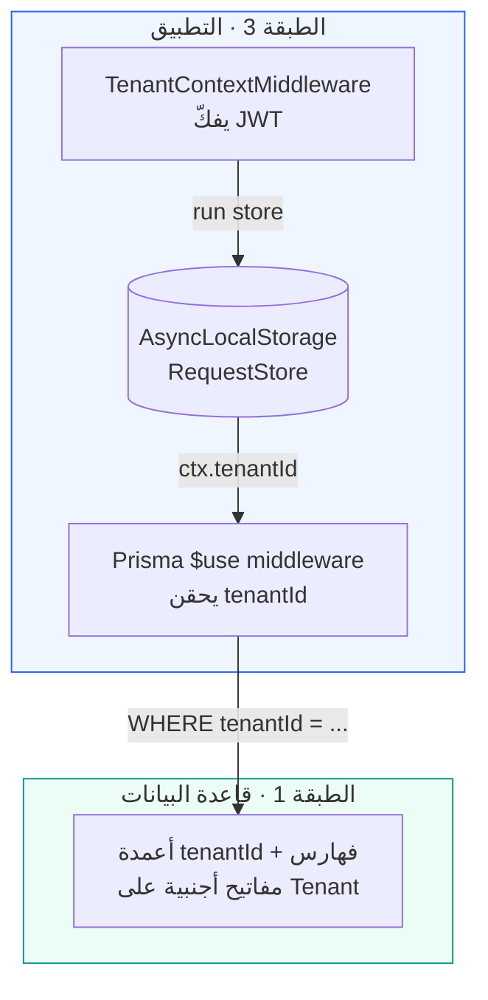
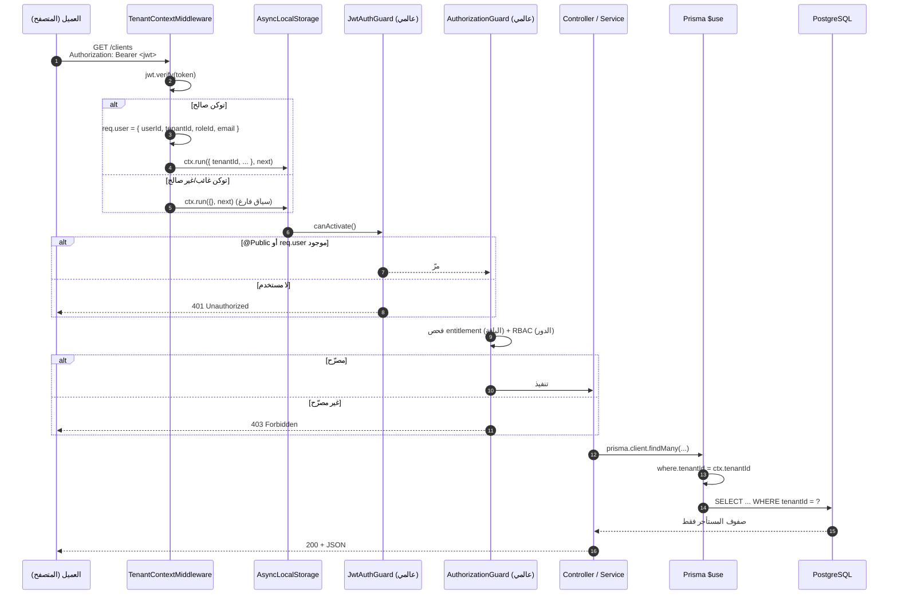

# 04 — الأمان وعزل المستأجرين (Security & Multi-tenancy)

> يصف هذا المستند كيف تفرض منصة IBP **عزل المستأجرين** و**المصادقة** و**سجل التدقيق** و**الامتثال** (PDPL/NCA). جوهر النظام عزلٌ بثلاث طبقات: مفاتيح أجنبية على `tenantId` في قاعدة البيانات، سياق طلب عبر `AsyncLocalStorage`، و**Prisma middleware** يحقن `tenantId` في كل استعلام تلقائياً. كل ما هنا مستخرج من الكود الفعلي — المسارات مذكورة بجانب كل ادّعاء. يلتزم هذا المستند بـ [CLAUDE.md](../CLAUDE.md) §3 (العزل، الأمان، الامتثال).

## جدول المحتويات
- [1. نظرة عامة على نموذج التهديد](#1-نظرة-عامة-على-نموذج-التهديد)
- [2. عزل المستأجرين بثلاث طبقات](#2-عزل-المستأجرين-بثلاث-طبقات)
  - [2.1 الطبقة 1 — قاعدة البيانات (FK على tenantId)](#21-الطبقة-1--قاعدة-البيانات-fk-على-tenantid)
  - [2.2 الطبقة 2 — سياق الطلب (AsyncLocalStorage)](#22-الطبقة-2--سياق-الطلب-asynclocalstorage)
  - [2.3 الطبقة 3 — Prisma middleware (الحقن التلقائي)](#23-الطبقة-3--prisma-middleware-الحقن-التلقائي)
- [3. المصادقة (Authentication)](#3-المصادقة-authentication)
- [4. مخطط تدفّق التحقق](#4-مخطط-تدفق-التحقق)
- [5. سجل التدقيق (Audit Log)](#5-سجل-التدقيق-audit-log)
- [6. الامتثال (PDPL / NCA)](#6-الامتثال-pdpl--nca)
- [7. صلابة الحدود (Hardening)](#7-صلابة-الحدود-hardening)
- [8. الاختبارات](#8-الاختبارات)
- [9. انظر أيضاً](#9-انظر-أيضاً)

---

## 1. نظرة عامة على نموذج التهديد

المنصة **SaaS متعددة المستأجرين** — تتعايش بيانات شركات وساطة متعددة في قاعدة بيانات واحدة. التهديد الأخطر هو **التسرّب العابر للمستأجرين** (Cross-tenant leakage): أن يرى مستخدمٌ من مستأجر بيانات مستأجر آخر، أو يعدّلها. قاعدة [CLAUDE.md](../CLAUDE.md) §3 صريحة:

> «**كل** استعلام يُفلتر بـ `tenantId` من سياق الطلب (Prisma middleware يفرضه تلقائياً). ممنوع استعلام بلا نطاق مستأجر. العزل يُفرض في طبقة التفويض، لا بخفاء المسارات.»

التصميم يحقّق ذلك بحيث لا يعتمد العزل على انضباط المطوّر في كتابة `where: { tenantId }` يدوياً — بل **يُحقن قسراً** في طبقة البنية التحتية.

| التهديد | الدفاع | الطبقة |
|---|---|---|
| قراءة بيانات مستأجر آخر بالقوائم | حقن `tenantId` في `where` لكل `findMany`/`count`/... | 3 (Prisma `$use`) |
| تخمين معرّف سجل لمستأجر آخر | إعادة توجيه `findUnique` ⇒ `findFirst` + `tenantId` | 3 (Prisma `$use`) |
| تعديل/حذف عابر للمستأجرين | حقن `tenantId` في `where` لـ `update`/`delete` ⇒ `P2025` | 3 (Prisma `$use`) |
| طلب بلا مصادقة | `JwtAuthGuard` عالمي + رفض `req.user` الفارغ | 3 (المصادقة) |
| توكن مزوّر / منتهٍ | `JwtService.verify` يفشل ⇒ سياق فارغ ⇒ رفض | 2/3 |
| فقدان أثر العمليات الحسّاسة | `AuditService` يسجّل في `auditLog` | — |

---

## 2. عزل المستأجرين بثلاث طبقات

العزل دفاعٌ متعدّد الطبقات (Defense in Depth). كل طبقة كافية وحدها للحدّ من التسرّب، ومجتمعة تجعل التسرّب يتطلّب إخفاقاً في الطبقات الثلاث معاً.



### 2.1 الطبقة 1 — قاعدة البيانات (FK على `tenantId`)

أساس العزل في نموذج البيانات: **كل جدول مملوك للمستأجر يحمل عمود `tenantId`** بمفتاح أجنبي إلى جدول `Tenant`، ومُفهرس به (تفاصيل المخطط في [03-data-model.md](./03-data-model.md) و[`prisma/schema.prisma`](../packages/db/prisma/schema.prisma)). هذا يضمن:

- **سلامة مرجعية**: لا يمكن أن يشير سجل إلى مستأجر غير موجود.
- **أداء الفلترة**: الفهرس على `tenantId` يجعل شرط `WHERE tenantId = ?` رخيصاً.
- **مرساة للطبقة 3**: قائمة الموديلز المملوكة للمستأجر تُشتقّ آلياً من وجود هذا العمود (انظر 2.3).

البيانات المرجعية على مستوى المنصة (مثل كتالوج المنتجات `ProductClass`/`ProductLine`) **لا** تحمل `tenantId` عمداً، فتُستثنى من الفرض تلقائياً — راجع [`catalog.service.ts`](../apps/api/src/modules/catalog/catalog.service.ts).

### 2.2 الطبقة 2 — سياق الطلب (`AsyncLocalStorage`)

سياق المستأجر يُحمل طوال عمر الطلب دون تمريره يدوياً عبر كل دالة، باستخدام `AsyncLocalStorage` من `node:async_hooks`. المصدر: [`request-context.service.ts`](../apps/api/src/common/request-context/request-context.service.ts).

```ts
export interface RequestStore {
  tenantId?: string;
  userId?: string;
  roleId?: string | null;
  email?: string;
}

@Injectable()
export class RequestContextService {
  private readonly als = new AsyncLocalStorage<RequestStore>();
  run<T>(store: RequestStore, fn: () => T): T { return this.als.run(store, fn); }
  get tenantId(): string | undefined { return this.als.getStore()?.tenantId; }
  get userId(): string | undefined { return this.als.getStore()?.userId; }
}
```

من يملأ هذا السياق؟ الـ **`TenantContextMiddleware`** المركّب على كل المسارات (`forRoutes("*")` في [`app.module.ts`](../apps/api/src/app.module.ts)). يفكّ JWT من ترويسة `Authorization: Bearer ...`، يضبط `req.user`، ثم **يلفّ بقية الطلب داخل `ctx.run(store, () => next())`** — لذا أي كود لاحق (Guards، Controllers، Services، Prisma) يقرأ نفس السياق. المصدر: [`tenant-context.middleware.ts`](../apps/api/src/common/middleware/tenant-context.middleware.ts).

```ts
const payload = this.jwt.verify<JwtPayload>(token);
(req as Request & { user?: unknown }).user = {
  userId: payload.sub, tenantId: payload.tenantId,
  roleId: payload.roleId ?? null, email: payload.email,
};
store.tenantId = payload.tenantId;
store.userId = payload.sub;
// ...
this.ctx.run(store, () => next());
```

> توكن غائب أو غير صالح ⇒ السياق يبقى **فارغاً** (الاستثناء يُلتقط بصمت)، والحارس العالمي يرفض المسار المحمي لاحقاً (401). لا يُسمح بمرور طلب بسياق فارغ إلى نقطة محمية.

### 2.3 الطبقة 3 — Prisma middleware (الحقن التلقائي)

قلب الفرض: middleware عبر `prisma.$use(...)` يعترض **كل** عملية على أي موديل يملك `tenantId`، ويحقن الفلتر آلياً. المصدر: [`prisma.service.ts`](../apps/api/src/prisma/prisma.service.ts).

**اشتقاق الموديلز من DMMF (لا قائمة صلبة):** بدل صيانة قائمة يدوية تتقادم، تُشتقّ مجموعة الموديلز المملوكة للمستأجر من خريطة بيانات Prisma وقت الإقلاع:

```ts
const TENANT_MODELS = new Set(
  Prisma.dmmf.datamodel.models
    .filter((m) => m.fields.some((f) => f.name === "tenantId"))
    .map((m) => m.name),
);
```

أي جدول جديد يُضاف بعمود `tenantId` يُحمى **تلقائياً** دون تعديل في هذا الملف.

**سلوك الحقن حسب نوع العملية:**

| نوع العملية | الإجراء | الأثر الأمني |
|---|---|---|
| `findMany`, `findFirst`, `findFirstOrThrow`, `count`, `aggregate`, `groupBy`, `updateMany`, `deleteMany` | إضافة `tenantId` إلى `args.where` | القراءة/الكتابة بالجملة محصورة بالمستأجر |
| `findUnique`, `findUniqueOrThrow` | **إعادة توجيه** إلى `findFirst`/`findFirstOrThrow` + `tenantId` في `where` | معرّف مستأجر آخر ⇒ «غير موجود» (404)، لا تسرّب |
| `create` | إضافة `tenantId` إلى `args.data` | السجل الجديد يُختم بمستأجر الطلب |
| `createMany` | إضافة `tenantId` لكل صف (مصفوفة أو كائن) | إدراج جماعي مختوم |
| `update`, `delete` | إضافة `tenantId` إلى `where` | تعديل/حذف عابر للمستأجرين يفشل بـ `P2025` |
| `upsert` | `tenantId` في `where` + `create` | الإنشاء والتحديث مختومان |

```ts
this.$use(async (params, next) => {
  const tenantId = this.ctx.tenantId;
  // بلا سياق مستأجر (إقلاع/مصادقة) ⇒ لا فرض
  if (!tenantId || !params.model || !TENANT_MODELS.has(params.model)) return next(params);

  if (READ_INJECT.has(params.action)) {
    params.args.where = { ...(params.args.where ?? {}), tenantId };
  } else if (params.action === "findUnique" || params.action === "findUniqueOrThrow") {
    params.action = params.action === "findUnique" ? "findFirst" : "findFirstOrThrow";
    params.args.where = { ...(params.args.where ?? {}), tenantId };
  } // create / createMany / update / delete / upsert ...
  return next(params);
});
```

> **متى يُتخطّى الفرض؟** عند غياب سياق المستأجر فقط: الإقلاع، وتسجيل الدخول (لا توكن بعد — البحث بالبريد غير مفلتر لأن البريد نفسه يحدّد المستأجر، انظر [`auth.service.ts`](../apps/api/src/modules/auth/auth.service.ts))، ومستقبلاً مسارات السوبر-أدمن. هذا تصميمٌ مقصود لا ثغرة: بلا توكن لا يصل المستخدم إلى مسار محمي أساساً.

عند الإقلاع يُسجَّل عدد الموديلز المحمية: `العزل مفعّل على N موديل`.

---

## 3. المصادقة (Authentication)

| المكوّن | التقنية | المصدر |
|---|---|---|
| إصدار التوكن | `@nestjs/jwt` (`JwtModule` عالمي، `expiresIn` = `JWT_EXPIRES_IN` افتراضياً `15m`) | [`auth.module.ts`](../apps/api/src/modules/auth/auth.module.ts) |
| تجزئة كلمة المرور | `bcryptjs` (`bcrypt.compare` للتحقق، `bcrypt.hash(…, 10)` للإنشاء) | [`auth.service.ts`](../apps/api/src/modules/auth/auth.service.ts) |
| فكّ التوكن وضبط السياق | `TenantContextMiddleware` (على كل المسارات) | [`tenant-context.middleware.ts`](../apps/api/src/common/middleware/tenant-context.middleware.ts) |
| فرض المصادقة | `JwtAuthGuard` عالمي (`APP_GUARD`) | [`jwt-auth.guard.ts`](../apps/api/src/modules/auth/jwt-auth.guard.ts) |
| إعفاء مسارات عامة | المزخرف `@Public()` | [`public.decorator.ts`](../apps/api/src/modules/auth/public.decorator.ts) |

**حمولة التوكن (JWT payload):** `{ sub: userId, tenantId, roleId, email }`. هكذا يحمل التوكن **نفسه** هوية المستأجر، فلا يُشتقّ من المسار أو من رأس قابل للتزوير.

**الحارس العالمي:** `JwtAuthGuard` مركّب عبر `APP_GUARD` في [`app.module.ts`](../apps/api/src/app.module.ts)، فيحمي **كل** المسارات افتراضياً. يقرأ علامة `IS_PUBLIC_KEY`؛ إن وُجدت يمرّ، وإلا يتطلّب `req.user?.userId` ويرمي `401 UnauthorizedException("مطلوب تسجيل الدخول")`.

**المسارات العامة فقط** (`@Public()`):

- `POST /auth/login` — تسجيل الدخول ([`auth.controller.ts`](../apps/api/src/modules/auth/auth.controller.ts)).
- `GET /health` و`GET /health/live` — الفحص الصحّي ([`health.controller.ts`](../apps/api/src/modules/health/health.controller.ts)؛ `@Public()` على مستوى المتحكّم كاملاً).

كل ما عداها يتطلّب توكناً صالحاً. ملاحظة: التحقق من صحة التوكن (التوقيع والصلاحية) يجري في **الـ middleware** بـ `jwt.verify`؛ الحارس يكتفي بالتحقق من وجود `req.user` الناتج.

---

## 4. مخطط تدفّق التحقق

التسلسل الكامل لطلب محمي (مثل `GET /clients`)، من الترويسة حتى الاستعلام المعزول:



> فحص الـ `AuthorizationGuard` (entitlement + RBAC) موثّق تفصيلاً في [05-rbac-and-entitlements.md](./05-rbac-and-entitlements.md).

---

## 5. سجل التدقيق (Audit Log)

مطلب تنظيمي ([CLAUDE.md](../CLAUDE.md) §3 و§7 #5): تُسجَّل كل عملية حسّاسة (إنشاء/تعديل/حذف، توليد رابط ملف، تحقق، اعتماد). المصدر: [`audit.service.ts`](../apps/api/src/common/audit/audit.service.ts).

```ts
export interface AuditParams {
  action: string;   // login | create | update | delete | file_url | verify | approve ...
  entity: string;
  entityId?: string;
  tenantId?: string;       // يُمرَّر صراحةً عند غياب السياق (مثل login)
  userId?: string | null;
  meta?: Prisma.InputJsonValue;
}
```

خصائص رئيسية:

- **مختوم بالمستأجر**: `tenantId` يُؤخذ من الوسيط الصريح أو من السياق (`ctx.tenantId`). إن غاب الاثنان لا يُسجَّل شيء (`if (!tenantId) return`).
- **لا يُفشل العملية الأصلية**: فشل الكتابة في `auditLog` يُلتقط ويُسجَّل تحذيراً فقط (`logger.warn`)، فلا يُسقط الطلب الأساسي.
- **يُمرَّر صراحةً عند غياب السياق**: تسجيل الدخول الناجح يُسجَّل بتمرير `tenantId`/`userId` يدوياً لأن السياق لم يُملأ بعد (لا توكن).

**أمثلة فعلية على العمليات المسجّلة** (من خدمات المرحلة الحالية):

| المسار | `action` | `entity` |
|---|---|---|
| `POST /auth/login` | `login` | `auth` |
| `POST /clients` | `create` | `client` |
| `POST /clients/:id/compliance` | `approve` | `client` |
| `POST /requests` | `create` | `policy_request` |
| `POST /slips` | `create` | `slip` |
| `POST /slips/:id/quotations` | `create` | `quotation` |
| `POST /slips/:id/select` (Firm Order) | `approve` | `firm_order` |
| `POST /staff` | `create` | `user` |

بنية جدول `AuditLog` (الحقول: `tenantId`, `userId`, `action`, `entity`, `entityId`, `meta`) في [03-data-model.md](./03-data-model.md).

---

## 6. الامتثال (PDPL / NCA)

تلتزم المنصة بنظام حماية البيانات الشخصية (PDPL) وضوابط الهيئة الوطنية للأمن السيبراني (NCA)، وفق [CLAUDE.md](../CLAUDE.md) §3:

| المتطلّب | الحالة | المرجع |
|---|---|---|
| **توطين البيانات داخل المملكة** | بيانات الإنتاج (والنسخ الاحتياطية والـ logs والمرفقات) داخل المملكة فقط. التطوير ببيانات وهمية فقط؛ التكامل الحكومي عبر Sandbox | [CLAUDE.md](../CLAUDE.md) §3 — `STORAGE_REGION=me-central-1` في [.env.example](../.env.example) |
| **التشفير in-transit** | HTTPS + `helmet()` لترويسات HTTP آمنة | [`main.ts`](../apps/api/src/main.ts) |
| **التشفير at-rest** | تشفير قرص قاعدة البيانات/التخزين على مستوى البنية التحتية (k8s/Terraform) | [02-architecture.md](./02-architecture.md) |
| **روابط مؤقّتة للملفات** | **Presigned URLs** بصلاحية **5 دقائق** (`PRESIGNED_URL_EXPIRY_SECONDS=300`) — تخزين S3-متوافق، لا وصول مباشر للـ bucket | [.env.example](../.env.example) (مخطّط للمرحلة 5) |
| **سجل التدقيق** | كل عملية حسّاسة في `auditLog` (بما فيها `file_url` لتوليد الروابط) | [§5](#5-سجل-التدقيق-audit-log) |
| **لا أسرار في الكود** | كل الأسرار من `.env`؛ يُوفَّر [.env.example](../.env.example) بقيم وهمية | [CLAUDE.md](../CLAUDE.md) §3 |

> الوصول إلى الملفات لا يكون أبداً عبر رابط دائم؛ كل تنزيل/رفع عبر **Presigned URL** قصير الأجل (5 دقائق)، وتوليد الرابط نفسه عملية حسّاسة تُسجَّل في التدقيق. هذه طبقة المرحلة 5 (التخزين) في [ROADMAP.md](../ROADMAP.md).

---

## 7. صلابة الحدود (Hardening)

إعدادات الأمان عند الإقلاع في [`main.ts`](../apps/api/src/main.ts):

- **`helmet()`**: ترويسات HTTP آمنة افتراضياً (CSP، HSTS، إلخ).
- **CORS من البيئة فقط**: `CORS_ORIGINS` (مفصول بفواصل)؛ لا قيم صلبة، `credentials: true`.
- **`ValidationPipe` عالمي** بخيارات `{ whitelist: true, forbidNonWhitelisted: true, transform: true }`:
  - `whitelist`: تُجرَّد الحقول غير المُعرَّفة في الـ DTO.
  - `forbidNonWhitelisted`: أي حقل زائد ⇒ **رفض الطلب (400)** بدل تجاهله بصمت — يمنع تمرير حقول غير متوقّعة (مثل محاولة تمرير `tenantId` يدوياً).
  - `transform`: تحويل الحمولة إلى نوع الـ DTO.
- **`enableShutdownHooks()`**: إغلاق نظيف (يُغلق اتصال Prisma عبر `onModuleDestroy`).

التحقق من المدخلات على حدود الـ API يستخدم `class-validator` في كل DTO — التفاصيل في [06-api-reference.md](./06-api-reference.md).

---

## 8. الاختبارات

اختبار العزل الصريح e2e في [`apps/api/test/isolation.e2e-spec.ts`](../apps/api/test/isolation.e2e-spec.ts) (يتطلّب `pnpm db:seed` — مستأجران: `demo-tenant` / `demo-tenant-2`). يغطّي:

| السيناريو | المتوقّع |
|---|---|
| `/clients` بلا توكن | `401` |
| تسجيل دخول بكلمة مرور خاطئة | `401` |
| المستأجر (أ) يطلب `/clients` | يرى عملاء مستأجره **فقط** (`tenantId === "demo-tenant"`)، ولا يرى `cl2-nukhba` |
| المستأجر (ب) يطلب `/clients` | يرى عملاء مستأجره فقط (`demo-tenant-2`) |
| (أ) يطلب عميل (ب) بالمعرّف `GET /clients/cl2-nukhba` | `404` (إعادة توجيه `findUnique`⇒`findFirst` + `tenantId`) |
| (ب) يطلب عميل (أ) `GET /clients/cl-fahd` | `404` |
| `/auth/me` للمستأجر (أ) | يعيد `tenantId` و`email` الصحيحين |

> اختبار `404` على المعرّف العابر للمستأجرين هو الدليل المباشر على عمل الطبقة 3 (إعادة توجيه `findUnique`). اختبارات الصلاحيات (RBAC/Entitlements) في [`rbac.e2e-spec.ts`](../apps/api/test/rbac.e2e-spec.ts) — موثّقة في [05-rbac-and-entitlements.md](./05-rbac-and-entitlements.md).

---

## 9. انظر أيضاً

- [01 — نظرة عامة (Overview)](./01-overview.md)
- [02 — المعمار (Architecture)](./02-architecture.md) — تدفّق الطلب والطبقات
- [03 — نموذج البيانات (Data Model)](./03-data-model.md) — أعمدة `tenantId` وجدول `AuditLog`
- [05 — الصلاحيات و Entitlements](./05-rbac-and-entitlements.md) — الفحص المزدوج في `AuthorizationGuard`
- [06 — مرجع الـ API](./06-api-reference.md) — الحماية لكل endpoint
- [CLAUDE.md](../CLAUDE.md) §3 — القواعد غير القابلة للتفاوض
- الكود: [`prisma.service.ts`](../apps/api/src/prisma/prisma.service.ts) · [`tenant-context.middleware.ts`](../apps/api/src/common/middleware/tenant-context.middleware.ts) · [`request-context.service.ts`](../apps/api/src/common/request-context/request-context.service.ts) · [`audit.service.ts`](../apps/api/src/common/audit/audit.service.ts)
