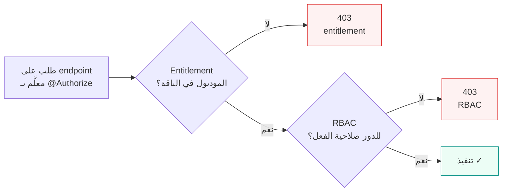
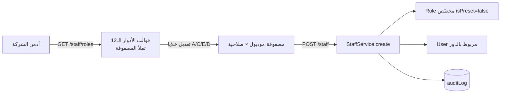

# 05 — الصلاحيات و Entitlements (RBAC & Entitlements)

> الصلاحيات في IBP **ببُعدين منفصلين** ([GUIDELINES.md](../GUIDELINES.md) §3): (أ) **Entitlements الباقة** تحدّد الموديولز المتاحة للمستأجر بحسب اشتراكه؛ (ب) **RBAC الدور** يحدّد ما يفعله الموظف داخل الموديولز المتاحة. كل endpoint محمي بـ **فحص مزدوج**: هل الموديول مفعّل في الباقة؟ وهل للدور صلاحية الفعل؟ كل ما هنا مستخرج من الكود — المسارات مذكورة.

## جدول المحتويات
- [1. البُعدان: لماذا منفصلان؟](#1-البعدان-لماذا-منفصلان)
- [2. البُعد (أ) — Entitlements الباقة](#2-البعد-أ--entitlements-الباقة)
- [3. البُعد (ب) — RBAC الدور](#3-البعد-ب--rbac-الدور)
  - [3.1 موديولز RBAC وأفعالها](#31-موديولز-rbac-وأفعالها)
  - [3.2 ربط الفعل بعمود الصلاحية](#32-ربط-الفعل-بعمود-الصلاحية)
- [4. الفحص المزدوج: @Authorize + AuthorizationGuard](#4-الفحص-المزدوج-authorize--authorizationguard)
- [5. كيف تُحرس كل endpoint](#5-كيف-تحرس-كل-endpoint)
- [6. مصفوفة الأدوار الـ12 الجاهزة](#6-مصفوفة-الأدوار-الـ12-الجاهزة)
- [7. شاشة إنشاء الموظف بمصفوفة الصلاحيات](#7-شاشة-إنشاء-الموظف-بمصفوفة-الصلاحيات)
- [8. الاختبارات](#8-الاختبارات)
- [9. انظر أيضاً](#9-انظر-أيضاً)

---

## 1. البُعدان: لماذا منفصلان؟

| البُعد | يجيب عن | المصدر | الفشل ⇒ |
|---|---|---|---|
| **Entitlement** (الباقة) | هل **المستأجر** اشترك في هذا الموديول؟ | [`entitlement.service.ts`](../apps/api/src/modules/rbac/entitlement.service.ts) | `403` «الموديول غير مفعّل في باقة المستأجر» |
| **RBAC** (الدور) | هل لـ **دور المستخدم** صلاحية هذا الفعل على الموديول؟ | [`permission.service.ts`](../apps/api/src/modules/rbac/permission.service.ts) | `403` «لا تملك صلاحية لهذا الإجراء» |

الفصل ضروري: قد يكون موديول المطالبات **مفعّلاً في الباقة** لكن موظفاً معيّناً **بلا صلاحية** عليه (محاسب مثلاً) — يُمنع بالـ RBAC. وقد يملك دورٌ صلاحية المطالبات نظرياً لكن **الباقة لا تتضمنها** — يُمنع بالـ Entitlement. الفحصان **مستقلان**، وكلاهما يجب أن يمرّ.



---

## 2. البُعد (أ) — Entitlements الباقة

`EntitlementService.isFeatureEnabled(tenantId, featureKey)` يجيب: هل الميزة/الموديول مفعّل في اشتراك المستأجر؟ المصدر: [`entitlement.service.ts`](../apps/api/src/modules/rbac/entitlement.service.ts).

```ts
async isFeatureEnabled(tenantId: string, featureKey: string): Promise<boolean> {
  const sub = await this.prisma.subscription.findFirst({
    where: { tenantId },
    include: { plan: { include: { entitlements: true } }, addons: true },
  });
  if (!sub) return false;
  // 1) اشتُري كـ add-on صراحةً ⇒ مسموح
  if (sub.addons.some((a) => a.addonKey === featureKey)) return true;
  // 2) من entitlements الباقة
  const ent = sub.plan.entitlements.find((e) => e.featureKey === featureKey);
  if (!ent) return false;
  return ent.mode === "INCLUDED" || ent.mode === "QUOTA" || ent.mode === "METERED";
}
```

**قاعدة القرار:**

| الحالة | النتيجة |
|---|---|
| لا اشتراك للمستأجر | **مقفل** |
| اشتُري كـ **add-on** (`addonKey === featureKey`) | **مسموح** |
| entitlement موجود ووضعه `INCLUDED` أو `QUOTA` أو `METERED` | **مسموح** |
| entitlement وضعه `DISABLED` | **مقفل** |
| لا entitlement مطابق إطلاقاً | **مقفل** |

`featureKey` يأخذ شكل `module.<x>` (مثل `module.clients`, `module.sales`, `module.production`, `module.claims`, `module.reports`, `module.compliance`, `module.finance`) — راجع خريطة التنقّل في [`packages/shared/src/modules.ts`](../packages/shared/src/modules.ts).

> `EntitlementService.getEffective(tenantId)` يعيد الخريطة الكاملة (مع `mode`/`quota`/`numericValue`/`enabled`) للواجهات والتقارير — يُستخدم لإظهار/إخفاء عناصر القائمة الجانبية.

نموذج بيانات الاشتراك (`Subscription`, `Plan`, `Entitlement`, `Addon`, الوضع `EntitlementMode`) في [03-data-model.md](./03-data-model.md).

---

## 3. البُعد (ب) — RBAC الدور

`PermissionService.can(roleId, module, action)` يجيب: هل لدور المستخدم صلاحية الفعل على الموديول؟ المصدر: [`permission.service.ts`](../apps/api/src/modules/rbac/permission.service.ts).

```ts
async can(roleId: string | null, module: RbacModule, action: RbacAction): Promise<boolean> {
  if (!roleId) return false;
  const role = await this.prisma.role.findFirst({
    where: { id: roleId },
    include: { permissions: { where: { module } } },
  });
  const perm = role?.permissions[0];
  return perm ? perm[ACTION_FLAG[action]] === true : false;
}
```

> الدور يُحمَّل ضمن **نطاق المستأجر** (Prisma middleware) فلا يُقرأ دور مستأجر آخر — العزل من [04-security-and-multitenancy.md](./04-security-and-multitenancy.md) يسري هنا أيضاً. `roleId` فارغ ⇒ **مرفوض** فوراً.

### 3.1 موديولز RBAC وأفعالها

المصدر: [`rbac.constants.ts`](../apps/api/src/modules/rbac/rbac.constants.ts) (مطابق لـ [`packages/shared/src/rbac.ts`](../packages/shared/src/rbac.ts) و[BLUEPRINT.md](../BLUEPRINT.md) §4).

**الموديولز الـ12** (`RBAC_MODULES`):

`dashboard` · `sales` · `clients` · `underwriting` (الاكتتاب/RFQ) · `production` (الإصدار) · `renewals` · `service` · `claims` · `finance` · `reports` · `compliance` · `hr` · `settings`

**الأفعال** (`RbacAction`): `read` · `create` · `update` · `delete` · **`revert`** (التراجع خطوة للوراء — E4).

### 3.2 ربط الفعل بعمود الصلاحية

كل فعل يقابل عموداً منطقياً في جدول `Permission` عبر `ACTION_FLAG`:

| الفعل (`RbacAction`) | العمود في `Permission` | الرمز في المصفوفة |
|---|---|---|
| `read` | `canAccess` | **A** (وصول) |
| `create` | `canCreate` | **C** (إضافة) |
| `update` | `canEdit` | **E** (تعديل) |
| `delete` | `canDelete` | **D** (حذف) |
| `revert` | `canRevert` | **R** (تراجع خطوة — إشرافي) |

```ts
export const ACTION_FLAG: Record<RbacAction, "canAccess" | "canCreate" | "canEdit" | "canDelete" | "canRevert"> = {
  read: "canAccess", create: "canCreate", update: "canEdit", delete: "canDelete", revert: "canRevert",
};
```

> **فلترة العرض حسب الصلاحية:** إضافةً للفرض في الـbackend، **القائمة الجانبية مُفلترة** — كل موظف لا يرى إلا الأقسام التي يملك `canAccess` على وحدتها (عبر `/auth/me` الذي يُرجِع خريطة الصلاحيات). دفاع مزدوج (عرض + backend).

---

## 4. الفحص المزدوج: @Authorize + AuthorizationGuard

المزخرف `@Authorize({ module, action, entitlement })` يُعلّم الـ endpoint بمتطلّباته، والحارس العالمي `AuthorizationGuard` يطبّقها. المصادر: [`authorize.decorator.ts`](../apps/api/src/modules/rbac/authorize.decorator.ts) · [`authorization.guard.ts`](../apps/api/src/modules/rbac/authorization.guard.ts) · مركّب عالمياً في [`rbac.module.ts`](../apps/api/src/modules/rbac/rbac.module.ts).

```ts
export interface AuthorizeMeta {
  module?: RbacModule;   // موديول RBAC المطلوبة صلاحيته
  action?: RbacAction;   // read | create | update | delete
  entitlement?: string;  // مفتاح الباقة المطلوب تفعيله (مثل module.claims)
}
```

تسلسل الحارس (`canActivate`):

```ts
const meta = this.reflector.getAllAndOverride<AuthorizeMeta>(AUTHORIZE_KEY, [getHandler, getClass]);
if (!meta) return true;                                  // بلا @Authorize ⇒ يمرّ (يحرسه JwtAuthGuard للمصادقة فقط)
const user = req.user;
if (!user) throw new ForbiddenException("غير مصرّح");

if (meta.entitlement) {                                  // 1) فحص الباقة
  if (!(await this.entitlements.isFeatureEnabled(user.tenantId, meta.entitlement)))
    throw new ForbiddenException("الموديول غير مفعّل في باقة المستأجر (entitlement)");
}
if (meta.module && meta.action) {                        // 2) فحص الدور
  if (!(await this.permissions.can(user.roleId, meta.module, meta.action)))
    throw new ForbiddenException("لا تملك صلاحية لهذا الإجراء (RBAC)");
}
return true;
```

نقاط مهمة:

- **الترتيب**: الـ entitlement أولاً ثم RBAC. كلاهما يرمي `403` عند الفشل.
- **اختياريّة الحقول**: endpoint قد يطلب الاثنين، أو RBAC فقط (مثل `/staff` بـ `settings` بلا entitlement)، أو لا شيء (بلا `@Authorize` ⇒ يكفي أن يكون مصادَقاً، مثل `/catalog`).
- **حارسان عالميان متتاليان**: `JwtAuthGuard` (المصادقة، من [04](./04-security-and-multitenancy.md)) ثم `AuthorizationGuard` (التفويض). المسارات بلا `@Authorize` تمرّ من الثاني.

---

## 5. كيف تُحرس كل endpoint

كل دالة في المتحكّمات تُزيَّن بـ `@Authorize(...)` حسب حساسيتها. أمثلة فعلية:

| Endpoint | `@Authorize` | الملاحظة |
|---|---|---|
| `GET /clients` · `GET /clients/:id` | `{ module: "clients", action: "read", entitlement: "module.clients" }` | [`clients.controller.ts`](../apps/api/src/modules/clients/clients.controller.ts) |
| `POST /clients` | `{ module: "clients", action: "create", entitlement: "module.clients" }` | |
| `POST /clients/:id/compliance` | `{ module: "compliance", action: "update" }` | بوّابة الالتزام — صلاحية موديول **compliance** (لا entitlement) |
| `GET/POST /requests` | `{ module: "sales", action: "read"\|"create", entitlement: "module.sales" }` | [`requests.controller.ts`](../apps/api/src/modules/requests/requests.controller.ts) |
| `GET/POST /slips`, `/comparison`, `/quotations` | `{ module: "production", action: "read"\|"create", entitlement: "module.production" }` | [`slips.controller.ts`](../apps/api/src/modules/underwriting/slips.controller.ts) |
| `POST /slips/:id/select` | `{ module: "production", action: "update", entitlement: "module.production" }` | أمر الإسناد (Firm Order) |
| `GET /claims` | `{ module: "claims", action: "read", entitlement: "module.claims" }` | فحص مزدوج كامل |
| `GET /staff`, `GET /staff/roles` | `{ module: "settings", action: "read" }` | RBAC فقط (لا entitlement) |
| `POST /staff` | `{ module: "settings", action: "create" }` | |

> ملاحظة معمارية: بوّابة الالتزام (`POST /clients/:id/compliance`) تستخدم موديول `compliance` لا `clients` — فالاعتماد سلطة قسم الالتزام لا قسم المبيعات. هذا يطابق المصفوفة في §6 (المدير العام ومدير الالتزام فقط يملكان `compliance`).

---

## 6. مصفوفة الأدوار الـ12 الجاهزة

القوالب الجاهزة (Preset Roles) منقولة حرفياً من [BLUEPRINT.md](../BLUEPRINT.md) §4 ومعرّفة في [`packages/shared/src/rbac.ts`](../packages/shared/src/rbac.ts). تُزرع كأدوار `isPreset` وتملأ مصفوفة شاشة إنشاء الموظف.

**مفتاح الرموز:** **A** = وصول (`read`/`canAccess`) · **C** = إضافة (`create`/`canCreate`) · **E** = تعديل (`update`/`canEdit`) · **D** = حذف (`delete`/`canDelete`) · **—** = بلا صلاحية.

ترتيب الأعمدة كما في `RBAC_MODULES`: `dashboard, sales, clients, production, renewals, service, claims, finance, reports, compliance, hr, settings`.

| الدور (`code`) | الاسم | dashboard | sales | clients | production | renewals | service | claims | finance | reports | compliance | hr | settings |
|---|---|:---:|:---:|:---:|:---:|:---:|:---:|:---:|:---:|:---:|:---:|:---:|:---:|
| `general_manager` | المدير العام | A | ACED | ACED | ACED | ACED | ACED | ACED | ACED | ACED | ACED | ACED | ACED |
| `sales_manager` | مدير المبيعات | A | ACED | ACE | — | ACE | — | — | — | A | — | — | — |
| `sales_rep` | ممثل مبيعات | A | ACE | ACE | — | — | — | — | — | — | — | — | — |
| `pricing_officer` | مسؤول التسعير | A | AE | — | ACE | ACE | — | — | — | A | — | — | — |
| `policy_admin` | مسؤول إدارة الوثائق | A | — | A | ACE | — | A | — | — | — | — | — | — |
| `customer_care_manager` | مدير عناية العملاء | A | — | AE | — | — | ACED | A | — | A | — | — | — |
| `claims_officer` | مسؤول المطالبات | A | — | A | — | — | A | ACE | — | — | — | — | — |
| `accountant` | المحاسب / مدير مالي | A | — | — | — | — | — | — | ACED | A | — | — | — |
| `collector` | محصّل | A | — | A | — | — | — | — | AE | — | — | — | — |
| `compliance_manager` | مدير الالتزام | A | A | — | A | — | — | A | A | A | ACED | — | — |
| `hr_manager` | مدير الموارد البشرية | A | — | — | — | — | — | — | — | — | — | ACED | — |
| `admin_assistant` | مساعد إداري | A | — | — | — | — | — | — | — | — | — | A | — |

> الأدوار كلها تملك **A** على `dashboard` (لوحة البيانات متاحة للجميع). فقط **المدير العام** يملك صلاحية كاملة على كل الموديولز (ACED شاملة)، ووحده مع **مدير الالتزام** يملكان `compliance`. الدالة `parsePerm(code)` في [`packages/shared/src/rbac.ts`](../packages/shared/src/rbac.ts) تحوّل رمزاً مثل `"ACED"` إلى مجموعة الأعلام المنطقية.

---

## 7. شاشة إنشاء الموظف بمصفوفة الصلاحيات

عند إنشاء موظف يُنشأ له **دور مخصّص** (`isPreset: false`) من **مصفوفة صلاحيات** ترسلها الواجهة — صف لكل موديول بأعلام A/C/E/D. المصدر: [`staff.service.ts`](../apps/api/src/modules/staff/staff.service.ts) و[`create-staff.dto.ts`](../apps/api/src/modules/staff/dto/create-staff.dto.ts).

```ts
export class PermissionRowDto {
  @IsIn(RBAC_MODULES) module!: string;   // أحد الموديولز الـ12
  @IsBoolean() canAccess!: boolean;       // A
  @IsBoolean() canCreate!: boolean;       // C
  @IsBoolean() canEdit!: boolean;         // E
  @IsBoolean() canDelete!: boolean;       // D
}
export class CreateStaffDto {
  fullName; email; password; roleName;
  @ValidateNested({ each: true }) @Type(() => PermissionRowDto)
  permissions!: PermissionRowDto[];
}
```

التدفّق (في معاملة ذرّية `$transaction`):

1. التحقق من عدم تكرار البريد ضمن المستأجر (`409` وإلا).
2. تجزئة كلمة المرور بـ `bcrypt.hash(…, 10)`.
3. إنشاء `Role` بـ `name: roleName` و`isPreset: false`، وإنشاء صفوف `Permission` من المصفوفة.
4. إنشاء `User` مربوط بالدور، حالته `ACTIVE`.
5. تسجيل العملية في `auditLog` (`action: create`, `entity: user`).

شاشة الإنشاء تُهيّأ بقوالب الأدوار الجاهزة عبر `GET /staff/roles` (`roleTemplates()` يعيد أدوار `isPreset` مع صفوف صلاحياتها) — فيختار الأدمن قالباً يملأ المصفوفة ثم يعدّلها قبل الحفظ.



---

## 8. الاختبارات

اختبار الصلاحيات الصريح e2e في [`apps/api/test/rbac.e2e-spec.ts`](../apps/api/test/rbac.e2e-spec.ts) (يتطلّب `pnpm db:seed`). يغطّي البُعدين معاً:

| الفئة | السيناريو | المتوقّع |
|---|---|---|
| **Entitlement** | الأمان (باقة basic) يطلب `/claims` — الموديول خارج الباقة | `403` |
| **Entitlement** | الخليج (premium + add-on مطالبات) يطلب `/claims` لمسؤول المطالبات | `200` |
| **Entitlement** | المدير العام (الخليج) يطلب `/claims` | `200` |
| **RBAC** | المحاسبة تطلب `/clients` — لا صلاحية للموديول | `403` |
| **RBAC** | المحاسبة تطلب `/claims` — **رغم تفعيل الباقة** لا صلاحية للدور | `403` (دليل استقلال البُعدين) |
| **RBAC** | المدير العام يطلب `/clients` | `200` |
| **settings** | مدير المبيعات يطلب `/staff` (لا صلاحية `settings`) | `403` |
| **settings** | المدير العام يطلب `/staff` | `200` |
| **settings** | مدير المبيعات يحاول `POST /staff` | `403` |
| **إنشاء + تطبيق** | المدير العام ينشئ موظفاً بمصفوفة (`clients: A` فقط) | `201`؛ الموظف الجديد يصل `/clients` (`200`) لكنه يُمنع من `/staff` (`403`) |

> الحالة المحورية: **المحاسبة تُمنع من `/claims` رغم أن الباقة تفعّلها** — تثبت أن الفحصين مستقلان وأن RBAC يحجب حتى لو مرّ الـ entitlement.

---

## 9. انظر أيضاً

- [01 — نظرة عامة (Overview)](./01-overview.md)
- [03 — نموذج البيانات (Data Model)](./03-data-model.md) — `Role`, `Permission`, `Subscription`, `Entitlement`, `Addon`
- [04 — الأمان وعزل المستأجرين](./04-security-and-multitenancy.md) — `JwtAuthGuard` والعزل الذي يحمي قراءة الأدوار
- [06 — مرجع الـ API](./06-api-reference.md) — `@Authorize` لكل endpoint
- [BLUEPRINT.md](../BLUEPRINT.md) §4 — مصدر مصفوفة الأدوار
- [GUIDELINES.md](../GUIDELINES.md) §3 — قاعدة البُعدين المنفصلين
- الكود: [`entitlement.service.ts`](../apps/api/src/modules/rbac/entitlement.service.ts) · [`permission.service.ts`](../apps/api/src/modules/rbac/permission.service.ts) · [`authorization.guard.ts`](../apps/api/src/modules/rbac/authorization.guard.ts) · [`authorize.decorator.ts`](../apps/api/src/modules/rbac/authorize.decorator.ts) · [`rbac.constants.ts`](../apps/api/src/modules/rbac/rbac.constants.ts) · [`packages/shared/src/rbac.ts`](../packages/shared/src/rbac.ts)
