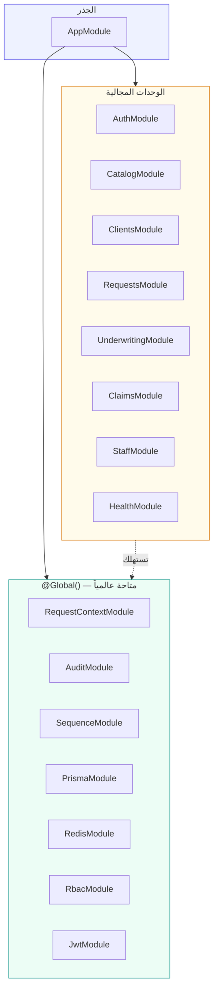
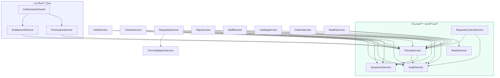

# 07 — وحدات الـ Backend (NestJS Modules)

> مرجع كل وحدة (module) في خدمة الـ API (NestJS 10، Prisma 5، PostgreSQL، Redis). معماري وحدات — module لكل مجال ([GUIDELINES.md](../GUIDELINES.md) §5). كل وحدة تُضاف في مرحلتها بـ [ROADMAP.md](../ROADMAP.md)، ولا يُكتب كود مرحلة قبل اعتمادها (راجع [`src/modules/README.md`](../apps/api/src/modules/README.md)). كل ما هنا مستخرَج من الكود الفعلي — الملفات مذكورة بروابط نسبية.

## جدول المحتويات
- [1. خريطة الوحدات](#1-خريطة-الوحدات)
- [2. الوحدة الجذرية (AppModule)](#2-الوحدة-الجذرية-appmodule)
- [3. وحدات common المشتركة](#3-وحدات-common-المشتركة)
  - [3.1 RequestContext (ALS)](#31-requestcontext-als)
  - [3.2 TenantContext Middleware](#32-tenantcontext-middleware)
  - [3.3 Audit (AuditService)](#33-audit-auditservice)
  - [3.4 Sequence (SequenceService)](#34-sequence-sequenceservice)
- [4. وحدات البنية التحتية](#4-وحدات-البنية-التحتية)
  - [4.1 Prisma (PrismaService + $use)](#41-prisma-prismaservice--use)
  - [4.2 Redis (RedisService)](#42-redis-redisservice)
- [5. الوحدات المجالية (Domain Modules)](#5-الوحدات-المجالية-domain-modules)
  - [5.1 Auth](#51-auth)
  - [5.2 RBAC](#52-rbac)
  - [5.3 Catalog](#53-catalog)
  - [5.4 Clients](#54-clients)
  - [5.5 Requests](#55-requests)
  - [5.6 Underwriting (Slips)](#56-underwriting-slips)
  - [5.7 Claims](#57-claims)
  - [5.8 Staff](#58-staff)
  - [5.9 Health](#59-health)
- [6. جدول: الوحدة → المرحلة → الحالة](#6-جدول-الوحدة--المرحلة--الحالة)
- [7. مخطط التبعيات بين الوحدات](#7-مخطط-التبعيات-بين-الوحدات)
- [8. انظر أيضاً](#8-انظر-أيضاً)

---

## 1. خريطة الوحدات

ينقسم الـ API إلى ثلاث طبقات وحدات:

| الطبقة | الموقع | الدور |
|---|---|---|
| **الجذر** | [`app.module.ts`](../apps/api/src/app.module.ts) | تركيب الوحدات + حارسان عالميان (`JwtAuthGuard`, `AuthorizationGuard`) + middleware السياق |
| **common المشتركة** | [`src/common/`](../apps/api/src/common) | خدمات أفقية عابرة للمجالات: سياق الطلب، التدقيق، التسلسل |
| **البنية التحتية** | [`src/prisma/`](../apps/api/src/prisma) · [`src/redis/`](../apps/api/src/redis) | عملاء قاعدة البيانات والكاش كـ Providers |
| **المجالية** | [`src/modules/`](../apps/api/src/modules) | منطق الأعمال: auth, rbac, catalog, clients, requests, underwriting, production, finance, **producers**, **form-templates**, documents, service, claims, renewals, verification, **platform**, **portal**, **reports**, **compliance**, **regulatory**, **finance/zatca**, **crm**, **reminders**, **email** (BYO Resend)، **billing** (اشتراكات + بوّابة دفع Tap)، **payments** (إعدادات دفع المستأجر + دفع العميل)، **complaints** (سجلّ الشكاوى + تقرير تنظيمي)، **aml** (مكافحة غسل الأموال: مخاطر/فرز/STR)، **cover-notes** (مذكرة التغطية المؤقتة §4.2)، **bank** (الحسابات والتسوية البنكية §1.6)، **budget** (الموازنة التقديرية مقابل الفعلي §1.8)، staff, health |

> **اصطلاح `@Global()`:** الوحدات المشتركة والبنية التحتية معلَّمة `@Global()`، فتُصدِّر خدماتها لكل الوحدات دون استيراد متكرر. الوحدات المجالية وحدات عادية (غير عالمية) تُسجَّل في `AppModule`.

---

## 2. الوحدة الجذرية (AppModule)

**الملف:** [`app.module.ts`](../apps/api/src/app.module.ts)

**الغرض:** تجميع كل الوحدات وتركيب طبقتي الحماية العالميتين وميدلوير سياق المستأجر.

**ما تُركّبه:**

| العنصر | النوع | الدور |
|---|---|---|
| `JwtAuthGuard` | `APP_GUARD` عالمي | يتطلّب مصادقة على كل المسارات إلا `@Public` ([§5.1](#51-auth)) |
| `AuthorizationGuard` | `APP_GUARD` عالمي (يُسجَّل في `RbacModule`) | الفحص المزدوج entitlement + RBAC على `@Authorize` ([§5.2](#52-rbac)) |
| `TenantContextMiddleware` | middleware على `forRoutes("*")` | يفكّ JWT ويضبط سياق المستأجر (ALS) قبل كل طلب ([§3.2](#32-tenantcontext-middleware)) |
| `ConfigModule.forRoot({ isGlobal: true })` | إعدادات | تحميل متغيّرات البيئة عالمياً |

**ترتيب التنفيذ لكل طلب:** middleware (`TenantContextMiddleware`) ← الحارسان (`JwtAuthGuard` ثم `AuthorizationGuard`) ← `ValidationPipe` ← المتحكّم. ضبط السياق في الـ middleware يسبق كل شيء، فيصل `tenantId` إلى Prisma middleware داخل الخدمات تلقائياً.

> **ملاحظة حوكمة:** `main.ts` ([`main.ts`](../apps/api/src/main.ts)) يضيف `helmet()`، CORS من `CORS_ORIGINS` فقط (لا قيم صلبة)، و`ValidationPipe` عالمي بـ `whitelist + forbidNonWhitelisted + transform` — لا يُقبل أي حقل خارج الـ DTO.

---

## 3. وحدات common المشتركة

خدمات أفقية لا تخصّ مجالاً بعينه، كلها `@Global()`.

### 3.1 RequestContext (ALS)

**الملفات:** [`request-context.service.ts`](../apps/api/src/common/request-context/request-context.service.ts) · [`request-context.module.ts`](../apps/api/src/common/request-context/request-context.module.ts)

**الغرض:** حمل سياق الطلب (`tenantId`, `userId`, `roleId`, `email`) طوال عمره عبر **AsyncLocalStorage** (ALS) من `node:async_hooks`، دون تمرير `tenantId` يدوياً بين الطبقات.

**الخدمة `RequestContextService`:**

| العضو | الدور |
|---|---|
| `run(store, fn)` | ينفّذ بقية الطلب داخل سياق معطى (يلفّه الـ middleware) |
| `store` | يُرجع الـ `RequestStore` الحالي أو `undefined` |
| `tenantId` / `userId` | اختصارات قراءة من المخزن الحالي |

**ملاحظة العزل:** هذه الخدمة هي **مصدر `tenantId`** الذي يقرؤه Prisma middleware ([§4.1](#41-prisma-prismaservice--use)) و`AuditService` ([§3.3](#33-audit-auditservice)). أي طلب بلا توكن صالح يجري بمخزن فارغ ⇒ يرفضه `JwtAuthGuard`.

**التبعيات:** لا شيء (وحدة أساس).

### 3.2 TenantContext Middleware

**الملف:** [`tenant-context.middleware.ts`](../apps/api/src/common/middleware/tenant-context.middleware.ts)

**الغرض:** يفكّ `Authorization: Bearer <jwt>`، يتحقّق منه عبر `JwtService.verify`، يضبط `req.user` **و** سياق المستأجر (ALS)، ثم يلفّ بقية الطلب بـ `ctx.run(store, () => next())`.

**سلوك الحواف:**
- توكن غائب أو غير صالح ⇒ مخزن فارغ (لا يُرمى استثناء هنا)؛ المسارات المحمية يرفضها `JwtAuthGuard` لاحقاً، والمسارات `@Public` تمرّ.
- يُسجَّل في `AppModule` على `forRoutes("*")` فيغطّي كل مسار.

**التبعيات:** `JwtService` (من `JwtModule` العالمي في `AuthModule`)، `RequestContextService`.

> **ملاحظة حوكمة:** هذا الميدلوير هو **نقطة الدخول الوحيدة** التي تترجم التوكن إلى سياق مستأجر؛ لا تُحقَن `tenantId` يدوياً في أي مكان آخر.

### 3.3 Audit (AuditService)

**الملفات:** [`audit.service.ts`](../apps/api/src/common/audit/audit.service.ts) · [`audit.module.ts`](../apps/api/src/common/audit/audit.module.ts)

**الغرض:** سجل التدقيق (Audit Trail) — مطلب تنظيمي (هيئة التأمين/PDPL، [GUIDELINES.md](../GUIDELINES.md) §7 #5). يكتب صفّاً في `AuditLog` لكل عملية حسّاسة.

**الخدمة `AuditService.log(params)`:**

| البند | التفصيل |
|---|---|
| المعاملات | `action` (login/create/update/delete/file_url/verify/approve)، `entity`، `entityId?`، `tenantId?`، `userId?`، `meta?` |
| مصدر `tenantId` | `params.tenantId` صراحةً، وإلا من السياق (ALS) — يُمرَّر صراحةً عند غياب السياق (مثل `login`) |
| مبدأ عدم الإفشال | **فشل التدقيق لا يُفشل العملية الأصلية** — يُلتقط الاستثناء ويُسجَّل تحذيراً فقط |
| بلا `tenantId` | يخرج صامتاً (`return`) — لا يكتب صفّاً بلا مستأجر |

**من يستدعيه:** `AuthService` (login)، `ClientsService` (create/approve)، `RequestsService` (create)، `SlipsService` (create slip/quotation/firm_order)، `StaffService` (create user).

**التبعيات:** `PrismaService`، `RequestContextService`.

### 3.4 Sequence (SequenceService)

**الملفات:** [`sequence.service.ts`](../apps/api/src/common/sequence/sequence.service.ts) · [`sequence.module.ts`](../apps/api/src/common/sequence/sequence.module.ts)

**الغرض:** توليد أرقام تسلسلية مقروءة (مبدئي — يكتمل بجدول تسلسلات وفروع في المرحلة 4ب).

| الدالة | الصيغة | المثال | الاستخدام |
|---|---|---|---|
| `nextClientCode()` | `CLI-{السنة}-{1001+count}` | `CLI-2026-1001` | كود العميل التجاري |
| `nextRequestSeq(classCode)` | `SL-{class}-{السنة}-{seq}` | `SL-MED-2026-1001` | رقم الطلب (`PolicyRequest`) |
| `nextSlipSeq(classCode)` | `RFQ-{class}-{السنة}-{seq}` | `RFQ-MED-2026-1001` | رقم طلب الأسعار (`Slip`) |

> **ملاحظة العزل:** العدّ (`count()`) يجري **مفلتراً بالمستأجر تلقائياً** عبر Prisma middleware، فالتسلسل لكل مستأجر مستقل. الصيغة النهائية للمرحلة 4ب: `PREFIX-BRANCH-CLASS-YEAR-SEQ` ([ROADMAP.md](../ROADMAP.md) §4ب).

**التبعيات:** `PrismaService`.

---

## 4. وحدات البنية التحتية

### 4.1 Prisma (PrismaService + $use)

**الملفات:** [`prisma.service.ts`](../apps/api/src/prisma/prisma.service.ts) · [`prisma.module.ts`](../apps/api/src/prisma/prisma.module.ts)

**الغرض:** عميل Prisma كخدمة Nest، يحمل **middleware عزل المستأجرين** عبر `$use` — جوهر العزل ([GUIDELINES.md](../GUIDELINES.md) §3). يُصدَّر من حزمة `@ibp/db`.

**آلية الحارس (`installTenantGuard`):**

1. الموديلات الخاضعة تُشتقّ **آلياً من DMMF**: كل موديل يحوي حقل `tenantId` (لا قائمة صلبة) — `TENANT_MODELS`.
2. لكل استعلام: إن وُجد `tenantId` في السياق والموديل خاضع، يُحقَن الفلتر حسب نوع العملية:

| العملية | الحقن |
|---|---|
| `findMany`/`findFirst`/`count`/`aggregate`/`groupBy`/`updateMany`/`deleteMany` | `where.tenantId` |
| `findUnique`/`findUniqueOrThrow` | يُعاد توجيهها إلى `findFirst`/`findFirstOrThrow` + `where.tenantId` (معرّف مستأجر آخر ⇒ «غير موجود») |
| `create` | `data.tenantId` |
| `createMany` | `tenantId` لكل صف |
| `update`/`delete` | `where.tenantId` (عبور المستأجرين يفشل بـ `P2025`) |
| `upsert` | `where` + `create` كلاهما |

3. **بلا سياق مستأجر** (إقلاع/تسجيل دخول/سوبر أدمن لاحقاً) ⇒ يُتخطّى الفرض — هذا ما يسمح لـ `AuthService.login` بالبحث بالبريد عبر كل المستأجرين.

**دورة الحياة:** `onModuleInit` يتصل ويسجّل عدد الموديلات الخاضعة، و`onModuleDestroy` يقطع الاتصال. `enableShutdownHooks()` في `main.ts` يضمن الإغلاق النظيف.

**التبعيات:** `RequestContextService` (لقراءة `tenantId`).

> **ملاحظة العزل:** هذا أهم ملف أمني في النظام. تفاصيل العزل والحالات الحدّية في [04 — الأمان وتعدد المستأجرين](./04-security-and-multitenancy.md).

### 4.2 Redis (RedisService)

**الملفات:** [`redis.service.ts`](../apps/api/src/redis/redis.service.ts) · [`redis.module.ts`](../apps/api/src/redis/redis.module.ts)

**الغرض:** عميل Redis (ioredis) للكاش والطوابير — يُستخدم لاحقاً مع BullMQ للتذكيرات والمهام ([GUIDELINES.md](../GUIDELINES.md) §2).

| البند | التفصيل |
|---|---|
| الاتصال | `REDIS_URL` من البيئة (افتراضي `redis://localhost:6379`)، `lazyConnect` |
| المرونة | `maxRetriesPerRequest: 2`، `retryStrategy` تصاعدي حتى 2 ثانية، أخطاء كتحذير لا كسقوط |
| `ping()` | يتصل عند الحاجة ويُرجع `true` عند `PONG` — يستخدمه الفحص الصحّي |
| دورة الحياة | `onModuleDestroy` يقطع الاتصال |

**التبعيات:** لا شيء (يقرأ البيئة مباشرة). **المستهلك الحالي:** `HealthService`.

---

## 5. الوحدات المجالية (Domain Modules)

### 5.1 Auth

**المرحلة:** 1 · **الملفات:** [`auth.module.ts`](../apps/api/src/modules/auth/auth.module.ts) · [`auth.service.ts`](../apps/api/src/modules/auth/auth.service.ts) · [`auth.controller.ts`](../apps/api/src/modules/auth/auth.controller.ts)

**الغرض:** المصادقة بـ JWT وإصدار التوكن الحامل لـ `tenantId`.

**المتحكّم والمسارات:**

| المسار | الحماية | الدور |
|---|---|---|
| `POST /auth/login` | `@Public` | بريد + كلمة مرور ⇒ `{ accessToken, user }` |
| `GET /auth/me` | Auth | بيانات المستخدم الحالي (مفلترة بالسياق) |

**الخدمة `AuthService`:**
- `login(email, password)`: يبحث بالبريد **بلا سياق مستأجر** (لا توكن بعد — البريد يحدّد المستأجر)، يقارن `bcrypt`، يُصدر JWT يحمل `{ sub, tenantId, roleId, email }`، ويسجّل `login` في التدقيق بتمرير `tenantId` صراحةً.
- `me(userId)`: يقرأ المستخدم **ضمن السياق** فيُفلتر تلقائياً.

**ملحقات الوحدة:**
- [`jwt-auth.guard.ts`](../apps/api/src/modules/auth/jwt-auth.guard.ts) — الحارس العالمي للمصادقة (يقرأ `@Public`).
- [`public.decorator.ts`](../apps/api/src/modules/auth/public.decorator.ts) — `@Public()` لإعفاء المسار.
- [`current-user.decorator.ts`](../apps/api/src/modules/auth/current-user.decorator.ts) — `@CurrentUser()` لاستخراج `AuthUser` من الطلب.

**التبعيات:** `JwtModule` (عالمي، السر من `JWT_SECRET`، انتهاء `JWT_EXPIRES_IN` أو 8 ساعات)، `PrismaService`، `AuditService`.

> **ملاحظة حوكمة:** `login` هو المسار الوحيد المقصود الذي يجري بلا سياق مستأجر؛ خطأ الدخول يُرجع `401` موحَّداً دون كشف وجود البريد.

### 5.2 RBAC

**المرحلة:** 2 · **الملفات:** [`rbac.module.ts`](../apps/api/src/modules/rbac/rbac.module.ts) · [`entitlement.service.ts`](../apps/api/src/modules/rbac/entitlement.service.ts) · [`permission.service.ts`](../apps/api/src/modules/rbac/permission.service.ts) · [`authorization.guard.ts`](../apps/api/src/modules/rbac/authorization.guard.ts) · [`authorize.decorator.ts`](../apps/api/src/modules/rbac/authorize.decorator.ts) · [`rbac.constants.ts`](../apps/api/src/modules/rbac/rbac.constants.ts)

**الغرض:** محرّك الصلاحيات ببُعدين منفصلين ([GUIDELINES.md](../GUIDELINES.md) §3): entitlement الباقة + RBAC الدور. وحدة `@Global()` تُركّب `AuthorizationGuard` كحارس عالمي.

**الخدمات ومسؤولياتها:**

| الخدمة | المسؤولية |
|---|---|
| `EntitlementService` | `isFeatureEnabled(tenantId, featureKey)`: مفعّل إن كان `INCLUDED`/`QUOTA`/`METERED` أو اشتُري add-on؛ `DISABLED`/غير موجود ⇒ مقفل. و`getEffective(tenantId)` لخريطة كاملة |
| `PermissionService` | `can(roleId, module, action)`: هل لدور المستخدم العمود المطلوب (`ACTION_FLAG`) على الموديول؟ الدور يُحمَّل ضمن نطاق المستأجر |
| `AuthorizationGuard` | يقرأ `@Authorize`، يفحص entitlement أولاً ثم RBAC، يرمي `403` عند أي فشل |

**`@Authorize(meta)`:** يضع metadata `{ module?, action?, entitlement? }` على المتحكّم/المسار. مسار بلا `@Authorize` يمرّ بمصادقة فقط.

**الثوابت ([`rbac.constants.ts`](../apps/api/src/modules/rbac/rbac.constants.ts)):** `RBAC_MODULES` الـ13 (dashboard, sales, clients, underwriting, production, renewals, service, claims, finance, reports, compliance, hr, settings)، الأفعال (`read/create/update/delete`)، و`ACTION_FLAG` الذي يربط الفعل بعمود `Permission` (`canAccess/canCreate/canEdit/canDelete`).

**التبعيات:** `PrismaService`، `Reflector`. التفاصيل الكاملة في [05 — الصلاحيات و Entitlements](./05-rbac-and-entitlements.md).

### 5.3 Catalog

**المرحلة:** 3 · **الملفات:** [`catalog.module.ts`](../apps/api/src/modules/catalog/catalog.module.ts) · [`catalog.service.ts`](../apps/api/src/modules/catalog/catalog.service.ts) · [`catalog.controller.ts`](../apps/api/src/modules/catalog/catalog.controller.ts)

**الغرض:** كتالوج المنتجات (الفئات `ProductClass` والفروع `ProductLine`) ومخطط النموذج الديناميكي (`FormSchema`) — **بيانات مرجعية على مستوى المنصة** (غير مفلترة بمستأجر).

**المتحكّم والمسارات:**

| المسار | الحماية | الدور |
|---|---|---|
| `GET /catalog` | Auth | شجرة الفئات والفروع (لقوائم الاختيار) |
| `GET /catalog/lines/:code` | Auth | فرع واحد + مخطط نموذجه (`baseFields`, `blocks`) |

**الخدمة `CatalogService`:** `tree()` و`line(code)` (يرمي `404` إن لم يوجد الفرع).

> **ملاحظة العزل:** `ProductClass`/`ProductLine`/`FormSchema` **لا تحمل `tenantId`** (مرجعية مشتركة)، فلا يفرض عليها Prisma middleware عزلاً. الحماية بالمصادقة فقط (لا `@Authorize`) لأنها بيانات مرجعية عامة يحتاجها كل موظف لبناء النموذج.

**التبعيات:** `PrismaService`.

### 5.4 Clients

**المرحلة:** 3 · **الملفات:** [`clients.module.ts`](../apps/api/src/modules/clients/clients.module.ts) · [`clients.service.ts`](../apps/api/src/modules/clients/clients.service.ts) · [`clients.controller.ts`](../apps/api/src/modules/clients/clients.controller.ts) · DTOs: [`create-client.dto.ts`](../apps/api/src/modules/clients/dto/create-client.dto.ts) · [`compliance.dto.ts`](../apps/api/src/modules/clients/dto/compliance.dto.ts)

**الغرض:** سجل العملاء (أفراد/منشآت) + الكود التجاري المقروء + **بوّابة الالتزام** (Compliance Gate).

**المتحكّم والمسارات:**

| المسار | الحماية | الدور |
|---|---|---|
| `GET /clients` | `clients:read` + `module.clients` | قائمة العملاء |
| `POST /clients` | `clients:create` + `module.clients` | إنشاء عميل (يبدأ `complianceStatus = PENDING`) |
| `GET /clients/:id` | `clients:read` + `module.clients` | عميل واحد |
| `POST /clients/:id/compliance` | `compliance:update` | **بوّابة الالتزام**: `APPROVED`/`REJECTED` |

**الخدمة `ClientsService`:**
- `create(...)`: يولّد كوداً بـ `SequenceService`، يُنشئ العميل بـ `PENDING`، يلتقط `P2002` ⇒ `409` (تكرار CR/هوية/كود)، يسجّل `create` في التدقيق.
- `setCompliance(...)`: يضبط القرار، يسجّل `approve` في التدقيق — **بوابة حاكمة لكامل دورة الصفقة** (انظر [08](./08-deal-lifecycle-workflows.md)).

> **ملاحظة الحوكمة:** بوّابة الالتزام بصلاحية موديول `compliance` (لا `clients`) — أي **فصل الأدوار**: مدخل العميل (مبيعات) غير معتمده (مدير الالتزام). التفرّد `@@unique([tenantId, …])` يسمح بـ NULL متعدد (أفراد بلا CR، منشآت بلا هوية).

### 5.5 Requests

**المرحلة:** 3 · **الملفات:** [`requests.module.ts`](../apps/api/src/modules/requests/requests.module.ts) · [`requests.service.ts`](../apps/api/src/modules/requests/requests.service.ts) · [`form-validation.service.ts`](../apps/api/src/modules/requests/form-validation.service.ts) · [`requests.controller.ts`](../apps/api/src/modules/requests/requests.controller.ts) · DTO: [`create-request.dto.ts`](../apps/api/src/modules/requests/dto/create-request.dto.ts)

**الغرض:** محرّك طلب التأمين (`PolicyRequest`) بالنموذج الديناميكي المحقّق ضد مخطط الفرع، مع كتل متكررة عامة (`RequestBlockRow`).

**المتحكّم والمسارات:**

| المسار | الحماية | الدور |
|---|---|---|
| `GET /requests` | `sales:read` + `module.sales` | قائمة الطلبات |
| `POST /requests` | `sales:create` + `module.sales` | إنشاء طلب محقَّق |
| `GET /requests/:id` | `sales:read` + `module.sales` | طلب واحد + صفوف الكتل |

**الخدمات ومسؤولياتها:**

| الخدمة | المسؤولية |
|---|---|
| `RequestsService` | يتحقّق من العميل ضمن المستأجر، **يفرض بوّابة الالتزام** (`complianceStatus !== APPROVED` ⇒ `409`)، يجلب مخطط الفرع، يستدعي المحقّق، يولّد التسلسل، ويُنشئ الطلب + صفوف الكتل **ذرّياً** عبر `$transaction` |
| `FormValidationService` | محرّك تحقّق **عام** لأي منتج: يفحص الحقول الأساسية والكتل المتكررة (`required`, `min/max`, الأنواع `number/currency/percent/date/select/nationalId/email/boolean`) ويُرجع مصفوفة أخطاء عربية |

**التحقّق:** فشل المخطط ⇒ `422 UnprocessableEntity` بجسم `{ message, errors }` (تحقّق المحتوى)، بخلاف `400` من `ValidationPipe` (تحقّق الشكل).

> **ملاحظة الحوكمة:** نقطتا حوكمة هنا — (1) لا طلب قبل اعتماد الالتزام؛ (2) لا طلب يخالف مخطط الفرع. الكتل تُخزَّن في جدول عام واحد (`RequestBlockRow`) مدفوع بالمخطط لا بجداول ثابتة.

### 5.6 Underwriting (Slips)

**المرحلة:** 4أ · **الملفات:** [`underwriting.module.ts`](../apps/api/src/modules/underwriting/underwriting.module.ts) · [`slips.service.ts`](../apps/api/src/modules/underwriting/slips.service.ts) · [`slips.controller.ts`](../apps/api/src/modules/underwriting/slips.controller.ts) · DTOs: [`create-slip.dto.ts`](../apps/api/src/modules/underwriting/dto/create-slip.dto.ts) · [`create-quotation.dto.ts`](../apps/api/src/modules/underwriting/dto/create-quotation.dto.ts) · [`select-quotation.dto.ts`](../apps/api/src/modules/underwriting/dto/select-quotation.dto.ts)

**الغرض:** الاكتتاب الفني (RFQ): طلب الأسعار (`Slip`)، عروض شركات التأمين الهجينة (`Quotation`)، جدول المقارنة الآلي، وأمر الإسناد (Firm Order).

**المتحكّم والمسارات:**

| المسار | الحماية | الدور |
|---|---|---|
| `GET /slips` | `production:read` + `module.production` | قائمة طلبات الأسعار |
| `POST /slips` | `production:create` + `module.production` | إنشاء Slip (يتطلّب التزاماً معتمداً ⇒ الطلب `QUOTING`) |
| `GET /slips/:id` | `production:read` + `module.production` | Slip واحد + عروضه |
| `GET /slips/:id/comparison` | `production:read` + `module.production` | **جدول المقارنة الآلي** + الأرخص |
| `POST /slips/:id/quotations` | `production:create` + `module.production` | إضافة عرض هجين |
| `POST /slips/:id/select` | `production:update` + `module.production` | **Firm Order** ⇒ الطلب `AWARDED` |

**الخدمة `SlipsService`:**
- `createSlip`: يفرض `complianceStatus === APPROVED` (وإلا `409`)، يولّد تسلسلاً، ويُحدّث الطلب إلى `QUOTING` ذرّياً.
- `addQuotation`: يرفض إضافة عرض إلى Slip مُغلق (`SELECTED`/`CLOSED` ⇒ `409`)، ينقل الـ Slip إلى `QUOTED` عند أول عرض.
- `comparison`: يبني الأعمدة المعيارية والصفوف من الحقول الرقمية ويحدّد `bestByPrice` (أقل `totalPremium ?? premium`).
- `selectQuotation`: يرفض كل العروض، يختار واحداً، ينقل الـ Slip إلى `SELECTED` والطلب إلى `AWARDED`، ويسجّل `firm_order` في التدقيق.

> **ملاحظة الحوكمة:** بوّابة الالتزام تُعاد هنا (دفاع متعدّد الطبقات)؛ كل خطوة تُسجَّل تدقيقياً. آلة الحالات الكاملة وتسلسل الخطوات في [08 — دورة حياة الصفقة](./08-deal-lifecycle-workflows.md).

### 5.7 Claims

**المرحلة:** 6 (بوّابة entitlement فقط الآن) · **الملفات:** [`claims.module.ts`](../apps/api/src/modules/claims/claims.module.ts) · [`claims.service.ts`](../apps/api/src/modules/claims/claims.service.ts) · [`claims.controller.ts`](../apps/api/src/modules/claims/claims.controller.ts)

**الغرض:** نقطة قراءة مصغّرة للمطالبات — غرضها الحالي **إثبات بوّابة الـ entitlement** (يُوسَّع في المرحلة 6).

**المتحكّم والمسارات:**

| المسار | الحماية | الدور |
|---|---|---|
| `GET /claims` | `claims:read` + `module.claims` | قائمة المطالبات (مصغّرة) |

> **ملاحظة الحوكمة:** هذا الموديول هو **العيّنة الحيّة للفحص المزدوج**: `module.claims` غالباً add-on خارج الباقة الأساسية ⇒ `403 entitlement` حتى لو ملك الدور صلاحية `claims:read`.

**التبعيات:** `PrismaService`.

### 5.8 Staff

**المرحلة:** 2 · **الملفات:** [`staff.module.ts`](../apps/api/src/modules/staff/staff.module.ts) · [`staff.service.ts`](../apps/api/src/modules/staff/staff.service.ts) · [`staff.controller.ts`](../apps/api/src/modules/staff/staff.controller.ts) · DTO: [`create-staff.dto.ts`](../apps/api/src/modules/staff/dto/create-staff.dto.ts)

**الغرض:** إدارة موظفي المستأجر وإنشاء أدوار مخصّصة من مصفوفة الصلاحيات (شاشة «إنشاء موظف»، [ROADMAP.md](../ROADMAP.md) §2).

**المتحكّم والمسارات:**

| المسار | الحماية | الدور |
|---|---|---|
| `GET /staff` | `settings:read` | قائمة الموظفين + أدوارهم |
| `GET /staff/roles` | `settings:read` | قوالب الأدوار الجاهزة (`isPreset`) |
| `POST /staff` | `settings:create` | إنشاء موظف + دور مخصّص ذرّياً |

**الخدمة `StaffService`:** `create` يرفض البريد المكرّر (`409`)، يُجزّئ كلمة المرور (`bcrypt`)، ينشئ الدور + صفوف الصلاحيات ثم المستخدم في `$transaction`، ويسجّل `create` في التدقيق. `DTO` يقصر `module` على `RBAC_MODULES` ويتحقّق من كل صفّ صلاحية (`@ValidateNested`).

> **ملاحظة الحوكمة:** إدارة الموظفين محصورة بموديول `settings` (الأدمن في القوالب) — لا يُنشئ موظفٌ عاديٌّ موظفين. لا entitlement هنا لأنه قدرة أساسية لكل مستأجر.

### 5.9 Health

**المرحلة:** 0 · **الملفات:** [`health.module.ts`](../apps/api/src/modules/health/health.module.ts) · [`health.service.ts`](../apps/api/src/modules/health/health.service.ts) · [`health.controller.ts`](../apps/api/src/modules/health/health.controller.ts)

**الغرض:** الفحص الصحّي للنظام (Liveness/Readiness) — معلَّم `@Public` بالكامل.

**المتحكّم والمسارات:**

| المسار | الحماية | الدور |
|---|---|---|
| `GET /health/live` | `@Public` | فحص حيّ بسيط `{ status: "ok" }` |
| `GET /health` | `@Public` | فحص شامل (DB + Redis)؛ `503` لو إحداها معطّلة |

**الخدمة `HealthService`:** `check()` يفحص قاعدة البيانات (`SELECT 1`) و Redis (`ping`) بالتوازي ويُرجع `{ status, uptimeSec, timestamp, checks }`.

**التبعيات:** `PrismaService`، `RedisService`.

---

## 6. جدول: الوحدة → المرحلة → الحالة

| الوحدة | المرحلة ([ROADMAP](../ROADMAP.md)) | الحالة | ملاحظة |
|---|---|---|---|
| `health` | 0 — التهيئة | ✅ مبنية | فحص DB + Redis |
| `auth` + `tenant-context` (ALS) | 1 — المصادقة والعزل | ✅ مبنية | JWT + سياق المستأجر + Prisma guard + **MFA للموظفين (TOTP، تحدّي دخول من خطوتين + إلزام الشركة)** |
| `rbac` | 2 — الصلاحيات | ✅ مبنية | فحص مزدوج entitlement + RBAC |
| `staff` | 2 — الصلاحيات | ✅ مبنية | إنشاء موظف بمصفوفة الصلاحيات |
| `catalog` | 3 — العملاء والكتالوج | ✅ مبنية | كتالوج مرجعي + FormSchema |
| `clients` | 3 — العملاء | ✅ مبنية | كود تجاري + بوّابة الالتزام + **DLP (إخفاء الهوية/الآيبان) + حق المحو PDPL + سجلّ إتلاف + تقرير احتفاظ** |
| `requests` | 3 — النموذج الديناميكي | ✅ مبنية | تحقّق المخطط + بوّابة الالتزام |
| `underwriting` (Slips) | 4أ — الاكتتاب وعروض الأسعار | ✅ مبنية | RFQ + مقارنة آلية + Firm Order |
| `production` + `finance` | 4ب — الإصدار والمالية | ✅ مبنية | إصدار + قيد JRV مزدوج + إشعار مدين + فاتورة + ZATCA + **سلسلة اعتماد E2 + فصل مهام** |
| `documents` · `service` · `claims` · `renewals` · `verification` | 5–7 | ✅ مبنية | مستندات/خدمة/مطالبات/تجديدات/تحقّق حكومي |
| `platform` · `portal` · `reports` · `compliance` · `regulatory` | 8–9 | ✅ مبنية | سوبر أدمن · بوّابة العميل · تقارير حيّة · امتثال/تنظيمي |
| `finance/zatca` | 4ب+ | ✅ مبنية | ZATCA Fatoora المرحلة 2 (تهيئة/فوترة/توجيه معزولة) |

**وحدات ما بعد الاكتمال:**

| الوحدة | الغرض |
|---|---|
| `notifications` | نظام الإشعارات لكامل النظام (34 نوعًا، عملاء+موظفون، `notify`/`notifyStaff`/`notifyUser`) + مركز in-app + بوّابة seam (Taqnyat/Resend) |
| `complaints` · `aml` | **عنقود الامتثال** — سجلّ الشكاوى (§6.1، SLA + تصعيد + تقرير) · مكافحة غسل الأموال (§6.2: تقييم مخاطر + فرز عقوبات/PEP + بلاغات اشتباه STR) — تحت صلاحية `compliance` |
| `crm` | إدارة العلاقات — صفقات (Pipeline) + مهام + نشاط + لوحة متابعة، برؤية حسب الدور |
| `reminders` | مجدول تذكيرات دوري (`@nestjs/schedule`، cron يومي) — مهام CRM مستحقّة + تجديد الوثائق، بلا تكرار؛ تشغيل يدوي معزول `POST /reminders/run` |
| `config` | تهيئة المستأجر — سلسلة اعتماد الوثيقة (E2) + سياسة الأمان (إلزام MFA) |
| `revert` | التراجع خطوة للوراء (E4) بصلاحية `canRevert` وحواجز امتثالية |
| `producers` | سجلّ الوسطاء الفرعيين (الوسطاء الفرعيون) + دفتر عمولاتهم وتسويتها (PYV، COA `05010`) — تحت المالية |
| `form-templates` | مكتبة قوالب النماذج الديناميكية (تعبئة `base`+`blocks` مسبقة، تطبيق يزيد العدّاد) — تحت المبيعات |
| `signup` · `billing` · `org` | تسجيل ذاتي · فوترة اشتراكات (Tap) · الهيكل الإداري |

> **الحالة الفعلية:** كل المراحل 0–9 + ZATCA P2 + مسارات ما بعد الاكتمال (E1–E5/الإشعارات/الأمن) + **خارطة تجاوز أويسس 8/8** + سجلّ الوسطاء الفرعيين + مكتبة قوالب النماذج **مبنية ومُختبَرة** + إكمال القسم المالي (القوائم المالية الثلاث) + عنقود الامتثال (شكاوى/كشف المؤمِّن/AML) (e2e 354/354). راجع [`docs/00`](./00-project-status.md) و[`docs/29`](./29-roadmap-next.md).

---

## 7. مخطط التبعيات بين الوحدات

كل خدمة تستهلك `PrismaService` (الذي يفرض العزل تلقائياً)، ومعظمها `AuditService` للعمليات الحسّاسة. `AuthorizationGuard` يحرس المتحكّمات بفحص `EntitlementService` + `PermissionService`.

---

## 8. انظر أيضاً

- [02 — المعمارية](./02-architecture.md) — الطبقات وتدفّق الطلب.
- [03 — نموذج البيانات](./03-data-model.md) — الكيانات والعلاقات.
- [04 — الأمان وتعدد المستأجرين](./04-security-and-multitenancy.md) — تفاصيل Prisma guard والعزل.
- [05 — الصلاحيات و Entitlements](./05-rbac-and-entitlements.md) — الفحص المزدوج بالتفصيل.
- [06 — مرجع الـ API](./06-api-reference.md) — كل endpoint بمدخلاته ومخرجاته.
- [08 — دورة حياة الصفقة (Workflows)](./08-deal-lifecycle-workflows.md) — تسلسل العمليات وآلات الحالات.
- [`src/modules/README.md`](../apps/api/src/modules/README.md) — حالة الوحدات حسب المرحلة.
- [GUIDELINES.md](../GUIDELINES.md) · [ROADMAP.md](../ROADMAP.md) · [BLUEPRINT.md](../BLUEPRINT.md)
