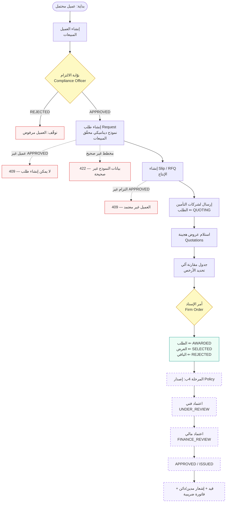
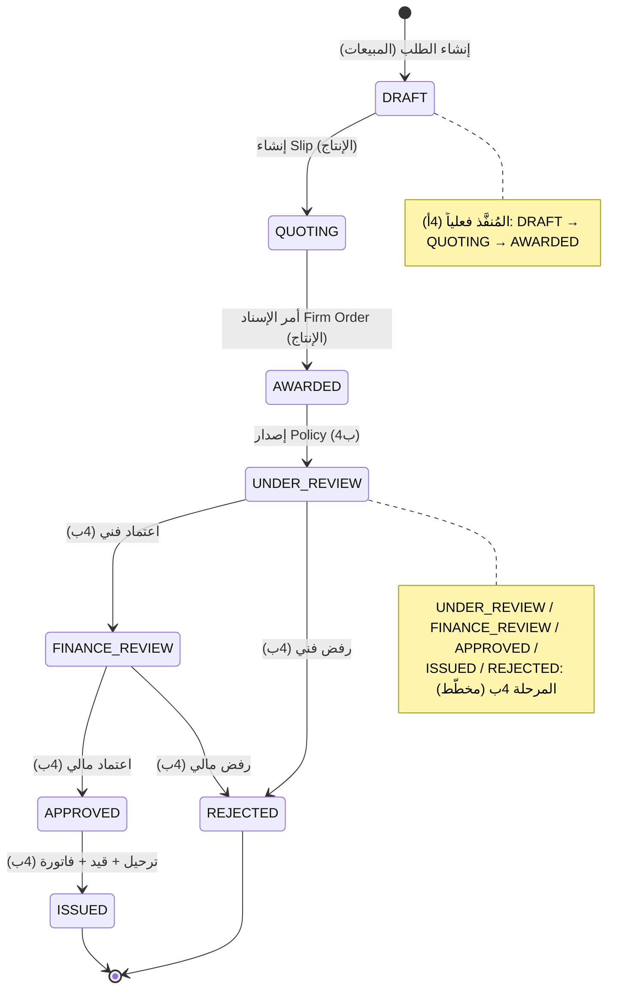
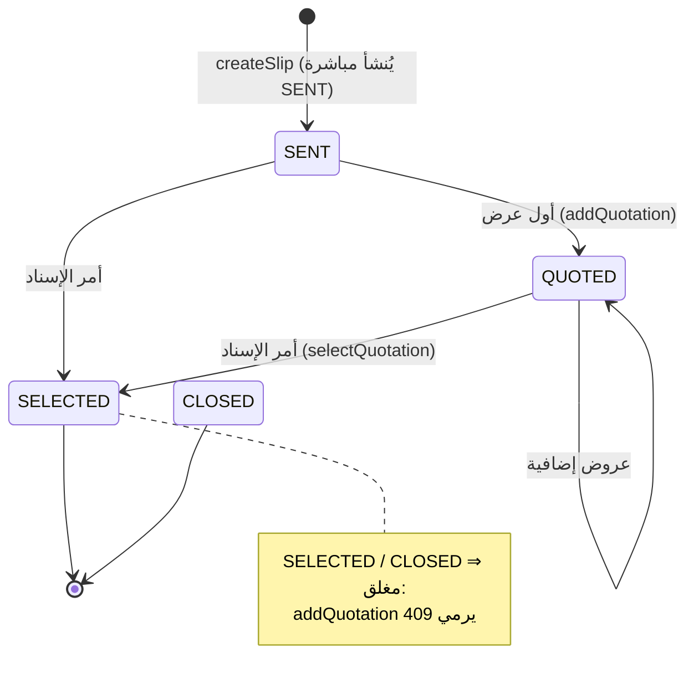
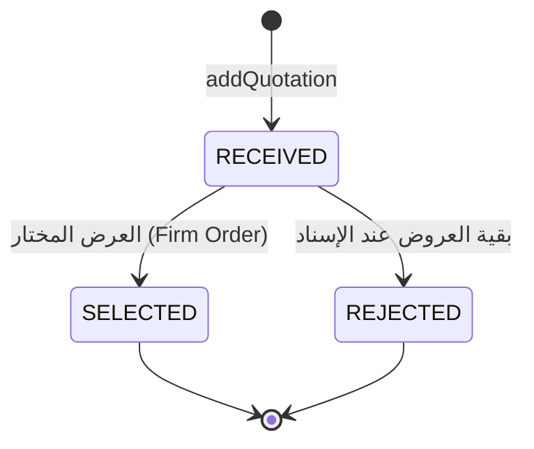
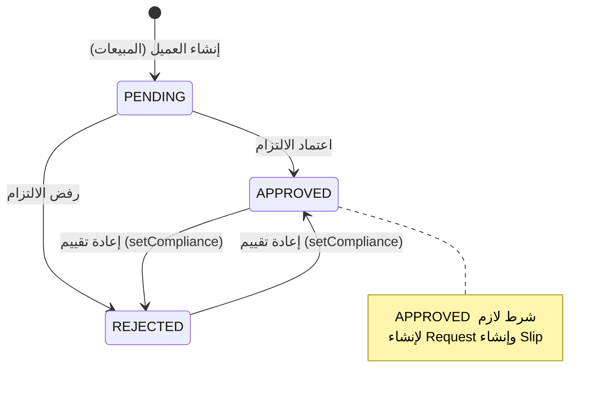
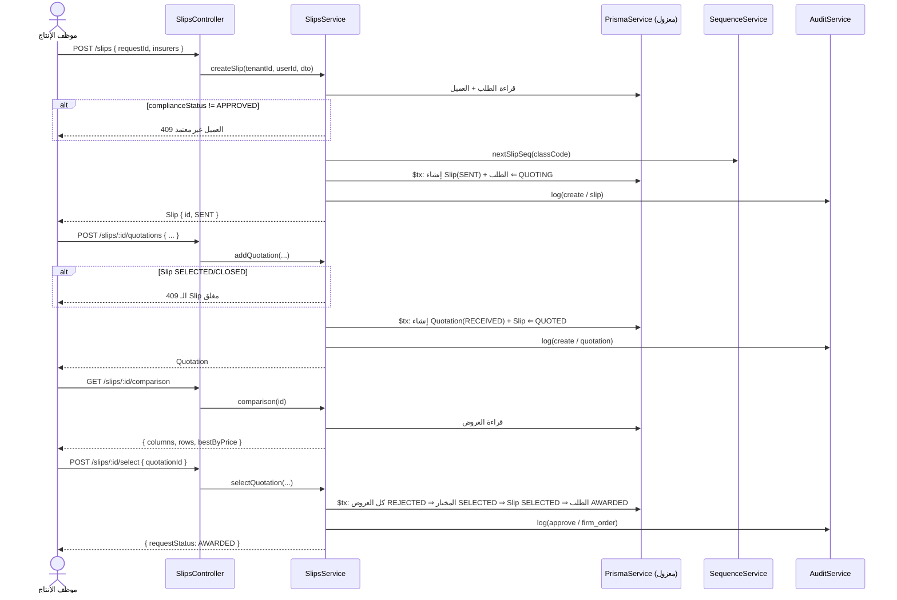

# 08 — دورة حياة الصفقة (Deal Lifecycle & Workflows)

> الرحلة الكاملة للصفقة في IBP من تسجيل العميل حتى أمر الإسناد (وما بعده في المرحلة 4ب)، مع **نقاط الحوكمة** والأدوار المسؤولة وآلات الحالات الفعلية. كل ما هنا مستخرَج من الخدمات الفعلية ([`clients.service.ts`](../apps/api/src/modules/clients/clients.service.ts)، [`requests.service.ts`](../apps/api/src/modules/requests/requests.service.ts)، [`slips.service.ts`](../apps/api/src/modules/underwriting/slips.service.ts)) ومن enums [schema.prisma](../packages/db/prisma/schema.prisma). يقابل هذا المستند رحلة الصفقة في [BLUEPRINT.md](../BLUEPRINT.md) §5.

> **تحديث ما بعد الاكتمال:** أُضيفت طبقات تُثري الرحلة — **CRM** (خطّ أنابيب الصفقات قبل الطلب) · **سلسلة اعتماد ديناميكية + فصل مهام** (E2) على شلال الإصدار · **التراجع خطوة للوراء** (E4) · **إشعارات** تلقائية على انتقالات الحالة (E3). التفصيل في [34 — طبقة ما بعد الاكتمال](./34-post-completion-features.md).

## جدول المحتويات
- [1. نظرة عامة على الرحلة](#1-نظرة-عامة-على-الرحلة)
- [2. مخطط الرحلة الكاملة (Flowchart)](#2-مخطط-الرحلة-الكاملة-flowchart)
- [3. الخطوات بالتفصيل ونقاط الحوكمة](#3-الخطوات-بالتفصيل-ونقاط-الحوكمة)
  - [3.1 إنشاء العميل](#31-إنشاء-العميل)
  - [3.2 بوّابة الالتزام](#32-بوابة-الالتزام-compliance-gate)
  - [3.3 إنشاء الطلب (Request)](#33-إنشاء-الطلب-request)
  - [3.4 طلب الأسعار (Slip/RFQ)](#34-طلب-الأسعار-sliprfq)
  - [3.5 عروض شركات التأمين](#35-عروض-شركات-التأمين-quotations)
  - [3.6 جدول المقارنة الآلي](#36-جدول-المقارنة-الآلي)
  - [3.7 أمر الإسناد (Firm Order)](#37-أمر-الإسناد-firm-order)
  - [3.8 المرحلة 4ب — الإصدار والمالية](#38-المرحلة-4ب--الإصدار-والمالية-مخطّط-لاحقاً)
- [4. آلة حالات الطلب (RequestStatus)](#4-آلة-حالات-الطلب-requeststatus)
- [5. آلة حالات طلب الأسعار (SlipStatus)](#5-آلة-حالات-طلب-الأسعار-slipstatus)
- [6. آلة حالات العرض (QuotationStatus)](#6-آلة-حالات-العرض-quotationstatus)
- [7. آلة حالات الالتزام (ComplianceStatus)](#7-آلة-حالات-الالتزام-compliancestatus)
- [8. مخطط تتابع خطوة الاكتتاب (Sequence)](#8-مخطط-تتابع-خطوة-الاكتتاب-sequence)
- [9. مصفوفة الأدوار × الخطوات](#9-مصفوفة-الأدوار--الخطوات)
- [10. انظر أيضاً](#10-انظر-أيضاً)

---

## 1. نظرة عامة على الرحلة

تمرّ كل صفقة عبر سلسلة خطوات محكومة، كلٌّ منها يحرسه فحص مزدوج (entitlement + RBAC) ونقطة حوكمة تمنع القفز للأمام:

| # | الخطوة | القسم المسؤول | البوّابة الحاكمة | الأثر على الحالة |
|---|---|---|---|---|
| 1 | إنشاء العميل | المبيعات (`clients:create`) | — | العميل `complianceStatus = PENDING` |
| 2 | **بوّابة الالتزام** | الالتزام (`compliance:update`) | — | `PENDING → APPROVED / REJECTED` |
| 3 | إنشاء الطلب | المبيعات (`sales:create`) | يتطلّب عميلاً `APPROVED` + تحقّق المخطط | الطلب `DRAFT` |
| 4 | طلب الأسعار (Slip) | الإنتاج (`production:create`) | يتطلّب التزاماً `APPROVED` | الطلب `DRAFT → QUOTING`، الـ Slip `SENT` |
| 5 | عروض شركات التأمين | الإنتاج (`production:create`) | الـ Slip غير مُغلق | الـ Slip `SENT → QUOTED` |
| 6 | جدول المقارنة الآلي | الإنتاج (`production:read`) | — | (قراءة فقط) |
| 7 | **أمر الإسناد (Firm Order)** | الإنتاج (`production:update`) | عرض موجود ضمن الـ Slip | الـ Slip `SELECTED`، العرض `SELECTED`، الطلب `AWARDED` |
| 8 | الإصدار والمالية (4ب) | الإنتاج + المالية | اعتماد فني ← مالي | `AWARDED → UNDER_REVIEW → FINANCE_REVIEW → APPROVED/ISSUED` |

كل خطوة من 1–7 تكتب صفّاً في `AuditLog` ([§3.3 في 07](./07-backend-modules.md#33-audit-auditservice)).

---

## 2. مخطط الرحلة الكاملة (Flowchart)

> العقد المتقطّعة البنفسجية (`Policy → … → فاتورة`) هي **المرحلة 4ب** — الكيانات موجودة في المخطط ([schema.prisma](../packages/db/prisma/schema.prisma): `Policy`, `Endorsement`, `Voucher`, `Invoice`, `DebitNote`, `CreditNote`) والمنطق يُبنى في مرحلتها.

---

## 3. الخطوات بالتفصيل ونقاط الحوكمة

### 3.1 إنشاء العميل

**من:** المبيعات · **الحماية:** `clients:create` + `module.clients` · **المصدر:** [`clients.service.ts`](../apps/api/src/modules/clients/clients.service.ts) `create()`

- يولّد كوداً تجارياً (`CLI-2026-1001`) عبر `SequenceService`.
- يُنشئ العميل **مبدئياً بـ `complianceStatus = PENDING`** — لا يمكن استخدامه في أي طلب بعد.
- التفرّد لكل مستأجر على `code`/`crNumber`/`nationalId` ⇒ تكرار يرمي `409` (`P2002`).
- يكتب `create / client` في التدقيق.

### 3.2 بوّابة الالتزام (Compliance Gate)

**من:** مدير الالتزام (Compliance Officer) · **الحماية:** `compliance:update` · **المصدر:** [`clients.service.ts`](../apps/api/src/modules/clients/clients.service.ts) `setCompliance()`

- المسار `POST /clients/:id/compliance` بجسم `{ decision: APPROVED|REJECTED, note? }`.
- ينقل `complianceStatus` ويكتب `approve / client` في التدقيق مع القرار والملاحظة.

> **نقطة الحوكمة الأولى (فصل الأدوار):** البوّابة بصلاحية موديول **`compliance`** لا `clients` — فمن يُدخل العميل (مبيعات) **ليس** من يعتمده (الالتزام). هذا يحقّق مطلب فحص AML/CFT قبل بدء العمل ([BLUEPRINT.md](../BLUEPRINT.md) §3.9). ربط هذه الصلاحية بالأدوار في [05 §6](./05-rbac-and-entitlements.md).

### 3.3 إنشاء الطلب (Request)

**من:** المبيعات · **الحماية:** `sales:create` + `module.sales` · **المصدر:** [`requests.service.ts`](../apps/api/src/modules/requests/requests.service.ts) `create()`

تسلسل الفحوص الفعلي:

1. العميل موجود ضمن المستأجر (وإلا `404`).
2. **بوّابة الالتزام:** `client.complianceStatus !== "APPROVED"` ⇒ **`409`** «العميل غير معتمد من الالتزام بعد».
3. مخطط الفرع موجود (`ProductLine.formSchema`، وإلا `404`).
4. **تحقّق المخطط** عبر `FormValidationService` ⇒ أي خطأ يرمي **`422`** بجسم `{ message, errors }`.
5. توليد التسلسل (`SL-MED-2026-1001`).
6. إنشاء الطلب (`status = DRAFT`) + صفوف الكتل (`RequestBlockRow`) **ذرّياً** في `$transaction`.
7. تدقيق `create / policy_request`.

> **نقطتا حوكمة:** لا طلب قبل اعتماد الالتزام (دفاع أمامي)، ولا طلب يخالف مخطط الفرع الديناميكي.

### 3.4 طلب الأسعار (Slip/RFQ)

**من:** الإنتاج (التسعير) · **الحماية:** `production:create` + `module.production` · **المصدر:** [`slips.service.ts`](../apps/api/src/modules/underwriting/slips.service.ts) `createSlip()`

- يجلب الطلب مع عميله؛ **يُعيد فرض بوّابة الالتزام** (`complianceStatus === APPROVED` وإلا `409`) — دفاع متعدّد الطبقات.
- يولّد تسلسل الـ Slip (`RFQ-MED-2026-1001`).
- في `$transaction`: يُنشئ الـ Slip بـ `status = SENT` ويُحدّث الطلب إلى **`QUOTING`**.
- تدقيق `create / slip`.

> **نقطة الحوكمة الثالثة:** لا Slip قبل `complianceStatus == APPROVED` ([ROADMAP.md](../ROADMAP.md) §4أ). الانتقال إلى `QUOTING` يعلن دخول الطلب طور جمع العروض.

### 3.5 عروض شركات التأمين (Quotations)

**من:** الإنتاج · **الحماية:** `production:create` + `module.production` · **المصدر:** [`slips.service.ts`](../apps/api/src/modules/underwriting/slips.service.ts) `addQuotation()`

- **نموذج هجين** ([`create-quotation.dto.ts`](../apps/api/src/modules/underwriting/dto/create-quotation.dto.ts)): حقول معيارية رقمية (`rate`, `premium`, `vat`, `totalPremium`, `deductible`, `limit`, `coverFields`) **للمقارنة الآلية** + نص حر (`generalRemarks`, `additionalConditions`) للشروط الاستثنائية.
- يرفض الإضافة إن كان الـ Slip `SELECTED`/`CLOSED` ⇒ `409`.
- أول عرض ينقل الـ Slip من `SENT`/`DRAFT` إلى **`QUOTED`**.
- تدقيق `create / quotation`.

### 3.6 جدول المقارنة الآلي

**من:** الإنتاج (وللعرض على العميل لاحقاً) · **الحماية:** `production:read` + `module.production` · **المصدر:** [`slips.service.ts`](../apps/api/src/modules/underwriting/slips.service.ts) `comparison()`

- يبني أعمدة معيارية ثنائية اللغة (النسبة/القسط/الضريبة/الإجمالي/التحمّل/حد التغطية) وصفوفاً من كل عرض.
- يحدّد **`bestByPrice`** = أقل `totalPremium ?? premium` بين العروض المسعّرة (الأرخص).
- قراءة بحتة — لا يغيّر حالة.

### 3.7 أمر الإسناد (Firm Order)

**من:** الإنتاج · **الحماية:** `production:update` + `module.production` · **المصدر:** [`slips.service.ts`](../apps/api/src/modules/underwriting/slips.service.ts) `selectQuotation()`

في `$transaction` واحدة:
1. كل عروض الـ Slip ⇒ `REJECTED`.
2. العرض المختار ⇒ `SELECTED`.
3. الـ Slip ⇒ `SELECTED` + `selectedQuotationId`.
4. **الطلب ⇒ `AWARDED`** (جاهز للإصدار في 4ب).
5. تدقيق `approve / firm_order`.

> **نقطة الحوكمة الرابعة:** يتحقّق أن العرض المختار يخصّ هذا الـ Slip (وإلا `404`)؛ الذرّية تمنع حالات تناقض (Slip مختار بلا عرض مُحدَّد). `AWARDED` هو **خط التسليم** بين المرحلة 4أ و4ب.

### 3.8 الإصدار والمالية (مُنفَّذة ومُتحقَّقة end-to-end)

التسلسل الفعلي العامل في المنصّة (مُختبَر حيًّا 17/17 — انظر [ROADMAP.md](../ROADMAP.md) §4ب و[27](./27-regulatory-and-launch.md)):

1. **الإنتاج** — إصدار `Policy` من طلب `AWARDED` (العرض المختار) ⇒ الوثيقة `TECHNICAL_REVIEW`، الطلب `UNDER_REVIEW`. 🔒 لا إصدار إلا من طلب مُسنَد.
2. **الموافقة الفنية** ⇒ الوثيقة `FINANCE_REVIEW`، الطلب `FINANCE_REVIEW`.
3. 🔒 **بوّابة المراجعة**: لا اعتماد مالي قبل الفني (`409`).
4. **الاعتماد المالي** — في **معاملة ذرّية واحدة** ([20](./20-issuance-and-finance-core.md)):
   - الوثيقة والطلب ⇐ `ISSUED`.
   - **قيد JRV مزدوج متوازن** (مدين ذمم العملاء = دائن أمانات الأقساط *خارج الميزانية* + عمولة الوساطة).
   - إشعار مدين للعميل + فاتورة ضريبية، وفتح حساب تحليلي للعميل في `ChartOfAccount` (17 رقماً).
   - **مستندات ZATCA المرحلة 2** (`BillingDocument`): UUIDv4 + عدّاد/تجزئة معزولة بالمستأجر + QR (TLV) + UBL.
5. **التوجيه بعد التثبيت**: B2B ⇒ مقاصة فورية (Clearance)، B2C ⇒ إبلاغ خلفي (Reporting خلال 24س) — [28](./28-zatca-phase2-fatoora.md).

كل خطوة تُسجَّل في `auditLog`. **ما بعد الإصدار**: خدمة العملاء، التجديدات ([22](./22-operational-modules.md))، والمطالبات.

---

## 4. آلة حالات الطلب (RequestStatus)

enum من [schema.prisma](../packages/db/prisma/schema.prisma): `DRAFT, QUOTING, AWARDED, UNDER_REVIEW, FINANCE_REVIEW, APPROVED, REJECTED, ISSUED`.

**الانتقالات المُنفَّذة فعلياً (الكود الحالي):**

| من | إلى | المُطلِق | الملف |
|---|---|---|---|
| `(جديد)` | `DRAFT` | `RequestsService.create` | [`requests.service.ts`](../apps/api/src/modules/requests/requests.service.ts) |
| `DRAFT` | `QUOTING` | `SlipsService.createSlip` | [`slips.service.ts`](../apps/api/src/modules/underwriting/slips.service.ts) |
| `QUOTING` | `AWARDED` | `SlipsService.selectQuotation` | [`slips.service.ts`](../apps/api/src/modules/underwriting/slips.service.ts) |

الحالات من `UNDER_REVIEW` فصاعداً مُعرَّفة في الـ enum لكن انتقالاتها تأتي في المرحلة 4ب.

---

## 5. آلة حالات طلب الأسعار (SlipStatus)

enum: `DRAFT, SENT, QUOTED, SELECTED, CLOSED`.

| من | إلى | المُطلِق |
|---|---|---|
| `(جديد)` | `SENT` | `createSlip` — يُنشأ بـ `SENT` مباشرة |
| `SENT`/`DRAFT` | `QUOTED` | `addQuotation` (أول عرض) |
| `*` | `SELECTED` | `selectQuotation` (Firm Order) |

> `DRAFT` و`CLOSED` معرَّفان في الـ enum؛ الكود الحالي يُنشئ الـ Slip بـ `SENT` مباشرةً، ويعامل `SELECTED`/`CLOSED` كحالتين مغلقتين ترفضان عروضاً جديدة.

---

## 6. آلة حالات العرض (QuotationStatus)

enum: `RECEIVED, SELECTED, REJECTED`.

عند `selectQuotation`: **كل** العروض تُضبط `REJECTED` أولاً، ثم المختار `SELECTED` — فلا يبقى أكثر من عرض مختار.

---

## 7. آلة حالات الالتزام (ComplianceStatus)

enum: `PENDING, APPROVED, REJECTED` (على `Client`).

`setCompliance` يقبل `APPROVED`/`REJECTED` ويمكن استدعاؤه لاحقاً لإعادة التقييم. حالة `APPROVED` هي **البوّابة الحاكمة** لخطوتي الطلب والـ Slip.

---

## 8. مخطط تتابع خطوة الاكتتاب (Sequence)

تفصيل خطوة الاكتتاب (إنشاء Slip ← إضافة عروض ← مقارنة ← إسناد):

كل قراءة/كتابة تمرّ عبر `PrismaService` المعزول بالمستأجر تلقائياً ([04](./04-security-and-multitenancy.md))، والعمليات الحسّاسة تُسجَّل تدقيقياً.

---

## 9. مصفوفة الأدوار × الخطوات

ربط كل خطوة بالموديول/الفعل المطلوب وأبرز الأدوار الجاهزة المخوّلة (راجع المصفوفة الكاملة في [05 §6](./05-rbac-and-entitlements.md) و[BLUEPRINT.md](../BLUEPRINT.md) §4):

| الخطوة | الموديول:الفعل | entitlement | الأدوار النموذجية |
|---|---|---|---|
| إنشاء العميل | `clients:create` | `module.clients` | ممثل/مدير المبيعات، المدير العام |
| بوّابة الالتزام | `compliance:update` | — | مدير الالتزام، المدير العام |
| إنشاء الطلب | `sales:create` | `module.sales` | ممثل/مدير المبيعات، المدير العام |
| إنشاء Slip | `production:create` | `module.production` | مسؤول التسعير، إدارة الوثائق، المدير العام |
| إضافة عرض | `production:create` | `module.production` | مسؤول التسعير، المدير العام |
| المقارنة | `production:read` | `module.production` | الإنتاج (قراءة) |
| أمر الإسناد | `production:update` | `module.production` | مسؤول التسعير، المدير العام |
| الإصدار/المالية (4ب) | `production` + `finance` | `module.finance` | الإنتاج + المحاسب/المدير المالي |

> **تكامل الحوكمة:** كل خطوة محكومة بفحص مزدوج ([05](./05-rbac-and-entitlements.md)) **و** ببوّابة منطقية في الخدمة (الالتزام/تحقّق المخطط/إغلاق الـ Slip)؛ الاثنان مستقلان — فحص الصلاحية لا يُغني عن بوّابة العمل وبالعكس.

---

## 10. انظر أيضاً

- [07 — وحدات الـ Backend](./07-backend-modules.md) — تفصيل كل وحدة وخدمة.
- [05 — الصلاحيات و Entitlements](./05-rbac-and-entitlements.md) — الفحص المزدوج ومصفوفة الأدوار.
- [06 — مرجع الـ API](./06-api-reference.md) — كل endpoint بمدخلاته ومخرجاته.
- [04 — الأمان وتعدد المستأجرين](./04-security-and-multitenancy.md) — العزل والتدقيق.
- [03 — نموذج البيانات](./03-data-model.md) — الكيانات و enums.
- [BLUEPRINT.md](../BLUEPRINT.md) §5 — رحلة الصفقة الوظيفية · [ROADMAP.md](../ROADMAP.md) §4أ/4ب — المراحل.
