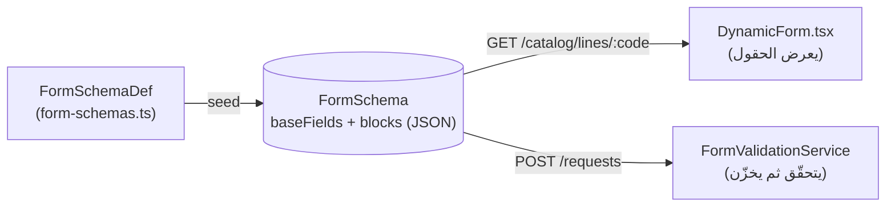
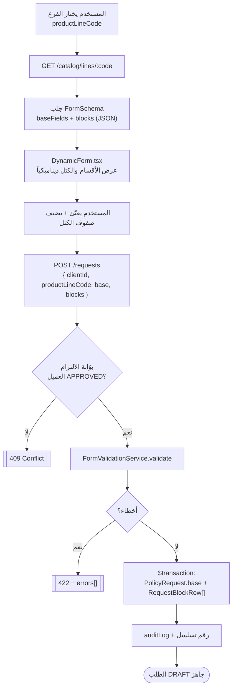

# 09 — محرّك النموذج الديناميكي (Schema-Driven Form Engine)

> منصة IBP تخدم وسطاء تأمين يبيعون عائلات منتجات شديدة الاختلاف: طبي، مركبات، ممتلكات، هندسي، بحري، حوادث عامة، حياة، سفر. كل منتج يطلب بيانات مختلفة جوهرياً. بدل بناء نموذج (Form) وجدول قاعدة بيانات لكل منتج، تعتمد المنصة **محرّكاً مدفوعاً بمخطط (Schema-Driven)**: مصدر واحد يصف لغة الحقول، الواجهة تعرضه، والـ API يتحقّق منه، ومخزن عام واحد يحفظ صفوفه. هذا المستند يوثّق ذلك المحرّك حرفياً كما هو في الكود.
>
> المصادر الفعلية: لغة الوصف في [`packages/shared/src/form-schema.ts`](../packages/shared/src/form-schema.ts)؛ المخططات في [`packages/shared/src/form-schemas.ts`](../packages/shared/src/form-schemas.ts)؛ الكتالوج في [`packages/shared/src/product-catalog.ts`](../packages/shared/src/product-catalog.ts)؛ محرّك التحقّق في [`form-validation.service.ts`](../apps/api/src/modules/requests/form-validation.service.ts)؛ منطق الطلب في [`requests.service.ts`](../apps/api/src/modules/requests/requests.service.ts)؛ العرض في [`DynamicForm.tsx`](../apps/web/src/components/forms/DynamicForm.tsx)؛ التخزين في [schema.prisma](../packages/db/prisma/schema.prisma)؛ الزرع في [`seed.ts`](../packages/db/prisma/seed.ts).

## جدول المحتويات

- [1. الفكرة في سطر](#1-الفكرة-في-سطر)
- [2. لغة الوصف (Form Schema DSL)](#2-لغة-الوصف-form-schema-dsl)
  - [2.1 FieldType — أنواع الحقول](#21-fieldtype--أنواع-الحقول)
  - [2.2 FieldDef — تعريف الحقل](#22-fielddef--تعريف-الحقل)
  - [2.3 SectionDef — القسم](#23-sectiondef--القسم)
  - [2.4 BlockDef — الكتلة المتكررة](#24-blockdef--الكتلة-المتكررة)
  - [2.5 FormSchemaDef — المخطط الكامل](#25-formschemadef--المخطط-الكامل)
- [3. كتالوج المنتجات (7 فئات / 15 فرعاً)](#3-كتالوج-المنتجات-7-فئات--15-فرعاً)
- [4. مفاتيح الكتل (BlockKey) وكيف يتكيّف النموذج لكل منتج](#4-مفاتيح-الكتل-blockkey-وكيف-يتكيف-النموذج-لكل-منتج)
- [5. التخزين العام: RequestBlockRow](#5-التخزين-العام-requestblockrow)
- [6. محرّك التحقّق (FormValidationService)](#6-محرّك-التحقق-formvalidationservice)
- [7. كيف تُخزَّن الحمولة (base JSON + blockRows)](#7-كيف-تُخزَّن-الحمولة-base-json--blockrows)
- [8. تدفّق النموذج من البداية للنهاية (Mermaid)](#8-تدفق-النموذج-من-البداية-للنهاية-mermaid)
- [9. كيف تُضاف منتجات/فروع جديدة (بلا تغيير كود)](#9-كيف-تُضاف-منتجاتفروع-جديدة-بلا-تغيير-كود)
- [10. أمثلة JSON](#10-أمثلة-json)
- [11. انظر أيضاً](#11-انظر-أيضاً)

---

## 1. الفكرة في سطر

النموذج لا يُبرمَج لكل منتج، بل **يُوصَف** بمخطط بيانات (Data). المخطط مصدر واحد (`FormSchemaDef`) يستهلكه ثلاثة أطراف:



النتيجة: إضافة منتج جديد = إضافة بيانات وصفية، لا كتابة كود واجهة أو API أو جدول جديد.

---

## 2. لغة الوصف (Form Schema DSL)

اللغة معرّفة بالكامل في [`form-schema.ts`](../packages/shared/src/form-schema.ts) كأنواع TypeScript. أربعة مستويات تركيبية: `FieldDef` ← `SectionDef`/`BlockDef` ← `FormSchemaDef`.

### 2.1 FieldType — أنواع الحقول

النوع يحكم العرض في الواجهة **و** قواعد التحقّق في الـ API. الأنواع المتاحة:

| النوع | المعنى | عرض الواجهة | تحقّق الـ API |
|---|---|---|---|
| `text` | نص حر قصير | `<input type=text>` | — |
| `textarea` | نص حر طويل | `<textarea>` | — |
| `number` | رقم صحيح/عشري | `<input type=number>` | رقم + `min`/`max` |
| `currency` | مبلغ بالريال (SAR) | `<input type=number>` | رقم + `min`/`max` |
| `percent` | نسبة مئوية | `<input type=number>` | رقم + `min`/`max` |
| `date` | تاريخ | `<input type=date>` | تاريخ صالح (`Date.parse`) |
| `select` | اختيار واحد | `<select>` من `options` | القيمة ضمن `options` |
| `multiselect` | اختيار متعدّد | (مُعرّف في DSL) | — |
| `boolean` | نعم/لا منطقي | `<input>` | `typeof === "boolean"` |
| `email` | بريد إلكتروني | `<input>` | regex بريد |
| `phone` | هاتف | `<input>` | — |
| `nationalId` | هوية/إقامة | `<input>` | **10 أرقام** (`/^\d{10}$/`) |
| `crNumber` | سجل تجاري | `<input>` | — |
| `iban` | آيبان | `<input>` | — |

> ملاحظة دقيقة: العرض في `DynamicForm.tsx` يصنّف الأنواع إلى ثلاث فئات تحكُّم فقط (`select` ← قائمة، `textarea` ← منطقة نص، والباقي ← `<input>` بنوع `date`/`number`/`text`). أما التحقّق الدلالي (هوية 10 أرقام، بريد، حدود) فيُفرض في الخادم لا الواجهة — لا نثق بأي مدخل من العميل.

### 2.2 FieldDef — تعريف الحقل

```ts
interface FieldDef {
  key: string;            // مفتاح برمجي فريد داخل القسم/الكتلة
  labelAr: string;        // عنوان عربي
  labelEn: string;        // عنوان إنجليزي (ثنائية اللغة من المصدر)
  type: FieldType;
  required?: boolean;     // حقل إلزامي
  options?: FieldOption[]; // لـ select/multiselect — { value, labelAr, labelEn }
  min?: number;           // حدّ أدنى (أرقام/عملة/نِسب)
  max?: number;           // حدّ أقصى
  maxLength?: number;
  helpAr?: string;
  helpEn?: string;
  span?: 1 | 2 | 3 | 4;   // تلميح تخطيط ضمن شبكة 4 أعمدة
}
```

كل حقل يحمل عنوانه بالعربية والإنجليزية، فالثنائية اللغوية (ar/en) و RTL مدمجتان في البيانات نفسها — الواجهة تنتقي العنوان حسب اللغة النشطة (`useLocale()`).

### 2.3 SectionDef — القسم

تجميعة حقول أساسية (Base) تظهر كبطاقة واحدة:

```ts
interface SectionDef {
  key: string;
  titleAr: string;
  titleEn: string;
  fields: FieldDef[];
}
```

### 2.4 BlockDef — الكتلة المتكررة

الكتلة (Block) تمثّل **صفوفاً متكررة** (Repeating Rows): قائمة تابعين، أسطول مركبات، عدّة مواقع، شحنات… يُضيف المستخدم/يحذف صفوفاً ديناميكياً:

```ts
interface BlockDef {
  key: string;            // members | vehicles | locations | ...
  titleAr: string; titleEn: string;
  itemLabelAr: string;    // اسم مفرد للصف (تابع/مركبة) — لزرّ «إضافة»
  itemLabelEn: string;
  min?: number;           // أقل عدد صفوف مطلوب (يُفرض في التحقّق)
  max?: number;           // أقصى عدد صفوف مسموح
  fields: FieldDef[];     // حقول الصف الواحد
}
```

`min`/`max` ليسا تزييناً: المحرّك يرفض الحمولة إن قلّت الصفوف عن `min` أو زادت عن `max`. والواجهة تمنع حذف صف إن كان العدد عند `min` ([`DynamicForm.tsx`](../apps/web/src/components/forms/DynamicForm.tsx) سطر 128).

### 2.5 FormSchemaDef — المخطط الكامل

المخطط الكامل لفرع واحد:

```ts
interface FormSchemaDef {
  lineCode: string;       // كود الفرع (GMI, MCI, …)
  version: number;        // إصدار المخطط (versioned)
  sections: SectionDef[]; // الحقول الأساسية مجمّعة بأقسام
  blocks: BlockDef[];     // الكتل المتكررة المفعّلة (قد تكون فارغة)
}
```

> **تنبيه تسمية مهم:** عند الزرع تُخزَّن `sections` في عمود قاعدة البيانات المسمّى `baseFields`، و`blocks` في عمود `blocks` ([`seed.ts`](../packages/db/prisma/seed.ts) سطر 153–158). لذلك في الخادم تُقرأ الأقسام عبر `formSchema.baseFields` ([`requests.service.ts`](../apps/api/src/modules/requests/requests.service.ts) سطر 84). الاسم تاريخي؛ المحتوى هو مصفوفة `SectionDef[]`.

خيارات مشتركة معاد استخدامها معرّفة مرّة واحدة في DSL: `YESNO` و`RELATION_OPTIONS` (موظف/زوج/ابن/والد) و`GENDER_OPTIONS` (ذكر/أنثى).

---

## 3. كتالوج المنتجات (7 فئات / 15 فرعاً)

الكتالوج ([`product-catalog.ts`](../packages/shared/src/product-catalog.ts)) شجرة من **فئات** (`CatalogClass`) تحوي **فروعاً** (`CatalogLine`)، كلّ فرع يعلن مفاتيح الكتل المتكررة في نموذجه. هذه الشجرة تُزرع في `ProductClass`/`ProductLine` ([schema.prisma](../packages/db/prisma/schema.prisma) سطر 213–227).

| الفئة (Class) | الكود | الفرع (Line) | الكود | الكتل المفعّلة (blocks) | مخطط النموذج |
|---|---|---|---|---|---|
| الطبي | `MED` | طبي جماعي | `GMI` | `members` | عام + مدة + تغطية طبية |
| | | طبي فردي | `IMI` | `members` | عام + مدة + تغطية طبية |
| المركبات | `MOT` | مركبات شامل | `MCI` | `vehicles` | عام + مدة + تغطية مركبات |
| | | مركبات ضد الغير | `MTP` | `vehicles` | عام + مدة + تغطية مركبات |
| الممتلكات | `PRP` | جميع أخطار الممتلكات | `PAR` | `locations` | عام + مدة |
| | | الحريق والأخطار الإضافية | `FIR` | `locations` | عام + مدة |
| الهندسي | `ENG` | جميع أخطار المقاولين | `CAR` | `locations` | عام + مدة + بيانات المشروع |
| | | جميع أخطار التركيب | `EAR` | `locations` | عام + مدة + بيانات المشروع |
| البحري | `MAR` | بحري بضائع | `MCG` | `shipments` | عام + مدة |
| الحوادث العامة | `GEN` | حوادث شخصية جماعية | `GPA` | `lives` | عام + مدة |
| | | مسؤولية عامة | `PLI` | — (بلا كتل) | عام + مدة + حدود المسؤولية |
| | | تأمين السفر | `TRV` | `travellers` | عام + مدة |
| الحياة | `LIF` | تأمين حياة لأجل | `TRM` | `lives` | عام + مدة + بيانات الحياة |
| | | تأمين حياة جماعي | `GLI` | `lives` | عام + مدة + بيانات الحياة |

> 7 فئات، 15 فرعاً. الثابت `ALL_LINE_CODES` يجمّع كل أكواد الفروع للتهيئة والزرع. لاحظ أن `PLI` (مسؤولية عامة) فرع بلا كتل متكررة — يعتمد أقساماً أساسية فقط.

---

## 4. مفاتيح الكتل (BlockKey) وكيف يتكيّف النموذج لكل منتج

النوع `BlockKey` ([`product-catalog.ts`](../packages/shared/src/product-catalog.ts) سطر 5–11) يحصر مفاتيح الكتل الممكنة. كل مفتاح يقابل `BlockDef` جاهزة في [`form-schemas.ts`](../packages/shared/src/form-schemas.ts):

| BlockKey | المنتج | عنوان الكتلة | أبرز الحقول (من form-schemas.ts) |
|---|---|---|---|
| `members` | الطبي | التابعون (السجل الطبي/Census) | الاسم، الهوية (`nationalId`)، صلة القرابة، تاريخ الميلاد، الجنس، فئة المنفعة (VIP/أ/ب/ج)، الجنسية |
| `vehicles` | المركبات | المركبات | الصانع، الطراز، السنة (1980–2027)، اللوحة، VIN، قيمة المركبة (`currency`)، الاستخدام، عمر السائق (18–90) |
| `locations` | الممتلكات/الهندسي | المواقع والأصول | الوصف، المدينة، النشاط، نوع البناء، مبلغ تأمين المبنى/المحتويات/المخزون |
| `shipments` | البحري | الشحنات | نوع البضاعة، وسيلة النقل (بحري/جوي/بري)، من/إلى، قيمة الشحنة، التغليف |
| `lives` | الحياة/الحوادث | الأرواح المؤمَّنة | الاسم، الهوية، تاريخ الميلاد، الجنس، المهنة، مبلغ التغطية (`sumAssured`)، المستفيد |
| `travellers` | السفر | المسافرون | الاسم، الهوية/الجواز، تاريخ الميلاد، الوجهة (شنغن/عالمي/خليج)، أيام الرحلة (1–365) |

**كيف يتكيّف النموذج عملياً** — يتكوّن مخطط كل فرع عبر الدالة المساعدة `base(lineCode, extra, blocks)` التي تركّب: قسم «بيانات عامة» (اسم المؤمَّن + العملة) + قسم «مدة التغطية» (`periodSection`: البداية/النهاية/الشركة السابقة/مطالبات سابقة)، ثم تُضاف أقسام خاصة وكتل خاصة:

- **طبي (GMI/IMI)** ← قسم «التغطية الطبية» (`medicalNetwork`: الشبكة VIP/Plus/Standard، الحد السنوي، الأسنان/النظارات/الأمومة) + كتلة `members`.
- **مركبات (MCI/MTP)** ← قسم «تغطية المركبات» (`motorCover`: نوع التغطية، خصم الأسطول %، النطاق الجغرافي) + كتلة `vehicles`.
- **هندسي (CAR/EAR)** ← قسم «بيانات المشروع» (`engineeringSection`: قيمة العقد، مدة المشروع، صاحب العمل) + كتلة `locations`.
- **حياة (TRM/GLI)** ← قسم «بيانات الحياة» (`lifeSection`: المدة بالسنوات، دورية القسط، مدخّن؟) + كتلة `lives`.
- **مسؤولية عامة (PLI)** ← قسم «حدود المسؤولية» (`liabilitySection`) فقط، بلا كتل.
- **ممتلكات/بحري/سفر/حوادث** ← الأقسام العامة + الكتلة المناسبة (`locations`/`shipments`/`travellers`/`lives`).

الخريطة النهائية فرع↦مخطط مُصرّحة في `FORM_SCHEMAS` ([`form-schemas.ts`](../packages/shared/src/form-schemas.ts) سطر 203–218)، وتُقرأ بالدالة `getFormSchema(lineCode)`.

---

## 5. التخزين العام: RequestBlockRow

سؤال جوهري: أين تُحفَظ صفوف الكتل؟ الإجابة المعمارية: **جدول واحد عام** بدل أربعة جداول ثابتة.

النموذج ([schema.prisma](../packages/db/prisma/schema.prisma) سطر 312–324):

```prisma
model RequestBlockRow {
  id        String        @id @default(cuid())
  tenantId  String                                   // عزل المستأجر
  requestId String
  request   PolicyRequest @relation(..., onDelete: Cascade)
  blockKey  String        // members | vehicles | locations | shipments | lives | travellers
  rowIndex  Int           // ترتيب الصف داخل كتلته
  data      Json          // حقول الصف كاملةً (شكلها يحدّده مخطط الكتلة)
  @@index([tenantId])
  @@index([requestId, blockKey])
}
```

**لماذا استُبدلت الجداول الأربعة الثابتة به؟**

- **التنوّع غير المحدود:** لو خصّصنا جدولاً لكل كتلة (members, vehicles, locations, shipments…) لاحتجنا migration وجدولاً جديداً مع كل منتج جديد. الجدول العام يستوعب أي كتلة جديدة بمجرد إضافة مفتاحها للمخطط — بلا migration.
- **مدفوع بمخطط لا بكود:** شكل `data` يحدّده `BlockDef.fields`، فالقاعدة لا تعرف «مركبة» من «تابع»؛ تعرف فقط «صف ينتمي لكتلة باسم `blockKey`». المعنى يأتي من المخطط.
- **اتساق العزل والتدقيق:** كل صف يحمل `tenantId` ومُفهرس به ([CLAUDE.md §3](../CLAUDE.md))، وحذفه يتتالى تلقائياً مع حذف الطلب (`onDelete: Cascade`). فهرس `[requestId, blockKey]` يجعل جلب «كل مركبات الطلب» استعلاماً واحداً سريعاً.
- **استعلام موحّد:** عرض الطلب يجلب كل الكتل دفعة واحدة مرتّبةً بـ `[blockKey, rowIndex]` ([`requests.service.ts`](../apps/api/src/modules/requests/requests.service.ts) سطر 56–59).

التعليق في المخطط نفسه يلخّص النية: *«مخزن عام موحّد لصفوف الكتل المتكررة لأي منتج… مدفوع بمخطط FormSchema بدل جداول ثابتة — يستوعب تنوّع منتجات التأمين.»*

---

## 6. محرّك التحقّق (FormValidationService)

[`FormValidationService`](../apps/api/src/modules/requests/form-validation.service.ts) محرّك تحقّق **عام**: يفحص أي حمولة ضد أي مخطط فرع دون كود خاص بكل منتج. يعيد مصفوفة رسائل أخطاء (`string[]`) فارغة عند النجاح.

التوقيع: `validate(sections, blocks, payload): string[]`.

**ما يفحصه على مستوى القسم (Base):** لكل حقل في كل قسم، يستدعي `checkField`.

**ما يفحصه على مستوى الكتلة:** لكل كتلة:
- إن كان `min` محدّداً والصفوف أقل منه ⇒ خطأ `«الكتلة "X": مطلوب N صف على الأقل»` (ويتخطّى فحص محتوى الصفوف).
- إن كان `max` محدّداً والصفوف أكثر منه ⇒ خطأ الحد الأقصى.
- لكل صف، يفحص كل حقل بالمسار `block[i].field` لتحديد موضع الخطأ بدقّة.

**قواعد `checkField` لكل نوع:**

| النوع | القاعدة | رسالة الخطأ (مختصرة) |
|---|---|---|
| أي (مع `required`) | فارغ (`undefined`/`null`/`""`) ⇒ خطأ | `حقل مطلوب` |
| `number`/`currency`/`percent` | يجب أن يكون رقماً؛ ثم `min`/`max` | `يجب أن يكون رقماً` / `أقل من الحد N` / `أكبر من الحد N` |
| `date` | `Date.parse` صالح | `تاريخ غير صالح` |
| `select` | القيمة ضمن `options[].value` | `قيمة غير مسموحة` |
| `nationalId` | `/^\d{10}$/` — **10 أرقام بالضبط** | `الهوية يجب أن تكون 10 أرقام` |
| `email` | regex بريد | `بريد غير صالح` |
| `boolean` | `typeof === "boolean"` | `قيمة منطقية متوقّعة` |

> الحقول غير الإلزامية الفارغة تُتخطّى (لا تُفحَص نوعياً). الأنواع التي لا قاعدة لها في الخادم (`text`, `textarea`, `phone`, `crNumber`, `iban`, `multiselect`) تمرّ كنص حر — التحقّق هنا تحفّظي ويُوسَّع عند الحاجة.

**كيف تُترجم الأخطاء إلى استجابة API:** في [`requests.service.ts`](../apps/api/src/modules/requests/requests.service.ts) سطر 86–89، إن رجعت أخطاء يُرمى `UnprocessableEntityException` بهيكل `{ message, errors }` ⇒ يصل العميل **HTTP 422** بقائمة الأخطاء بالعربية. الواجهة تعرضها كقائمة نقطية ([`DynamicForm.tsx`](../apps/web/src/components/forms/DynamicForm.tsx) سطر 143–147).

---

## 7. كيف تُخزَّن الحمولة (base JSON + blockRows)

الحمولة الواردة شكلها `{ base, blocks }`:

```ts
interface FormPayload {
  base?:   Record<string, unknown>;                          // حقول الأقسام الأساسية
  blocks?: Record<string, Array<Record<string, unknown>>>;   // { members: [...], vehicles: [...] }
}
```

مسار الإنشاء ([`requests.service.ts`](../apps/api/src/modules/requests/requests.service.ts) `create`) — بالترتيب:

1. **العميل موجود** ضمن المستأجر (Prisma middleware يفرض النطاق).
2. **بوّابة الالتزام:** إن لم يكن `client.complianceStatus === "APPROVED"` ⇒ `ConflictException` (**409**). لا طلب أسعار قبل اعتماد العميل قانونياً.
3. **جلب المخطط:** `productLine` مع `formSchema`؛ إن غاب ⇒ **404**.
4. **التحقّق:** قراءة `formSchema.baseFields` كـ `SectionDef[]` و`formSchema.blocks` كـ `BlockDef[]`، ثم `validator.validate(...)`؛ أي خطأ ⇒ **422**.
5. **رقم تسلسل:** `seq.nextRequestSeq(class.code)` (نمط `PREFIX-BRANCH-CLASS-YEAR-SEQ`).
6. **الكتابة الذرّية (`$transaction`):**
   - `policyRequest` بحقول `base` (و`details` الاختياري) كـ JSON، الحالة `DRAFT`.
   - **تفكيك الكتل إلى صفوف:** لكل كتلة في المخطط، يُمرّ على `dto.blocks[b.key]` ويُنشئ صفّ `RequestBlockRow` لكل عنصر `{ tenantId, requestId, blockKey, rowIndex: idx, data }` عبر `createMany`.
7. **تدقيق:** `audit.log({ action: "create", entity: "policy_request", … })` ([CLAUDE.md §7](../CLAUDE.md) يفرض تسجيل العمليات الحسّاسة).

النتيجة: الحقول الأساسية تعيش في `PolicyRequest.base` (JSON)، والصفوف المتكررة في جدول `RequestBlockRow` العام — **حمولة واحدة ⇒ مخزنان مكمّلان**، يُعاد تجميعهما عند القراءة.

---

## 8. تدفّق النموذج من البداية للنهاية (Mermaid)



---

## 9. كيف تُضاف منتجات/فروع جديدة (بلا تغيير كود)

إضافة فرع تأمين جديد لا تتطلّب لمس أي خدمة أو واجهة أو جدول. الخطوات:

1. **الكتالوج** — أضف الفرع إلى فئته في [`product-catalog.ts`](../packages/shared/src/product-catalog.ts) داخل `PRODUCT_CATALOG`، معلناً مفاتيح كتله:
   ```ts
   { code: "YYY", nameAr: "اسم الفرع", nameEn: "Line Name", blocks: ["members"] }
   ```
   (إن احتجت كتلة من نوع غير موجود، أضف مفتاحها إلى اتحاد `BlockKey` وعرّف `BlockDef` لها.)

2. **المخطط** — أضف مدخلاً في `FORM_SCHEMAS` ([`form-schemas.ts`](../packages/shared/src/form-schemas.ts)) يركّب الأقسام والكتل عبر `base(...)`:
   ```ts
   YYY: base("YYY", [اقسامٌ خاصة], [كتلةٌ مناسبة]),
   ```
   أعِد استخدام الأقسام/الكتل الجاهزة، أو عرّف جديدة بنفس DSL.

3. **الزرع** — شغّل seed: `seedCatalog()` يمرّ على `PRODUCT_CATALOG` ويُنشئ `ProductClass`/`ProductLine`، ثم يقرأ `FORM_SCHEMAS[line.code]` ويكتب `FormSchema` (`baseFields = sections`، `blocks = blocks`) عبر `upsert` ([`seed.ts`](../packages/db/prisma/seed.ts) سطر 138–162).

بمجرّد ذلك: الكتالوج يعرض الفرع، الواجهة تبني نموذجه تلقائياً، والـ API يتحقّق ويخزّن — **بلا سطر كود إضافي**. هذا تطبيق مباشر لمبدأ «مدفوع بمخطط» في [CLAUDE.md](../CLAUDE.md) والملحق 6.A من [BLUEPRINT.md](../BLUEPRINT.md).

> **ملاحظة الإصدارات (Versioning):** `FormSchemaDef.version` و`FormSchema.version` يسمحان بترقية مخطط فرع مع الحفاظ على الطلبات القديمة المحقّقة ضد إصدارها. تغيير `required`/`min`/`options` ينبغي أن يرفع رقم الإصدار.

---

## 10. أمثلة JSON

**(أ) مخطط فرع طبي جماعي (GMI)** — كما يُزرع في `FormSchema` (مختصر):

```json
{
  "lineCode": "GMI",
  "version": 1,
  "sections": [
    { "key": "general", "titleAr": "بيانات عامة", "titleEn": "General",
      "fields": [
        { "key": "insuredName", "labelAr": "اسم المؤمَّن له", "labelEn": "Insured name", "type": "text", "required": true, "span": 2 },
        { "key": "currency", "labelAr": "العملة", "labelEn": "Currency", "type": "text", "span": 2 }
      ] },
    { "key": "period", "titleAr": "مدة التغطية", "titleEn": "Cover Period",
      "fields": [
        { "key": "startDate", "labelAr": "تاريخ البداية", "labelEn": "Start date", "type": "date", "required": true, "span": 2 },
        { "key": "endDate", "labelAr": "تاريخ النهاية", "labelEn": "End date", "type": "date", "required": true, "span": 2 }
      ] },
    { "key": "medical", "titleAr": "بيانات التغطية الطبية", "titleEn": "Medical Cover",
      "fields": [
        { "key": "network", "labelAr": "الشبكة الطبية", "labelEn": "Network", "type": "select", "required": true,
          "options": [ { "value": "vip", "labelAr": "VIP", "labelEn": "VIP" }, { "value": "standard", "labelAr": "قياسية", "labelEn": "Standard" } ] },
        { "key": "annualLimit", "labelAr": "الحد السنوي للفرد", "labelEn": "Annual limit / member", "type": "currency", "required": true }
      ] }
  ],
  "blocks": [
    { "key": "members", "titleAr": "التابعون (السجل الطبي)", "titleEn": "Census (Members)",
      "itemLabelAr": "تابع", "itemLabelEn": "member", "min": 1,
      "fields": [
        { "key": "name", "labelAr": "الاسم", "labelEn": "Name", "type": "text", "required": true, "span": 2 },
        { "key": "nationalId", "labelAr": "الهوية/الإقامة", "labelEn": "ID/Iqama", "type": "nationalId", "required": true, "span": 2 },
        { "key": "relation", "labelAr": "صلة القرابة", "labelEn": "Relation", "type": "select", "required": true,
          "options": [ { "value": "employee", "labelAr": "موظف", "labelEn": "Employee" }, { "value": "spouse", "labelAr": "زوج/زوجة", "labelEn": "Spouse" } ] }
      ] }
  ]
}
```

**(ب) حمولة طلب (POST /requests)** — مطابقة لما في الاختبار [`underwriting.e2e-spec.ts`](../apps/api/test/underwriting.e2e-spec.ts):

```json
{
  "clientId": "clxxxx...",
  "productLineCode": "GMI",
  "base": {
    "insuredName": "شركة المثال",
    "currency": "SAR",
    "startDate": "2026-01-01",
    "endDate": "2026-12-31",
    "network": "standard",
    "annualLimit": 500000
  },
  "blocks": {
    "members": [
      { "name": "أحمد", "nationalId": "1234567890", "relation": "employee", "dob": "1990-01-01", "gender": "male" }
    ]
  }
}
```

تخزَّن `base` في `PolicyRequest.base`، ويصبح كل عنصر في `members` صفّاً في `RequestBlockRow` (`blockKey="members"`, `rowIndex=0`).

---

## 11. انظر أيضاً

- [10 — الاكتتاب الفني وعروض الأسعار](./10-underwriting-rfq.md) — ما يحدث للطلب بعد إنشائه (Slip/RFQ).
- [08 — دورة حياة الصفقة](./08-deal-lifecycle-workflows.md) — موضع النموذج في الرحلة الكاملة.
- [03 — نموذج البيانات](./03-data-model.md) — `PolicyRequest`, `RequestBlockRow`, `FormSchema`, `ProductClass/Line`.
- [07 — وحدات الـ Backend](./07-backend-modules.md) — وحدتا `requests` و`catalog`.
- [06 — مرجع الـ API](./06-api-reference.md) — `GET /catalog/lines/:code`, `POST /requests`.
- [05 — الصلاحيات و Entitlements](./05-rbac-and-entitlements.md) — `module.sales` للطلبات.
- [BLUEPRINT.md](../BLUEPRINT.md) §الملحق 6.A — كتالوج المنتجات المرجعي · [CLAUDE.md](../CLAUDE.md) §3 — قواعد العزل والمخطط.
