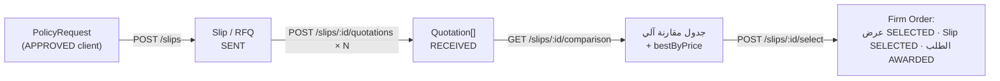
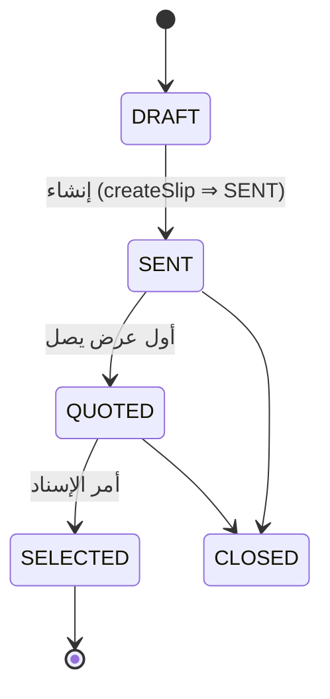
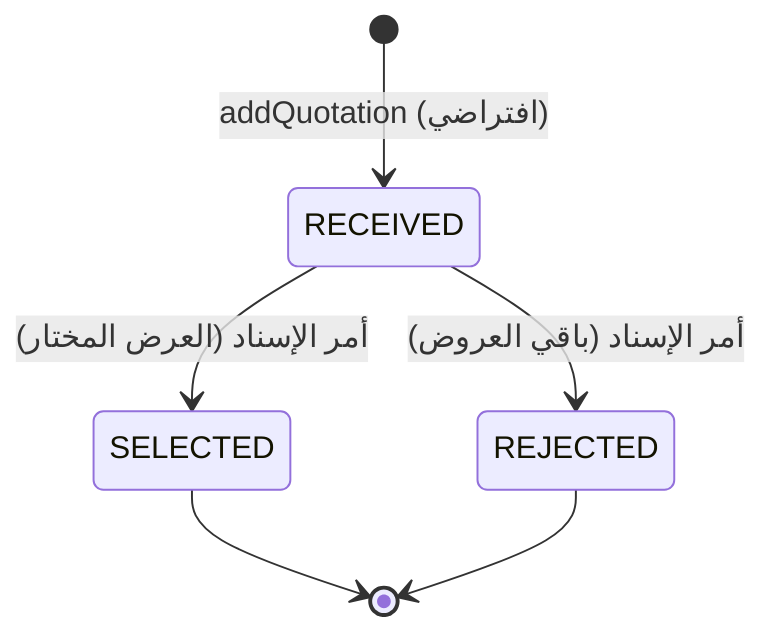
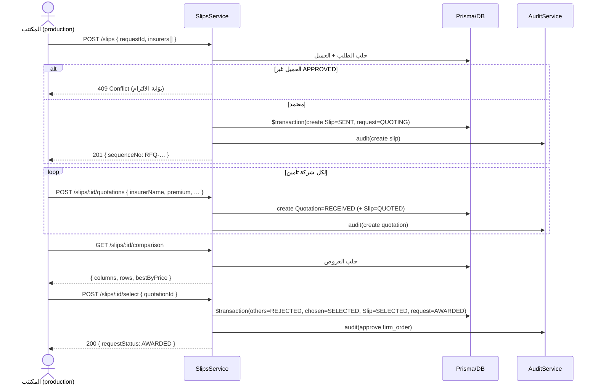

# 10 — الاكتتاب الفني وعروض الأسعار (Underwriting & RFQ — المرحلة 4أ)

> بعد إنشاء الطلب ([09](./09-dynamic-form-engine.md)) واعتماد العميل من الالتزام، يدخل الوسيط مرحلة **الاكتتاب الفني**: يُعدّ طلب أسعار (Slip/RFQ) ويرسله لعدّة شركات تأمين، يستقبل عروضها، يقارنها آلياً، ثم يُصدر **أمر الإسناد (Firm Order)** على العرض المختار فيصبح الطلب جاهزاً للإصدار (المرحلة 4ب). هذا المستند يوثّق المرحلة 4أ حرفياً من الكود.
>
> المصادر الفعلية: المنطق في [`slips.service.ts`](../apps/api/src/modules/underwriting/slips.service.ts)؛ المسارات في [`slips.controller.ts`](../apps/api/src/modules/underwriting/slips.controller.ts)؛ المدخلات في [`dto/`](../apps/api/src/modules/underwriting/dto/)؛ الكيانات في [schema.prisma](../packages/db/prisma/schema.prisma) (سطر 330–406)؛ المنضدة في [`slips/[id]/page.tsx`](../apps/web/src/app/[locale]/tenant/slips/[id]/page.tsx)؛ الاختبار في [`underwriting.e2e-spec.ts`](../apps/api/test/underwriting.e2e-spec.ts). المرجع الوظيفي: [broker-requirements-coverage.md](./broker-requirements-coverage.md) (الجدول 1 / الدور الرابع Underwriter).

## جدول المحتويات

- [1. نظرة عامة](#1-نظرة-عامة)
- [2. كيان Slip/RFQ](#2-كيان-sliprfq)
- [3. كيان Quotation الهجين](#3-كيان-quotation-الهجين)
- [4. لماذا التصميم الهجين؟](#4-لماذا-التصميم-الهجين)
- [5. محرّك المقارنة الآلي](#5-محرك-المقارنة-الآلي)
- [6. أمر الإسناد (Firm Order)](#6-أمر-الإسناد-firm-order)
- [7. الحوكمة وبوّابة الالتزام](#7-الحوكمة-وبوابة-الالتزام)
- [8. الصلاحيات (RBAC + Entitlement)](#8-الصلاحيات-rbac--entitlement)
- [9. مخطط التتابع (Sequence)](#9-مخطط-التتابع-sequence)
- [10. واجهة المنضدة /tenant/slips/[id]](#10-واجهة-المنضدة-tenantslipsid)
- [10ب. طابور الاكتتاب المركزي /tenant/underwriting](#10ب-طابور-الاكتتاب-المركزي-tenantunderwriting)
- [11. الاختبار (underwriting.e2e-spec.ts)](#11-الاختبار-underwritinge2e-spects)
- [12. كيان Endorsement (مهيّأ — دورته في 4ب)](#12-كيان-endorsement-مهيأ--دورته-في-4ب)
- [13. انظر أيضاً](#13-انظر-أيضاً)

---

## 1. نظرة عامة

المرحلة 4أ تربط ثلاثة كيانات: **Slip** (طلب أسعار واحد لطلب واحد) ⇽ **Quotation** (عرض شركة تأمين، عدّة عروض لكل Slip) ⇽ **Firm Order** (اختيار عرض واحد). المنطق كله في وحدة `underwriting` (موديول `production`).



---

## 2. كيان Slip/RFQ

طلب الأسعار (Request for Quotation) — الوثيقة التي تُرسَل لشركات التأمين. النموذج ([schema.prisma](../packages/db/prisma/schema.prisma) سطر 330–354):

| الحقل | النوع | الوصف |
|---|---|---|
| `id` | String (cuid) | المعرّف |
| `tenantId` | String | عزل المستأجر (مُفهرس) |
| `requestId` | String | الطلب المصدر (`PolicyRequest`) |
| `sequenceNo` | String? | رقم RFQ — نمط `RFQ-<CLASS>-<YEAR>-<SEQ>` (مثل `RFQ-MED-2026-1001`) |
| `status` | `SlipStatus` | حالة الـ Slip (أدناه) |
| `insurers` | String[] | شركات التأمين المستهدفة لإرسال الـ Slip |
| `notes` | String? | ملاحظات |
| `selectedQuotationId` | String? | العرض المختار بعد الإسناد (Firm Order) |
| `quotations` | Quotation[] | العروض المستلمة |

**آلة حالات `SlipStatus`** ([schema.prisma](../packages/db/prisma/schema.prisma) سطر 348–354):



- يُنشأ الـ Slip مباشرةً بحالة **`SENT`** (`createSlip`)، ويُحوّل الطلب المصدر إلى `QUOTING` ضمن `$transaction`.
- أول عرض (`addQuotation`) ينقل الحالة من `DRAFT`/`SENT` إلى **`QUOTED`**.
- بعد `SELECTED` أو `CLOSED` لا يُقبل أي عرض جديد (`addQuotation` يرمي **409**).
- رقم الـ RFQ يأتي من `seq.nextSlipSeq(class.code)` بفئة الطلب (افتراضياً `GEN` إن تعذّر استنتاج الفئة).

---

## 3. كيان Quotation الهجين

العرض (Quotation) **هجين بالتصميم**: قسم معياري رقمي للمقارنة الآلية + قسم نص حر للشروط. النموذج ([schema.prisma](../packages/db/prisma/schema.prisma) سطر 357–387):

**القسم المعياري (Structured — يغذّي جدول المقارنة):**

| الحقل | النوع (Prisma) | الوصف |
|---|---|---|
| `insurerName` | String | اسم شركة التأمين (إلزامي، `MinLength(2)`) |
| `rate` | Decimal(6,3)? | النسبة % |
| `sumInsured` | Decimal(16,2)? | مبلغ التأمين (أساس احتساب القسط) |
| `premium` | Decimal(14,2)? | القسط الصافي |
| `policyFees` | Decimal(14,2)? | رسوم الوثيقة/الإصدار |
| `vat` | Decimal(14,2)? | **ضريبة القسط المباشر** (15% قياسي؛ تأمين الحياة معفى `VATEX-SA-29-7`) |
| `totalPremium` | Decimal(14,2)? | القسط الإجمالي (الصافي + الرسوم + الضريبة) |
| `commissionRate` | Decimal(6,3)? | معدّل عمولة الوساطة % |
| `commissionAmount` | Decimal(14,2)? | مبلغ عمولة الوساطة (الصافي × المعدّل) |
| `commissionVat` | Decimal(14,2)? | **ضريبة عمولة الوساطة** (15% **دائمًا** بصرف النظر عن الفرع — ضريبة مخرجات الوسيط) |
| `deductible` | Decimal(14,2)? | مبلغ التحمّل |
| `limit` | Decimal(16,2)? | حد التغطية |
| `validUntil` | DateTime? | صلاحية العرض |
| `coverFields` | Json? | حقول معيارية إضافية خاصة بالمنتج |

> **الضريبتان معًا (وفق أويسس ومعايير الوساطة السعودية):** الاكتتاب يفرّق بين ضريبتين تُحتسبان تلقائيًّا عند 15%: **(1) ضريبة القسط المباشر** من شركة التأمين (معفاة في تأمين الحياة)، و**(2) ضريبة عمولة الوساطة** على دخل الوسيط (قائمة دائمًا). المنطق المرجعي في [`common/tax/vat.ts`](../apps/api/src/common/tax/vat.ts)، وتُحتسب على مستوى القيود في [`finance.service.ts`](../apps/api/src/modules/finance/finance.service.ts) (`commVat = commission × 0.15`). زرّ **احتساب** في منضدة العرض يملأها فوريًّا.

**القسم الحر (Free Text — يستوعب تنوّع الشروط):**

| الحقل | النوع | الوصف |
|---|---|---|
| `generalRemarks` | String? | ملاحظات عامة (تظهر تحت اسم الشركة في الجدول) |
| `additionalConditions` | String? | شروط إضافية |

**الحالة:** `status: QuotationStatus` ([schema.prisma](../packages/db/prisma/schema.prisma) سطر 383–387):



كل الحقول المعيارية اختيارية (`@IsOptional`) في [`create-quotation.dto.ts`](../apps/api/src/modules/underwriting/dto/create-quotation.dto.ts) — قد يصل عرض بـ `premium` فقط، أو بكامل الحقول. الأرقام تُخزَّن كـ `Decimal` وتُحوَّل إلى `number` عند القراءة (`num()` في [`slips.service.ts`](../apps/api/src/modules/underwriting/slips.service.ts) سطر 9).

---

## 4. لماذا التصميم الهجين؟

عروض شركات التأمين تختلف اختلافاً جوهرياً في **الشروط** (استثناءات، توسعات، شروط خاصة) لكنها تتشارك **أرقاماً معيارية** (قسط، تحمّل، حد). التصميم الهجين يحلّ التوتر بين متطلبين متعارضين:

- **مرونة النص الحر** (`generalRemarks` + `additionalConditions` + `coverFields` كـ JSON) ⇒ يستوعب أي شرط لا يمكن حصره مسبقاً، فلا نُكرِه شركات التأمين على قالب جامد.
- **ذكاء المقارنة الآلية** (`rate`/`premium`/`vat`/`totalPremium`/`deductible`/`limit` كأعمدة معيارية) ⇒ يتيح جدول مقارنة وترشيح أرخص عرض آلياً بلا قراءة بشرية لكل نص.

> **مطابقة الجدول 6 في المواصفة المرجعية:** يقابل هذا الدور الرابع (Underwriter) في [broker-requirements-coverage.md](./broker-requirements-coverage.md): *«طلبات الأسعار (Slips/RFQ)، جدول المقارنات، إدخال الوثيقة/الملحق، الموافقة الفنية»*. التصميم الهجين هو ما يجعل «جدول المقارنات» ممكناً مع الإبقاء على حرية الشروط — وهو ما تتطلّبه المواصفة المرجعية لجدول مقارنة العروض في دورة الاكتتاب.

لو اعتمدنا نصاً حراً بحتاً لاستحالت المقارنة الآلية؛ ولو اعتمدنا حقولاً معيارية بحتة لما اتّسعت لتنوّع الشروط الواقعية. الهجين يأخذ الأفضل من الاثنين.

---

## 5. محرّك المقارنة الآلي

`GET /slips/:id/comparison` ([`slips.service.ts`](../apps/api/src/modules/underwriting/slips.service.ts) سطر 131–167) يبني جدول مقارنة من الحقول المعيارية للعروض. المخرجات:

```ts
{
  slipId, sequenceNo, status,
  columns: [ { key, labelAr, labelEn } ],  // rate, premium, vat, totalPremium, deductible, limit
  rows:    [ { id, insurer, status, rate, premium, vat, totalPremium, deductible, limit, generalRemarks } ],
  bestByPrice: string | null               // id العرض الأرخص
}
```

**الأعمدة الستة الثابتة:** معدّل القسط (rate: % من مبلغ التأمين)، القسط الصافي، الضريبة، الإجمالي، التحمّل، حد التغطية — بعناوين ثنائية اللغة.

**حساب `bestByPrice` (ترشيح الأرخص):**
1. يُرشّح العروض المسعّرة فقط (لها `totalPremium` أو `premium`).
2. يختار صاحب أقل **`totalPremium ?? premium`** — أي يفضّل الإجمالي، وإن غاب يقع على القسط الصافي.
3. إن لم يوجد عرض مسعّر ⇒ `bestByPrice = null`.

> ملاحظة دقيقة: `bestByPrice` مبني على السعر فقط (الأرخص)، لا على «الأفضل قيمةً». قرار الإسناد يبقى بشرياً — الجدول يساعد لا يقرّر. الواجهة تُبرز الأرخص بأيقونة 🏆 وخلفية مميّزة لكن تتيح اختيار أي عرض.

---

## 6. أمر الإسناد (Firm Order)

`POST /slips/:id/select` ([`slips.service.ts`](../apps/api/src/modules/underwriting/slips.service.ts) سطر 170–186) — القرار النهائي باختيار عرض واحد. المدخل `{ quotationId }`.

**التحقّق:** الـ Slip موجود (وإلا 404)، والعرض ضمن عروض هذا الـ Slip تحديداً (وإلا **404** — لا يمكن اختيار عرض من Slip آخر).

**التحوّلات الذرّية (`$transaction`) — أربع كتابات معاً:**
1. كل عروض الـ Slip ⇒ `REJECTED` (`updateMany`).
2. العرض المختار ⇒ `SELECTED` (يَنسخ ما رفضته الخطوة 1).
3. الـ Slip ⇒ `status: SELECTED` + `selectedQuotationId = quotationId`.
4. الطلب المصدر (`PolicyRequest`) ⇒ `status: AWARDED` — جاهز للإصدار في المرحلة 4ب.

ثم تدقيق: `audit.log({ action: "approve", entity: "firm_order", … })`. المُخرَج: `{ slipId, selectedQuotationId, requestStatus: "AWARDED" }`.

> الذرّية حرجة: لا يجوز أن يبقى عرضان `SELECTED` أو أن يُحدَّث الطلب دون قفل الـ Slip. الـ `$transaction` يضمن أن الكتابات الأربع تنجح معاً أو تفشل معاً.

### 6ب. عرض العروض على العميل + قبوله (§4.1)

بديل عن الإسناد المباشر من الوسيط: **يعرض الوسيط عروضًا منتقاة على العميل** فيقرّر بنفسه — يدخل العميل في حلقة القرار قبل الإصدار (جوهر الوساطة).

- **`POST /slips/:id/present {quotationIds}`** (صلاحية `underwriting`): يختار الوسيط ما يُظهره (المُوصى به + بدائل). يتطلّب أن للطلب عميلًا (وإلا 422)، ولا يُسمح على Slip مُسنَد/مغلق (409). يضبط `presentedAt`/`presentedQuotationIds` وحالة قرار العميل `pending`. إشعار عميل `proposal_ready`. حقول على `Slip`: `presentedAt`/`presentedQuotationIds`/`clientDecision`/`clientDecidedAt`/`acceptedQuotationId`/`clientDecisionNote`.
- **القبول = أمر الإسناد**: العميل يقبل عرضًا من بوّابته (`POST /portal/proposals/:id/accept`) ⇒ نفس تحوّلات Firm Order الأربعة أعلاه + توثيق القبول + إشعار `staff_proposal_accepted`. **العروض تُعرض للعميل بلا أيّ بيانات عمولة الوسيط** (خصوصية). الرفض يوثّق ويُشعر `staff_proposal_declined`. التفصيل (نطاق العميل) في [25 §3د](./25-client-portal.md).
- **UI الوسيط:** زرّ «عرض على العميل» + شارة قرار العميل على صفحة المنضدة.

### 6ج. مذكرة التغطية المؤقتة (§4.2)

بعد الإسناد، يُصدر الوسيط **مذكرة تغطية مؤقتة** (`POST /cover-notes {requestId}`، وحدة `cover-notes` تحت `production`) بشروط العرض المختار وصلاحية زمنية (افتراضي 30 يومًا، رقم `COV-`) — تغطية فورية ريثما تُصدَر الوثيقة، وتُستبدَل تلقائيًا (`superseded`) عند إصدارها. مستند مطبوع بهوية المستأجر + عرض/طباعة في بوّابة العميل. النموذج في [03](./03-data-model.md)، والاستبدال في [20 §1](./20-issuance-and-finance-core.md).

---

## 7. الحوكمة وبوّابة الالتزام

نقطة حوكمة صارمة: **لا Slip قبل اعتماد العميل من الالتزام**. في `createSlip` ([`slips.service.ts`](../apps/api/src/modules/underwriting/slips.service.ts) سطر 65–68):

```ts
if (request.client.complianceStatus !== "APPROVED") {
  throw new ConflictException("لا يمكن إعداد طلب أسعار: العميل غير معتمد من الالتزام");
}
```

⇒ يصل العميل **HTTP 409**. هذا يعكس متطلب المواصفة المرجعية: الدور الثالث (Compliance Officer) يملك *«قبول/رفض قانوني قبل طلب الأسعار»* ([broker-requirements-coverage.md](./broker-requirements-coverage.md) الجدول 1). البوّابة تُفرض في طبقة الخدمة، لا بإخفاء المسار — حتى مكتتب مخوَّل لا يستطيع تجاوزها إن لم يُعتمد العميل. (الاختبار يثبت السيناريو العكسي أيضاً: عميل أُلغي اعتماده ⇒ 409.)

---

## 8. الصلاحيات (RBAC + Entitlement)

كل مسارات الـ Slip محمية بـ **الفحص المزدوج** ([05](./05-rbac-and-entitlements.md)) على موديول `production` ([`slips.controller.ts`](../apps/api/src/modules/underwriting/slips.controller.ts)):

| المسار | الفعل (RBAC) | Entitlement | الكود |
|---|---|---|---|
| `GET /slips` | `production:read` | `module.production` | 200 |
| `GET /slips/:id` | `production:read` | `module.production` | 200 |
| `GET /slips/:id/comparison` | `production:read` | `module.production` | 200 |
| `POST /slips` | `production:create` | `module.production` | 201 |
| `POST /slips/:id/quotations` | `production:create` | `module.production` | 201 |
| `POST /slips/:id/select` | `production:update` | `module.production` | 200 (`@HttpCode(200)`) |

> الأدوار النموذجية المخوّلة: مسؤول التسعير (`pricing_officer`)، إدارة الوثائق (`policy_admin`)، المدير العام. مدير المبيعات لا يملك `module.production` ⇒ يُرفض بـ **403** (يُثبته الاختبار). كل المسارات مفلترة بالمستأجر تلقائياً عبر Prisma middleware ([04](./04-security-and-multitenancy.md)).

---

## 9. مخطط التتابع (Sequence)



---

## 10. واجهة المنضدة /tenant/slips/[id]

المنضدة في [`apps/web/src/app/[locale]/tenant/slips/[id]/page.tsx`](../apps/web/src/app/[locale]/tenant/slips/[id]/page.tsx) — `SlipWorkbenchPage`. وظائفها:

- **التحميل المتوازي:** `Promise.all([GET /slips/:id, GET /slips/:id/comparison])`.
- **شارة الحالة** (`Badge`) بألوان حسب `SlipStatus` (نص مُترجم)، وقائمة شركات التأمين المُرسَل إليها.
- **إرسال طلب العرض (RFQ) بالبريد** (`SendRfq` · الطبقة ١): زر «إرسال لشركات التأمين» ⇒ منتقٍ لشركات السجلّ (مع إمكانية بريد فوري لمن لا بريد له) ⇒ **`POST /slips/:id/send-rfq`** يرسل رسالة طلب عرض عبر بريد المستأجر (Resend BYO/fallback) مع **Reply-To = بريد الوسيط** (تصل ردود الشركات إليه). بلا بريد ⇒ تُتخطّى (`skipped`)؛ بعد الإسناد/الإغلاق ⇒ 409؛ قائمة فارغة ⇒ 400.
  - **صيغة قابلة للتعديل + معاينة**: `GET /slips/:id/rfq-template` يعيد **الموضوع والنصّ** فيظهران للموظف **قابلَين للتحرير**؛ ويمكنه إضافة **نسخة كربونية (CC)** (تُنقّى وتُطبَّق على كل رسالة، حدّ 20)، ثم **معاينة** (إلى/CC/الموضوع/النصّ) قبل الإرسال. `send-rfq` يقبل `subject`/`body`/`cc` (وإلّا يستخدم الافتراضي)؛ CC غير صالح ⇒ 400. مُدقَّق (`slip_rfq_sent` مع `cc` و`edited`).
  - **قالب قابل للتخصيص في الإعدادات** (إعدادات ← البريد): `GET/PUT /config/rfq-template` ([`ConfigService`](../apps/api/src/modules/config/config.service.ts)) يحفظ موضوعًا ونصًّا افتراضيَّين + **CC افتراضية** في `TenantConfig.emailTemplates.rfq`، بـ**عناصر نائبة** تُستبدَل وقت الإرسال: `{client}`·`{line}`·`{period}`·`{ref}`·`{company}` ([`rfq-template.defaults`](../apps/api/src/modules/config/rfq-template.defaults.ts)). `rfq-template` يُطبّق القالب المحفوظ (أو المبرمَج) بعد الاستبدال؛ فيُعبّئ شاشة الإرسال ويبقى قابلًا للتعديل الحرّ لكل إرسال. الحفظ محكوم بصلاحية `settings`؛ حقول فارغة ⇒ استعادة الافتراضي.
  - يطابق أويسس (Table 5: Email to Insurance Companies requesting Quotation). التقاط الردود آليًا = الطبقة ٢ (لاحقًا).
- **نموذج إضافة عرض** (`AddQuotation`): حقول معيارية (insurer, rate=معدّل القسط, premium, vat, totalPremium, deductible, limit) + `generalRemarks` كنص حر ⇒ `POST /slips/:id/quotations`. يظهر فقط ما دام الـ Slip لم يُحسَم (`status !== "SELECTED"`).
- **جدول المقارنة:** صف لكل عرض، أعمدة معيارية، والإجمالي بخطّ عريض. العرض الأرخص (`bestByPrice`) يُبرز بأيقونة 🏆 وخلفية، والعرض المختار بخلفية نجاح وشارة «مختار».
- **زرّ أمر الإسناد** (`Award`) لكل صف ⇒ `POST /slips/:id/select`؛ يختفي بعد الحسم.

تطبيق مباشر لمبدأ «المنضدة» في دور المكتتب: استقبال العروض ومقارنتها وحسمها في شاشة واحدة.

---

## 10ب. طابور الاكتتاب المركزي /tenant/underwriting

بينما تُفتَح المنضدة (§10) لعرضٍ واحد عبر طلبه، يوفّر **طابور الاكتتاب المركزي** رؤية **كل الـslips في مكان واحد** — قسم مستقلّ في القائمة (بين الطلبات والوثائق، محكوم بصلاحية `underwriting` + باقة الإنتاج). يطابق «follow-up slips» في وحدة Underwriting Management بأويسس بتنفيذ أرقى:

- **قمع بالحالة:** بطاقات قابلة للنقر تُصفّي القائمة — الكل · بانتظار العروض (`SENT`) · وردت العروض (`QUOTED`) · تم الإسناد (`SELECTED`) · مُغلق (`CLOSED`) · مسودّة (`DRAFT`) — بعدّاد لكل حالة.
- **الجدول:** رقم العرض (رابط للمنضدة) · العميل · الفرع · **عدد العروض** · الحالة (مُترجمة) · **قرار العميل** (`clientDecision` بعد العرض) · **العمر** بالأيام منذ الإنشاء، **ملوّن تصاعديًا** (>7 كهرماني · >14 أحمر) للعالقة غير المحسومة — يكشف ما يحتاج متابعة.
- **الإثراء الخلفي:** `GET /slips` يُرجِع الآن `presentedAt` (وقت عرض العروض على العميل) + `clientDecision` — لتغذية عمودَي العمر والقرار.
- الصفحة: [`apps/web/src/app/[locale]/tenant/underwriting/page.tsx`](../apps/web/src/app/[locale]/tenant/underwriting/page.tsx).

---

## 11. الاختبار (underwriting.e2e-spec.ts)

التحقّق الشامل للمرحلة 4أ في [`apps/api/test/underwriting.e2e-spec.ts`](../apps/api/test/underwriting.e2e-spec.ts) — يغطّي المسار الأساسي والحوكمة والصلاحيات والعزل:

| الاختبار | يثبت |
|---|---|
| مدير المبيعات (بلا production) ⇒ **403** | الفحص المزدوج يمنع غير المخوَّل |
| المكتتب ينشئ Slip ⇒ **201** برقم `RFQ-MED-…` والطلب ⇒ `QUOTING` | الإنشاء + ترقيم RFQ + تحوّل الطلب |
| ثلاثة عروض هجينة + مقارنة ⇒ `bestByPrice = الأرخص`، والأعمدة تتضمّن `premium/deductible/limit/totalPremium`؛ ثم أمر الإسناد ⇒ الطلب **`AWARDED`** | المقارنة الآلية + Firm Order كاملاً |
| عميل أُلغي اعتماده ⇒ Slip **409** | بوّابة الالتزام |
| مستأجر «الأمان» لا يرى Slips «الخليج» (كلها `tenantId === demo-tenant-2`) | العزل بين المستأجرين |

> في اختبار المقارنة: ثلاثة عروض بإجماليّات 5750/5175/5980؛ يتحقّق أن `bestByPrice` يساوي العرض الأوسط (5175) — أي أقل `totalPremium`. وهذا يطابق منطق `comparison` تماماً.

---

## 12. كيان Endorsement (مهيّأ — دورته في 4ب)

النموذج `Endorsement` ([schema.prisma](../packages/db/prisma/schema.prisma) سطر 390–406) **مهيّأ بنيوياً** لكن دورته الكاملة (الإصدار، احتساب فرق القسط، الاعتماد) تأتي في المرحلة 4ب:

| الحقل | النوع | الغرض |
|---|---|---|
| `policyId` | String | الوثيقة المرتبطة (`Policy`) |
| `sequenceNo` | String? | نمط `POL-…/E1` |
| `type` | String | `addition` \| `deletion` \| `amendment` \| `cancellation` |
| `effectiveDate` | DateTime? | تاريخ السريان |
| `premiumDelta` | Decimal(14,2)? | فرق القسط (موجب/سالب) |
| `details` | Json? | تفاصيل الملحق |
| `status` | `RequestStatus` | يعيد استخدام آلة حالات الطلب |

يقابل هذا *«إدخال الوثيقة/الملحق»* في دور المكتتب بالمواصفة المرجعية. الكيان حاضر ليُبنى منطقه فوقه في 4ب دون migration هيكلي جديد — تماشياً مع نهج «التهيئة المبكرة للبنية» في [ROADMAP.md](../ROADMAP.md).

---

## 13. انظر أيضاً

- [09 — محرّك النموذج الديناميكي](./09-dynamic-form-engine.md) — كيف يُولَد الطلب الذي يسبق الـ Slip.
- [08 — دورة حياة الصفقة](./08-deal-lifecycle-workflows.md) — موضع الاكتتاب في الرحلة الكاملة وآلات الحالات.
- [07 — وحدات الـ Backend](./07-backend-modules.md) — وحدة `underwriting` بالتفصيل.
- [06 — مرجع الـ API](./06-api-reference.md) — مسارات `/slips` بمدخلاتها ومخرجاتها.
- [05 — الصلاحيات و Entitlements](./05-rbac-and-entitlements.md) — الفحص المزدوج على `module.production`.
- [04 — الأمان وتعدد المستأجرين](./04-security-and-multitenancy.md) — العزل والتدقيق.
- [03 — نموذج البيانات](./03-data-model.md) — `Slip`, `Quotation`, `Endorsement` و enums حالاتها.
- [broker-requirements-coverage.md](./broker-requirements-coverage.md) — الدور الرابع (Underwriter) ومصفوفة دورة العمل · [ROADMAP.md](../ROADMAP.md) §4أ/4ب.
