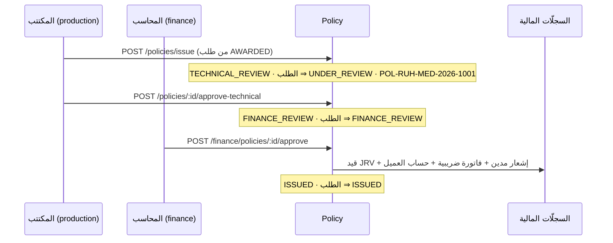

# 20 — الإصدار والنواة المالية (Issuance & Finance Core)

> المرحلة 4ب: تحويل الطلب المُسنَد (Firm Order) إلى **وثيقة مُصدَرة** عبر شلال اعتماد مزدوج (فني ← مالي)، حيث يُولّد الاعتماد المالي آلياً **قيد يومية مزدوجاً متوازناً** + إشعاراً مديناً + فاتورة ضريبية، ويفتح حساب العميل التحليلي في شجرة الحسابات. كل ذلك بالفصل الائتماني (On/Off‑Balance) الذي تفرضه هيئة التأمين.

## جدول المحتويات
- [1. شلال الاعتماد](#1-شلال-الاعتماد)
- [2. كيان الوثيقة](#2-كيان-الوثيقة)
- [3. شجرة الحسابات (COA)](#3-شجرة-الحسابات-coa)
- [4. القيد المزدوج والفصل الائتماني](#4-القيد-المزدوج-والفصل-الائتماني)
- [5. المستندات المولّدة](#5-المستندات-المولّدة)
- [6. أرقام التسلسل](#6-أرقام-التسلسل)
- [7. الـ endpoints والصلاحيات](#7-الـ-endpoints-والصلاحيات)
- [8. الاختبارات](#8-الاختبارات)

## 1. شلال الاعتماد

الحوكمة: لا يستطيع موظف المبيعات الإصدار (لا `production`)، ولا المكتتب الاعتماد المالي (لا `finance`) — فصل صارم للأدوار (راجع [05](./05-rbac-and-entitlements.md)).

## 2. كيان الوثيقة

`Policy` (محسّن في 4ب): `requestId`, `clientId`, `productLineCode`, `insurerName`, `sequenceNo`, `premium`, `vat`, `totalPremium`, `commissionRate`, `commissionAmount`, `status` (`PolicyStatus`), `startDate`, `endDate`, `endorsements[]`.

`PolicyStatus`: `TECHNICAL_REVIEW` → `FINANCE_REVIEW` → `ISSUED` (أو `REJECTED`/`CANCELLED`).

عند الإصدار: تُؤخذ المبالغ من العرض المُختار (Firm Order)، والعمولة = القسط الصافي × النسبة (افتراضي 12.5%).

## 3. شجرة الحسابات (COA)

تُزرع شجرة قياسية لكل مستأجر بـ**كود 17 رقماً**، المستوى 1/2 **مقفل** (`isLocked` — توحيد تقارير الهيئة)، مع **فصل داخل/خارج الميزانية** (`isOnBalance`):

| الكود | المستوى | الميزانية | الحساب |
|---|---|---|---|
| `01000000000000000` | 1 🔒 | On | الأصول |
| `01030000000000000` | 2 🔒 | On | ذمم العملاء المدينة |
| `02000000000000000` | 1 🔒 | On | الخصوم |
| `02020000000000000` | 2 🔒 | **Off** | **أمانات أقساط العملاء** (الفصل الائتماني) |
| `04010000000000000` | 2 🔒 | On | عمولات الوساطة |

المستوى 3 **تحليلي ديناميكي** (`isLocked=false`): يُفتح حساب لكل عميل تحت `0103` عند أول إصدار، ويدعم الرفع الأولي عبر Excel للهجرة. مراكز التكلفة (`CostCenter`) تبدأ بالفرع.

## 4. القيد المزدوج والفصل الائتماني

عند الاعتماد المالي، يُرحَّل **قيد يومية (JRV)** متوازن يُجسّد دور الوسيط كأمين:

| الحساب | مدين | دائن |
|---|---|---|
| `0103` ذمم العملاء المدينة | الإجمالي T | — |
| `0202` أمانات أقساط العملاء (Off‑Balance) | — | T − العمولة |
| `0401` عمولات الوساطة | — | العمولة C |

**مثال** (قسط 60,000، ضريبة 9,000، إجمالي 69,000، عمولة 12.5% = 7,500): مدين 69,000 = دائن (61,500 + 7,500) = **69,000 ✓**.
- الجزء المحتفظ به أمانةً للمؤمِّن (61,500) في حساب **خارج الميزانية** — فصل أموال العملاء.
- العمولة (7,500) إيراد للوسيط داخل الميزانية.

## 5. المستندات المولّدة

| المستند | الكيان | القيمة |
|---|---|---|
| قيد يومية | `Voucher` (type JRV, `isAuto`, `lines` JSON) | الإجمالي، متوازن |
| إشعار مدين للعميل | `DebitNote` | القسط الصافي + الضريبة |
| فاتورة ضريبية للمؤمِّن | `Invoice` (`zatca*` مهيّأة) | العمولة + ضريبتها (15%) |
| حساب العميل التحليلي | `ChartOfAccount` (level 3) | يُفتح إن لم يوجد |

كلها ذرّياً ضمن `$transaction` واحدة. تكامل ZATCA الفعلي (Fatoora/QR) في المرحلة 9 — انظر [17](./17-compliance-and-regulatory.md).

## 6. أرقام التسلسل

`SequenceService`: `POL-{branch}-{class}-{year}-{seq}` للوثيقة، `JRV-{year}-{seq}` للسند، `INV-{year}-{seq}` للفاتورة، `DN-{year}-{seq}` للإشعار. (المولّد الكامل بالفرع منفَّذ في 4ب.)

## 7. الـ endpoints والصلاحيات

| الطريقة والمسار | الصلاحية |
|---|---|
| `POST /policies/issue` | `module.production` + `production:create` |
| `POST /policies/:id/approve-technical` | `production:update` |
| `GET /policies` · `GET /policies/:id` | `production:read` |
| `POST /finance/policies/:id/approve` | `module.finance` + `finance:update` |
| `GET /finance/vouchers` · `GET /finance/policies/:id/postings` | `finance:read` |

## 8. الاختبارات

[`test/finance.e2e-spec.ts`](../apps/api/test/finance.e2e-spec.ts): الشلال الكامل، منع RBAC (المبيعات/المحاسب من الإنتاج، المكتتب من المالية)، **توازن القيد** (مدين = دائن)، قيم الفاتورة/الإشعار، انتقال الطلب إلى ISSUED، منع إعادة الاعتماد (409)، والعزل. **e2e 39/39**.

## انظر أيضاً
- [08 — دورة حياة الصفقة](./08-deal-lifecycle-workflows.md) · [10 — الاكتتاب الفني](./10-underwriting-rfq.md)
- [03 — نموذج البيانات](./03-data-model.md) — `Policy`/`ChartOfAccount`/`Voucher`/`Invoice` · [06 — مرجع الـ API](./06-api-reference.md)
- [17 — الامتثال](./17-compliance-and-regulatory.md) — الفصل الائتماني و ZATCA
