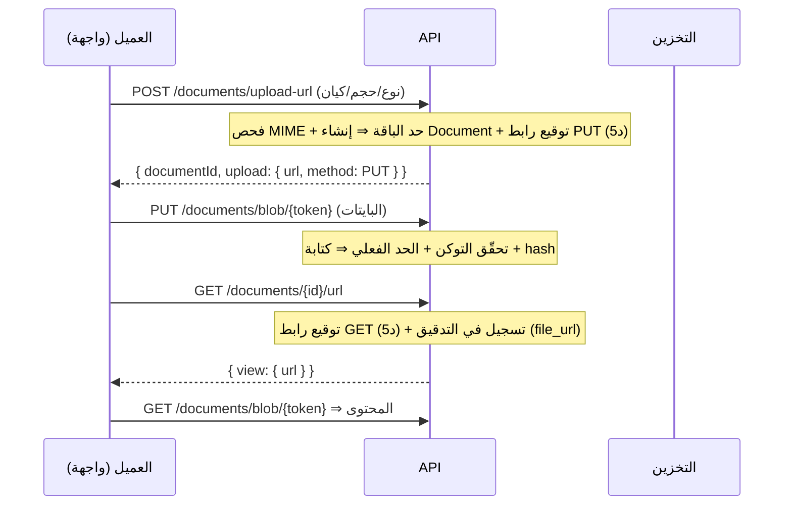

# 21 — وحدة المستندات (Document Service)

> المرحلة 5: وحدة مستندات موحّدة (polymorphic) تخدم كل الموديولز. الرفع والعرض عبر **روابط موقّتة فقط** (Presigned URLs قصيرة العمر — لا روابط عامة دائمة)، عزل منطقي بالمسار `tenant_{id}/` **مع** فرض المستأجر في طبقة التفويض، حد الرفع كـ **entitlement** للباقة، تمييز المستندات الرسمية، وتسجيل **كل توليد رابط** في سجل التدقيق.

## جدول المحتويات
- [1. تدفّق الرفع والعرض](#1-تدفّق-الرفع-والعرض)
- [2. خدمة التخزين (حيادية المزوّد)](#2-خدمة-التخزين-حيادية-المزوّد)
- [3. الضوابط الأمنية](#3-الضوابط-الأمنية)
- [4. حد الرفع كـ entitlement](#4-حد-الرفع-كـ-entitlement)
- [5. المرفق مقابل الرسمي](#5-المرفق-مقابل-الرسمي)
- [6. كيان المستند](#6-كيان-المستند)
- [7. الـ endpoints](#7-الـ-endpoints)
- [8. الاختبارات](#8-الاختبارات)

## 1. تدفّق الرفع والعرض

نمط presigned القياسي: الرابط الموقّع قصير العمر **هو التفويض** لعمليتي الرفع/التنزيل — لا حاجة لجلسة، ولا رابط عام دائم.

## 2. خدمة التخزين (حيادية المزوّد)

[`common/storage/storage.service.ts`](../apps/api/src/common/storage/storage.service.ts) واجهة (facade) تختار السائق من `STORAGE_DRIVER`:
- **`local`** (تطوير): يخزّن تحت `.storage/` ويخدم عبر الـ API — الرابط الموقّت JWT يمرّ بـ `/documents/blob/{token}` (`direct:false`).
- **`s3` / `r2` / `minio` / `alibaba_oss`** (إنتاج — متوافق S3): سائق [`s3-driver.ts`](../apps/api/src/common/storage/s3-driver.ts) **بلا أي تبعية SDK** — توقيع **AWS SigV4** يدويًا (`node:crypto`) + `fetch`. يولّد **روابط موقّتة مباشِرة للدلو** (`direct:true`) فلا تمرّ البايتات بالـ API، ويدعم عمليات الخادم `put/get/head` للمستندات المولّدة خادميًا (فواتير ZATCA).
- **رحلة الرفع السحابي:** `POST /documents/upload-url` ⇒ رابط PUT مباشر للدلو ⇒ العميل يرفع مباشرةً ⇒ **`POST /documents/:id/confirm`** يتحقّق (HEAD) ويثبّت الحجم/البصمة. (محليًا: الرفع عبر الـ API كما هو، بلا خطوة تأكيد.)
- التوقيع المحلي: JWT قصير العمر (`PRESIGNED_URL_EXPIRY_SECONDS=300`) يحمل `{ storageKey, op, documentId?, max? }`.
- مفتاح التخزين المعزول: `tenant_{tenantId}/{entityType}/{uuid}__{name}.{ext}`.

> النقل السحابي (Coolify→AWS/R2/Alibaba) بتغيير `.env` فقط (`STORAGE_*`) دون تغيير كود — انظر [13](./13-local-setup-and-operations.md) و[14](./14-environment-variables.md). توليد الرابط الموقّت حتميّ ومُختبَر دون شبكة (`storage-s3.e2e`).

## 3. الضوابط الأمنية

- **لا روابط عامة:** كل وصول عبر رابط موقّت قصير العمر؛ توكن غير صالح/منتهٍ ⇒ `403`.
- **عزل مزدوج:** المسار `tenant_{id}/` + فرض المستأجر عبر Prisma middleware (القوائم والعرض مفلترة، لا اعتماد على خفاء المسار).
- **فحص MIME:** قائمة مسموحة (`application/pdf`, `image/jpeg`, `image/png`, `image/webp`) — رفض التنفيذي وأي نوع خارجها (`400`).
- **سقف الطلب:** الرفع الخام محدود (50MB) فوق حد الباقة.
- **التدقيق:** كل توليد رابط عرض يُسجَّل في `audit_log` (مَن/أي ملف/متى) — مطلب تدقيقي للهوية والسجلات.
- التشفير at-rest/in-transit وفحص الفيروسات: في طبقة المزوّد/الإنتاج (المرحلة 9) — انظر [17](./17-compliance-and-regulatory.md).

## 4. حد الرفع كـ entitlement

الحد الأقصى لحجم الملف لكل باقة عبر `upload.maxFileMb` (basic 10، premium 25، enterprise 100 — يضبطها السوبر أدمن). يُفرض مرتين: عند طلب الرابط (الحجم المُعلن) وعند الرفع الفعلي (مضمّن في التوكن). تجاوز الحد ⇒ `403`. راجع [05](./05-rbac-and-entitlements.md).

## 5. المرفق مقابل الرسمي

- `ATTACHMENT`: قابل للضغط — صور المرفقات تستهدف **WebP** لتوفير المساحة (مفتاح التخزين بامتداد webp؛ الترميز الفعلي في سائق الإنتاج/worker).
- `OFFICIAL`: مستند ذو قيمة قانونية (عقد/تعميد موقّع/فاتورة) — يُحفظ **كأصل بلا ضغط فاقد**.

## 6. كيان المستند

`Document` (موحّد polymorphic): `tenantId`, `storageKey`, `fileName`, `mime`, `sizeBytes`, `hash`, `docType` (`ATTACHMENT`/`OFFICIAL`), `entityType` + `entityId` (مرجع لأي كيان)، و`rowId` اختياري (ربط بصفّ كتلة متكررة — هوية لكل تابع/مركبة).

## 7. الـ endpoints

| الطريقة والمسار | الحماية |
|---|---|
| `POST /documents/upload-url` | مصادَق (معزول بالمستأجر) |
| `GET /documents/{id}/url` | مصادَق + تسجيل تدقيق |
| `GET /documents?entityType=&entityId=` | مصادَق (مفلتر بالمستأجر) |
| `PUT /documents/blob/{token}` | عام (توكن موقّت) |
| `GET /documents/blob/{token}` | عام (توكن موقّت) |

## 8. الاختبارات

[`test/documents.e2e-spec.ts`](../apps/api/test/documents.e2e-spec.ts): رفض النوع التنفيذي (400)، تجاوز حد الباقة (403)، توكن غير صالح (403)، بلا مصادقة (401)، **دورة كاملة** (رابط رفع ← رفع ← رابط عرض ← تنزيل ← قائمة)، والعزل. **e2e 45/45**.

## انظر أيضاً
- [04 — الأمان وعزل المستأجرين](./04-security-and-multitenancy.md) · [17 — الامتثال](./17-compliance-and-regulatory.md)
- [14 — متغيّرات البيئة](./14-environment-variables.md) — `STORAGE_*` و `PRESIGNED_URL_EXPIRY_SECONDS`
- [03 — نموذج البيانات](./03-data-model.md) — `Document`
