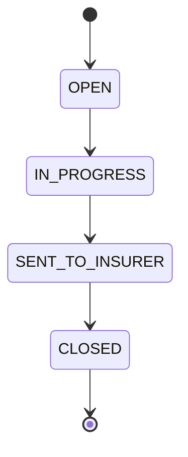
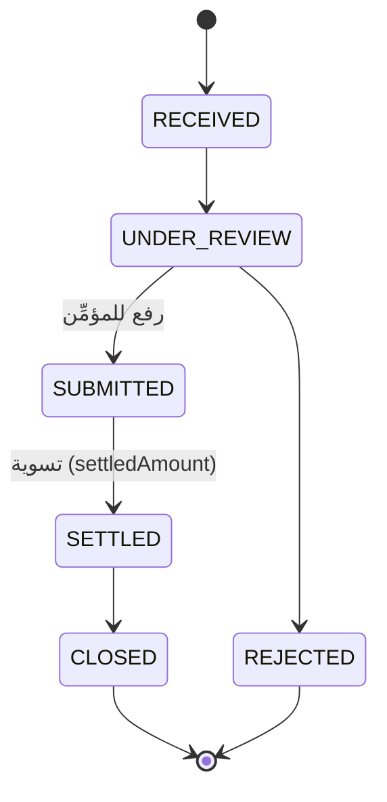

# 22 — الموديولز التشغيلية (Operational Modules)

> المرحلة 6: الموديولز التشغيلية اليومية على نمط الحوكمة نفسه (RBAC + entitlement + عزل + تدقيق): **خدمة العملاء** (طلبات إضافة/حذف/تعديل)، **المطالبات** (دورة كاملة)، و**التجديدات** (الوثائق المستحقّة + بدء التجديد).

## جدول المحتويات
- [1. خدمة العملاء](#1-خدمة-العملاء)
- [2. المطالبات](#2-المطالبات)
- [3. التجديدات](#3-التجديدات)
- [4. الـ endpoints](#4-الـ-endpoints)
- [5. الاختبارات](#5-الاختبارات)

## 1. خدمة العملاء

`ServiceRequest`: استقبال طلبات العملاء على وثيقة سارية. الأنواع: `addition`/`deletion`/`amendment`/`inquiry`/`renewal`. رقم `RQ-2026-1001`. دورة الحالة:

الحماية: `module.service` + RBAC `service:*` (مدير عناية العملاء، المدير العام). الموديول `service` مفعّل في كل الباقات.

**مراسلة شركة التأمين:** من تفاصيل طلب الخدمة زرّ **«مراسلة شركة التأمين»** يفتح نافذة تحرير مشتركة ([`InsurerLetterModal`](../apps/web/src/components/insurer/InsurerLetterModal.tsx)). `GET /service-requests/:id/insurer-letter` يبني **صيغة عربية افتراضية** من سياق الطلب (المؤمِّن مطابقًا لسجلّ شركات التأمين للحصول على البريد + رقم الوثيقة + نوع التعديل)، قابلة للتعديل بالكامل مع **مُرسَل إليه/CC ومعاينة**. `POST /service-requests/:id/send-insurer` يُرسل عبر `TenantEmailService` (BYO Resend أو المركزي)، يضبط `sentToInsurerAt`، ويسجّل نشاطًا في مسار الطلب وتدقيقًا (`service_insurer_sent`). الحقل `sentToInsurerAt` أُضيف بهجرة `insurer_correspondence`.

## 2. المطالبات

`Claim`: دورة كاملة من الاستقبال حتى الإغلاق، برقم `CL-2026-1001`، مع `claimedAmount`/`deductible`/`settledAmount`/`incidentDate`/`insurerName`.

الحماية: `module.claims` + RBAC `claims:*` (مسؤول المطالبات، مدير عناية العملاء، المدير العام). **بوّابة الباقة:** المطالبات موديول مدفوع (ADDON في premium، DISABLED في basic) — مستأجر بلا اشتراك يُمنع (`403`).

**التحقّق الآلي من التغطية عند الفتح:** `validateCoverage(policyId, incidentDate)` يقارن **تاريخ الحادثة بمدّة الوثيقة وحالتها**:

| الحالة | الشدّة |
|---|---|
| تاريخ الحادثة قبل بدء التغطية أو بعد انتهائها | **خطأ** (`before_coverage`/`after_coverage`) |
| الوثيقة ملغاة/مرفوضة (`CANCELLED`/`REJECTED`) | **خطأ** (`policy_inactive`) |
| الوثيقة غير مُصدَرة بعد | تنبيه (`policy_not_issued`) |
| لا مدّة على الوثيقة / لا تاريخ حادثة | معلومة (`no_period`/`no_incident_date`) |

فحص **مُسبق تحذيري لا يمنع**: `POST /claims/validate-coverage` تستدعيه الواجهة عند اختيار الوثيقة/تغيّر تاريخ الحادثة فتُظهر شريط تنبيهات حيًّا. وعند الإنشاء (`POST /claims`) يُعاد `coverageWarnings` مع المطالبة، وإن وُجد تعارض بشدّة **خطأ** يُوثَّق في **مسار المطالبة** (ملاحظة داخلية `CrmActivity`) وفي **التدقيق** (`coverage_warning`) — فالوسيط قد يسجّل المطالبة رغم التنبيه لكن يبقى التعارض موثّقًا.

**مراسلة شركة التأمين:** كما في الخدمة — `GET /claims/:id/insurer-letter` (صيغة تشمل تاريخ الحادثة والمبلغ المطالَب) + `POST /claims/:id/send-insurer` عبر نفس [`InsurerLetterModal`](../apps/web/src/components/insurer/InsurerLetterModal.tsx) و`TenantEmailService`؛ يضبط `sentToInsurerAt` ويسجّل نشاطًا وتدقيقًا.

## 3. التجديدات

عرض الوثائق المُصدَرة (`ISSUED`) المنتهية خلال نافذة (افتراضي 60 يوماً)، مُثراة باسم العميل والقسط ومرتّبة حسب الإلحاح. الحماية: `module.production` + RBAC `production:*`.

**بدء التجديد = دورة تجديد فعلية (معيار الوساطة):** `POST /renewals/:policyId/initiate` (يعيد **201**) يُنشئ **طلب تأمين جديدًا** (`PolicyRequest`) مبنيًا على بيانات الطلب الأصلي للوثيقة (استنساخ `base`/`details` + صفوف الكتل) مع رابط سلسلة التجديد `PolicyRequest.renewedFromPolicyId`، فيدخل دورة RFQ⇐عرض⇐إصدار من جديد (لا مجرّد تذكرة). **يمنع التكرار** (طلب تجديد قائم غير مرفوض لنفس الوثيقة ⇒ 409). **لا يُطلق تذكيرًا تلقائيًا للعميل** عند البدء — التذكير المبكّر مهمّة [المجدول الدوري](./22-operational-modules.md) (`renewal_reminder` ≤30 يومًا)، والتواصل الفعلي هو إرسال عرض التجديد لاحقًا؛ يُشعَر فريق التجديدات داخليًا فقط (`staff_renewal_due`).

**نافذة التجديد في الواجهة:** زر «طلب تجديد» في بوّابة العميل (صفحة الوثيقة + قائمة الوثائق) يظهر فقط ضمن نافذة **60 يوماً** قبل الانتهاء؛ خارجها يُستبدل بحالة «الوثيقة سارية حتى … — يفتح التجديد قبل الانتهاء بـ60 يوماً» — إذ لا معنى تجاريًا لتجديد وثيقة بعيدة الانتهاء.

**تجربة لوحة التجديدات (للموظف):** زرّ «بدء التجديد» يعطي **تغذية راجعة في مكانه** بدل أن يبقى ثابتًا: أثناء الإنشاء سبينر «جارٍ البدء…» + تعطيل، وعند النجاح يتحوّل إلى **«عرض طلب التجديد ✓»** (رابط لطلب التأمين المُنشأ `/tenant/requests/:id`)، والأخطاء (كطلب تجديد قائم) تظهر في شريط تنبيه. ولإتقان الحالة على التحميل: `GET /renewals?days=` يُرجع لكل وثيقة حقل **`renewalRequestId`** (معرّف أحدث طلب تجديد غير مرفوض مبنيّ عليها، أو `null`) — فتُظهر اللوحة «عرض طلب التجديد» مباشرةً للوثائق التي لها طلب قائم، بلا نقرٍ يُفشي الخطأ. الزرّ محكوم بصلاحية `renewals:create` (وإلا «—»).

## 4. الـ endpoints

| الطريقة والمسار | الصلاحية |
|---|---|
| `GET/POST /service-requests` · `POST /service-requests/:id/status` | `module.service` + `service:read/create/update` |
| `GET /service-requests/:id/insurer-letter` · `POST /service-requests/:id/send-insurer` | `module.service` + `service:read/update` |
| `GET/POST /claims` · `GET /claims/:id` · `POST /claims/:id/status` | `module.claims` + `claims:read/create/update` |
| `POST /claims/validate-coverage` | `module.claims` + `claims:create` (فحص تغطية مُسبق) |
| `GET /claims/:id/insurer-letter` · `POST /claims/:id/send-insurer` | `module.claims` + `claims:read/update` |
| `GET /renewals?days=` · `POST /renewals/:policyId/initiate` | `module.production` + `production:read/create` |

## 5. الاختبارات

[`test/operations.e2e-spec.ts`](../apps/api/test/operations.e2e-spec.ts): إنشاء/تحديث طلب خدمة (RQ)، منع RBAC للمبيعات (403)، دورة المطالبة (CL → SETTLED)، منع entitlement للأمان (403)، التجديدات المستحقّة، بدء تجديد لوثيقة غير موجودة (404)، والعزل. **e2e 53/53**.

## انظر أيضاً
- [08 — دورة حياة الصفقة](./08-deal-lifecycle-workflows.md) · [05 — الصلاحيات](./05-rbac-and-entitlements.md)
- [03 — نموذج البيانات](./03-data-model.md) — `ServiceRequest`/`Claim` · [06 — مرجع الـ API](./06-api-reference.md)
